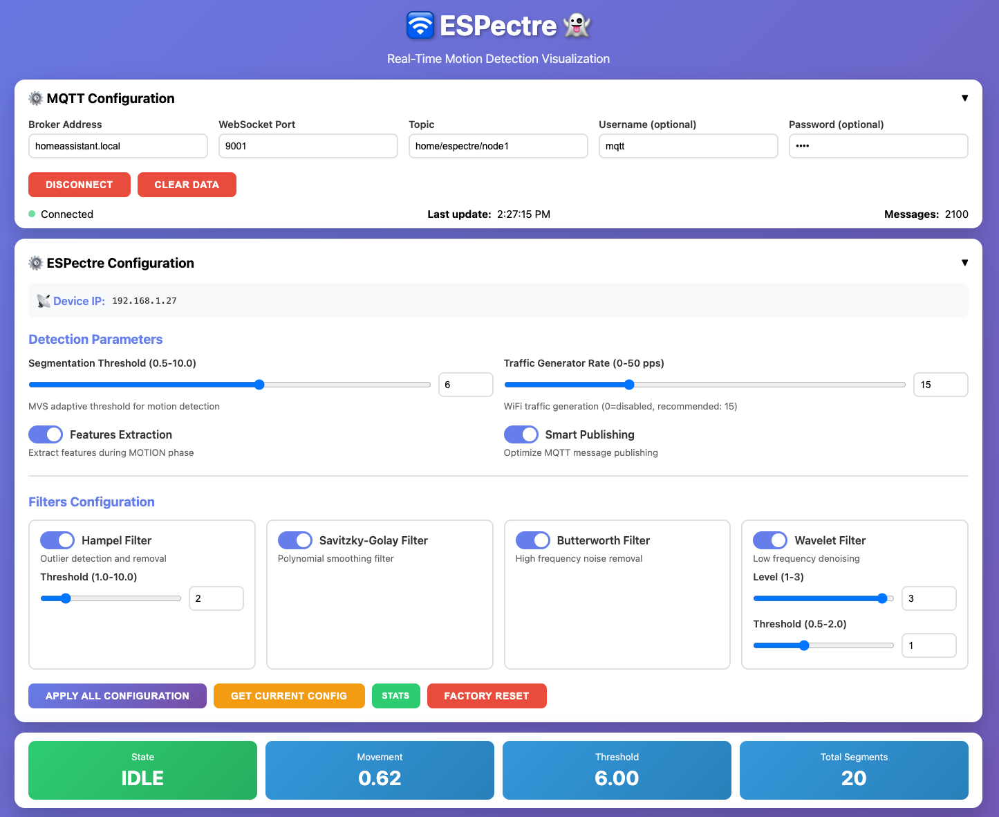

# 🛜 ESPectre 👻 - Calibration Guide

Quick guide to calibrate ESPectre for reliable movement detection in your environment.

> **💡 Tip**: Use the CLI tool (`espectre-cli.py`) or the web monitor (`espectre-monitor.html`) for real-time tuning.


*Web monitor configuration interface showing all tunable parameters*

---

## 🚀 Quick Start (5 minutes)

> **📌 Note on Subcarrier Selection**: ESPectre automatically selects optimal subcarriers using the NBVI (Normalized Baseline Variability Index) algorithm at first boot or after factory reset. No manual configuration needed. For details, see [micro-espectre/tools/README.md](micro-espectre/tools/README.md).

### 1. Launch Interactive CLI

```bash
./espectre-cli.py
```

This starts an interactive session with real-time feedback.

### 2. Observe Baseline (Empty Room)

Keep the room empty and still for 1-2 minutes.

**Check runtime statistics:**
```
espectre> stats
```

Note the typical `moving_variance` values when idle (typically 0.5-2.0).

### 3. Set Segmentation Threshold

This is the critical parameter for motion detection.

**What it does:** Determines sensitivity for motion detection.

**Default:** 3.0

**Rule of thumb:**
- Start with default value (3.0) and adjust based on your environment
- If baseline moving_variance is 0.5-2.0 → threshold 3.0 is good
- If baseline moving_variance is 2.0-4.0 → increase threshold to 4.0-5.0
- If baseline moving_variance is >4.0 → increase threshold to 6.0-8.0

```
espectre> segmentation_threshold 3.0
```

### 4. Test Movement

Walk around the room while monitoring:
```bash
idf.py monitor
```

Look for `state=MOTION` when moving, `state=IDLE` when still.

**Adjust if needed:**
- Too many false positives → increase threshold
- Missing movements → decrease threshold


---

## 🎯 Advanced MVS Parameters

ESPectre allows fine-tuning of the Moving Variance Segmentation algorithm parameters for optimal performance in your specific environment.

### Window Size (10-200 packets)

**What it does:** Number of turbulence samples used to calculate moving variance.

**Effect:**
- **Small (10-30)**: Fast response, more reactive, noisier
- **Large (100-200)**: Slow response, more stable, smoother

**Default:** 100 packets

**MQTT Command:**
```json
{"cmd": "segmentation_window_size", "value": 10}
```

**CLI Command:**
```bash
segmentation_window_size 10
```


<details>
<summary><b>📊 Optimal Window Configuration Guide</b></summary>

To detect general movement (walking, arm movement, standing up), you need to balance **sensitivity** (capturing even minimal movements) and **robustness** (ignoring noise).

**Sampling Rate ($F_s$)**

Maintaining $F_s = 100 \text{ Hz}$ is an excellent compromise between accuracy and computational load for detecting most human activities.

**Moving Window Size ($N$)**

For general movement detection, a window is recommended that captures transient action while being long enough to dampen high-frequency noise.

| $T_{window}$ | $N$ (at 100 Hz) | Advantage for Presence Detection |
|--------------|-----------------|----------------------------------|
| $0.5$ seconds | $50$ packets | Extremely reactive, but too sensitive to noise. |
| $1$ second | $100$ packets | **Recommended**. Optimal balance, captures $1-2$ steps or a complete gesture. |
| $2$ seconds | $200$ packets | Slower to react, but very robust against false positives. |

**Recommendation:** Start with $N=100$ packets (corresponding to $1$ second). This is the ideal point for detecting activities like entering a room.

**How to configure:**
```bash
# Via CLI
segmentation_window_size 100

# Via MQTT
{"cmd": "segmentation_window_size", "value": 100}
```
</details>

---

## ⚙️ Optional Parameters

### Traffic Generator Rate

**What it does:** Controls how many packets per second are sent for CSI measurement.

**Default:** 100 pps

**When to adjust:**
- Lower (50 pps): Reduce network load, slower detection
- Higher (600-1000 pps): Faster detection for rapid movements

**Command:**
```
espectre> traffic_rate 100
```

<details>
<summary><b>📐 Understanding Sampling Rates (Nyquist-Shannon Theorem)</b></summary>

The traffic generator rate determines the maximum frequency of motion that can be accurately detected. According to the **Nyquist-Shannon Sampling Theorem**, the sampling rate (Fs) must be at least twice the maximum frequency of the signal (Fmax):

$$F_s \geq 2 \times F_{max}$$

In Wi-Fi sensing, Fmax is the highest Doppler frequency generated by human movement reflected in the CSI signal.

**Application Scenarios:**

| Activity Type | Max Frequency (Fmax) | Minimum Sampling Rate (Fs) | Recommended Rate |
|---------------|---------------------|---------------------------|------------------|
| **Vital signs** (breathing, heartbeat) | < 5 Hz | ≥ 10 Hz | 10-30 pps |
| **Activity recognition** (walking, sitting, gestures) | ≈ 10-30 Hz | ≥ 60 Hz | 60-100 pps |
| **Fast motion** (rapid gestures, precision localization) | ≈ 300-400 Hz | ≥ 600 Hz | 600-1000 pps |

**Key Takeaways:**
- Higher rates enable detection of faster movements
- Lower rates are sufficient for slow movements (vital signs, presence)
- Choose the rate based on your application requirements
- Higher rates increase CPU usage and network traffic

</details>

### Feature Extraction

**What it does:** Enables detailed feature analysis during motion (turbulence, PCA, etc.).

**Default:** Enabled

**When to disable:**
- Only need basic motion detection (IDLE/MOTION)
- Want to reduce CPU usage

**Commands:**
```
# Disable features
espectre> features_enable off

# Re-enable features
espectre> features_enable on
```

### Smart Publishing

**What it does:** Reduces MQTT traffic by skipping redundant publishes when values don't change significantly.

**Default:** Disabled

**When to enable:**
- Reduce MQTT broker load
- Minimize network traffic
- Only publish when meaningful changes occur

**Commands:**
```
# Enable smart publishing
espectre> smart_publishing on

# Disable smart publishing (publish every cycle)
espectre> smart_publishing off
```

---

## 🔧 Optional Filters

**Note:** Filters are applied only to feature extraction, not to motion detection.

### Butterworth Low-Pass Filter

**What it does:** Removes high-frequency noise (>8Hz) from features.

**Default:** Enabled (recommended)

**Command:**
```
espectre> butterworth_filter on
```

### Hampel Filter (Outlier Removal)

**What it does:** Removes statistical outliers from features.

**Default:** Disabled

**When to enable:** High interference environments (fans, AC, microwave).

**Commands:**
```
espectre> hampel_filter on
espectre> hampel_threshold 2.0  # Default threshold value
```

### Savitzky-Golay Filter

**What it does:** Smooths feature values.

**Default:** Enabled

**Command:**
```
espectre> savgol_filter on
```

### Wavelet Filter (Advanced)

**What it does:** Removes persistent low-frequency noise using wavelet transform.

**Default:** Disabled

**When to enable:** Very high noise environments where other filters aren't enough.

**Commands:**
```
espectre> wavelet_filter on
espectre> wavelet_level 3
espectre> wavelet_threshold 1.0
```

**Performance impact:** ~5-8% CPU load, 320ms warm-up time.

---

## 🔍 Troubleshooting

### Too Many False Positives

**Symptoms:** Detects motion when room is empty.

**Solutions:**
1. Increase threshold:
   ```
   espectre> segmentation_threshold 8.0
   ```

2. Check for interference sources (fans, AC, moving curtains).

### Missing Movements

**Symptoms:** Doesn't detect when people move.

**Solutions:**
1. Decrease threshold gradually:
   ```
   espectre> segmentation_threshold 2.0
   ```
   Note: Start from default (3.0) and decrease in steps of 0.5 until detection improves.

2. Check sensor position (optimal: 3-8m from router).

3. Verify traffic generator is active:
   ```
   espectre> info
   ```

4. Increase window size for more stable detection:
   ```
   espectre> segmentation_window_size 150
   ```

### Unstable Detection

**Symptoms:** Rapid flickering between IDLE and MOTION.

**Solutions:**
1. Increase threshold to reduce sensitivity:
   ```
   espectre> segmentation_threshold 4.5
   ```

2. Increase window size for more stable detection:
   ```
   espectre> segmentation_window_size 150
   ```

### Factory Reset

**When needed:** Start fresh with default settings or trigger subcarriers recalibration.

**Command:**
```
espectre> factory_reset
```

**This will:**
- Clear all NVS storage and restore factory defaults
- Trigger automatic NBVI subcarrier calibration (~5 seconds)
- Require a quiet baseline period for optimal calibration

**Note:** After factory reset, the system will automatically select optimal subcarriers using NBVI algorithm. Ensure the environment is quiet during the first 5-10 seconds after reboot for best results.

---

## 📊 Monitoring Commands

### Check Current Configuration
```
espectre> info
```

Shows all current settings (threshold, filters, network, etc.).

### Check Runtime Statistics
```
espectre> stats
```

Shows dynamic metrics (state, turbulence, variance, segments, uptime).

### Monitor Real-Time Detection
```bash
idf.py monitor
```

Shows live CSI data and detection logs.

---

## 🎓 Quick Tips

1. **Start simple:** Tune only the segmentation threshold first.
2. **One change at a time:** Adjust one parameter, test for 5-10 minutes.
3. **Document your settings:** Note what works for your environment.
4. **Seasonal adjustments:** Retune when furniture changes or new interference sources appear.
5. **Distance matters:** Keep sensor 3-8m from router for optimal performance.

---

## 📚 Additional Resources

- **Main Documentation:** [README.md](README.md)
- **Setup Guide:** [SETUP.md](SETUP.md)
- **GitHub Issues:** [Report problems](https://github.com/francescopace/espectre/issues)
- **Email:** francesco.pace@gmail.com

---

## 🔧 CLI Configuration

The CLI reads settings from environment variables:

```bash
export MQTT_BROKER="homeassistant.local"
export MQTT_PORT="1883"
export MQTT_TOPIC="home/espectre/node1"
export MQTT_USERNAME="mqtt"
export MQTT_PASSWORD="mqtt"
./espectre-cli.py
```

Type `help` in the CLI for all available commands.
