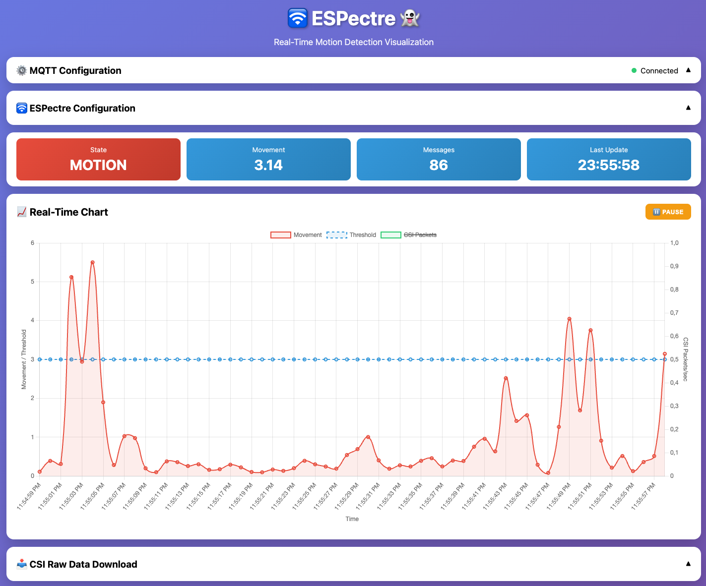
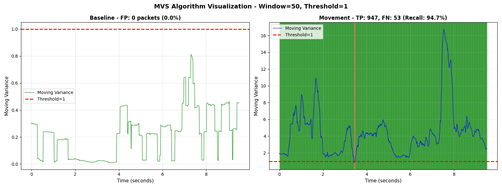

[](https://github.com/francescopace/espectre/blob/main/LICENSE)
[](https://github.com/espressif/esp-idf)
[](https://www.espressif.com/en/products/socs)
[](https://github.com/francescopace/espectre)
[](https://github.com/francescopace/espectre/releases/latest)

# 🛜 ESPectre 👻

**Motion detection system based on Wi-Fi spectre analysis (CSI), with Home Assistant integration.**

**📰 Featured Article**: Read the complete story behind ESPectre on Medium **[🇮🇹 Italian](https://medium.com/@francesco.pace/come-ho-trasformato-il-mio-wi-fi-in-un-sensore-di-movimento-40053fd83128?source=friends_link&sk=46d9cfa026790ae807ecc291ac5eac67&utm_source=github&utm_medium=readme&utm_campaign=espectre)**, **[🇬🇧 English](https://medium.com/@francesco.pace/how-i-turned-my-wi-fi-into-a-motion-sensor-61a631a9b4ec?sk=c7f79130d78b0545fce4a228a6a79af3&utm_source=github&utm_medium=readme&utm_campaign=espectre)**

**⚠️ Disclaimer**: This is an experimental project for educational and research purposes. The author assumes no responsibility for misuse or damage resulting from the use of this system. Use responsibly and in compliance with applicable laws.

---

## 📑 Table of Contents

- [In 3 Points](#-in-3-points)
- [Mathematical Approach](#-mathematical-approach)
- [What You Need](#-what-you-need)
- [Quick Start](#-quick-start)
- [How It Works](#-how-it-works-simple-version)
- [What You Can Do With It](#-what-you-can-do-with-it)
- [Sensor Placement Guide](#-where-to-place-the-sensor)
- [System Architecture](#️-system-architecture)
- [FAQ](#-faq-for-beginners)
- [Security and Privacy](#-security-and-privacy)
- [Technical Deep Dive](#-technical-deep-dive)
- [Future Evolutions](#-future-evolutions-ai-approach)
- [References](#-references)
- [Changelog](#-changelog)
- [License](#-license)
- [Author](#-author)

---

## 🎯 In 3 Points

1. **What it does**: Detects movement using Wi-Fi (no cameras, no microphones)
2. **What you need**: A ~€10 device (ESP32-S3 or ESP32-C6) + Home Assistant or MQTT server
3. **Setup time**: 30-45 minutes (first time, including ESP-IDF setup)

---

## 🔬 Mathematical Approach

**This project currently does NOT use Machine Learning models.** Instead, it employs a **mathematical approach** that extracts **10 features** from CSI (Channel State Information) data using statistical and signal processing techniques.

### Key Points

- ✅ **No ML training required**: Works out-of-the-box with mathematical algorithms
- ✅ **10 extracted features**: Statistical, spatial, and temporal features
- ✅ **Real-time processing**: Low latency detection on ESP32 hardware (S3/C6)
- ✅ **Foundation for ML**: These features can serve as the basis for collecting labeled datasets to train ML models for advanced tasks (people counting, activity recognition, gesture detection)

The mathematical approach provides excellent movement detection without the complexity of ML model training, while the extracted features offer a solid foundation for future ML-based enhancements.

---

## 🛒 What You Need

### Hardware

- ✅ **2.4GHz Wi-Fi Router** - the one you already have at home works fine
- ✅ **ESP32-S3 or ESP32-C6** - Available on Amazon, AliExpress, or electronics stores

📖 See [ESP32-PLATFORM-SUPPORT.md](ESP32-PLATFORM-SUPPORT.md) for detailed platform comparison and recommendations


*ESP32-S3 DevKit with external antennas*

### Software (All Free)

- ✅ **MQTT Broker** (required for operation):
  - **Home Assistant** with built-in MQTT broker (on Raspberry Pi, PC, NAS, or cloud)
  - OR standalone **Mosquitto** MQTT server (can run on any device, including Raspberry Pi)
- ✅ **ESP-IDF v6.1** (development framework for building firmware)

### Required Skills

- ✅ **Basic command line knowledge** required for building and flashing firmware
- ❌ **NO** router configuration needed

---

## 🚀 Quick Start

**Setup time**: ~30-45 minutes (first time)  
**Difficulty**: Intermediate (requires ESP-IDF setup)

1. **Setup & Installation**: Follow the complete guide in [SETUP.md](SETUP.md)
2. **Calibration & Tuning**: Optimize for your environment with [CALIBRATION.md](CALIBRATION.md)

### Web-Based Monitor

ESPectre includes a web-based monitoring interface (`espectre-monitor.html`) for real-time visualization and configuration without command line tools.


*Real-time CSI monitoring and configuration interface*

---

## 📖 How It Works (Simple Version)

When someone moves in a room, they "disturb" the Wi-Fi waves traveling between the router and the sensor. It's like when you move your hand in front of a flashlight and see the shadow change.

The ESP32 device "listens" to these changes and understands if there's movement.

### Advantages

- ✅ **No cameras** (total privacy)
- ✅ **No wearables needed** (no bracelets or sensors to wear)
- ✅ **Works through walls** (Wi-Fi passes through walls)
- ✅ **Very cheap** (~€10 total)

<details>
<summary>📚 Technical Explanation (click to expand)</summary>

### What is CSI (Channel State Information)?

**Channel State Information (CSI)** represents the physical characteristics of the wireless communication channel between transmitter and receiver. Unlike simple RSSI (Received Signal Strength Indicator), CSI provides rich, multi-dimensional data about the radio channel.

#### What CSI Captures

**Per-subcarrier information:**
- **Amplitude**: Signal strength for each OFDM subcarrier (up to 64)
- **Phase**: Phase shift of each subcarrier
- **Frequency response**: How the channel affects different frequencies

**Environmental effects:**
- **Multipath propagation**: Reflections from walls, furniture, objects
- **Doppler shifts**: Changes caused by movement
- **Temporal variations**: How the channel evolves over time
- **Spatial patterns**: Signal distribution across antennas/subcarriers

#### Why It Works for Movement Detection

When a person moves in an environment, they:
- Alter multipath reflections (new signal paths)
- Change signal amplitude and phase
- Create temporal variations in CSI patterns
- Modify the electromagnetic field structure

These changes are detectable even through walls, enabling **privacy-preserving presence detection** without cameras, microphones, or wearable devices.

</details>

---

## 💡 What You Can Do With It

### Practical Examples

- 🏠 **Home security**: Get an alert if someone enters while you're away
- 👴 **Elderly care**: Monitor activity to detect falls or prolonged inactivity
- 💡 **Smart automation**: Turn on lights/heating only when someone is present
- ⚡ **Energy saving**: Automatically turn off devices in empty rooms
- 👶 **Child monitoring**: Alert if they leave the room during the night
- 🌡️ **Climate control**: Heat/cool only occupied zones

---

## 📍 Where to Place the Sensor

Optimal sensor placement is crucial for reliable movement detection.

### Recommended Distance from Router

**Optimal range: 3-8 meters**

| Distance | Signal | Multipath | Sensitivity | Noise | Recommendation |
|----------|--------|-----------|-------------|-------|----------------|
| < 2m | Too strong | Minimal | Low | Low | ❌ Too close |
| 3-8m | Strong | Good | High | Low | ✅ **Optimal** |
| > 10-15m | Weak | Variable | Low | High | ❌ Too far |

### Placement Tips

✅ **Position sensor in the area to monitor** (not necessarily in direct line with router)  
✅ **Height: 1-1.5 meters** from ground (desk/table height)  
✅ **External antenna**: Use IPEX connector for better reception  
❌ **Avoid metal obstacles** between router and sensor (refrigerators, metal cabinets)  
❌ **Avoid corners** or enclosed spaces (reduces multipath diversity)

---

## ⚙️ System Architecture

### Processing Pipeline

ESPectre uses a streamlined processing pipeline with parallel paths for segmentation and feature extraction:

```
┌─────────────┐
│  CSI Data   │  Raw Wi-Fi Channel State Information
└──────┬──────┘
       │
       ├──────────────────────────────────────┐
       │                                      │
       │ (RAW CSI - unfiltered)               │ (IF features_enabled)
       ▼                                      ▼
┌─────────────┐                       ┌─────────────┐
│Segmentation │  MVS on RAW CSI       │   Filters   │  Butterworth, Wavelet,
│  (always)   │  IDLE ↔ MOTION        │  (optional) │  Hampel, Savitzky-Golay
└──────┬──────┘                       └───────┬─────┘
       │                                      │
       │                                      ▼
       │                               ┌─────────────┐
       │                               │  Features   │  10 mathematical features
       │                               │ Extraction  │  (from filtered CSI)
       │                               │  (always)   │
       │                               └──────┬──────┘
       │                                      │
       └──────────────┬───────────────────────┘
                      │
                      ▼
               ┌─────────────┐
               │    MQTT     │  Publish: state + movement + threshold
               │ Publishing  │  + features (if features_enabled=true)
               └─────────────┘
```

**Key Points:**
- **Parallel processing**: Segmentation (raw CSI) and Features (filtered CSI) run independently
- **Segmentation always active**: MVS operates on **raw, unfiltered CSI** to preserve motion sensitivity
- **Features always calculated**: When `features_enabled=true`, features are extracted continuously
- **Filters applied before features**: Signal processing filters clean CSI data before feature extraction
- **Single MQTT output**: Publishes state, movement, threshold, and optionally features

### Single or Multiple Sensors

```
┌─────────┐  ┌─────────┐  ┌─────────┐
│ ESP32   │  │ ESP32   │  │ ESP32   │
│ Room 1  │  │ Room 2  │  │ Room 3  │
└────┬────┘  └────┬────┘  └────┬────┘
     │            │            │
     └────────────┴────────────┘
                  │
                  │ MQTT
                  ▼
         ┌────────────────────┐
         │    MQTT Broker     │
         │ (Home Assistant    │
         │  built-in or any   │
         │  MQTT Server)      │
         └────────┬───────────┘
                  │
                  ▼
          ┌────────────────┐
          │ Home Assistant │
          │   MQTT Sensors │
          │  & Automations │
          └────────────────┘
```

Each sensor publishes to its own topic:
- `home/espectre/kitchen`
- `home/espectre/bedroom`
- `home/espectre/living`

Home Assistant can then:
- Monitor each room independently
- Create group sensors for whole-house occupancy
- Implement zone-based automations
- Track movement patterns across rooms


### Automatic Subcarrier Selection (NBVI)

ESPectre implements the **NBVI (Normalized Baseline Variability Index)** algorithm for automatic subcarrier selection, achieving near-optimal performance (F1=97.1%) with **zero manual configuration**.

NBVI automatically selects the optimal 12 subcarriers from the 64 available in WiFi CSI by analyzing their stability and signal strength during a baseline period. The calibration runs automatically:
- **At first boot** (if no saved configuration exists)
- **After factory_reset** command

---

## ❓ FAQ for Beginners

<details>
<summary>Click to expand FAQ</summary>

**Q: Do I need programming knowledge to use it?**  
A: Basic command line skills are needed to build and flash the firmware using ESP-IDF. Follow the step-by-step guide in SETUP.md.

**Q: Does it work with my router?**  
A: Yes, if your router has 2.4GHz Wi-Fi (virtually all modern routers have it).

**Q: How much does it cost in total?**  
A: Hardware: ~€10 for an ESP32-S3 or ESP32-C6 device. Software: All free and open source. You'll also need a device to run the MQTT broker (Home Assistant or Mosquitto), which can be a Raspberry Pi (~€35-50) or any existing PC/NAS you already have (free).

**Q: Do I need to modify anything on the router?**  
A: No! The router works normally. The sensor "listens" to Wi-Fi signals without modifying anything.

**Q: Can I try it without Home Assistant?**  
A: Yes, you can use any MQTT server (e.g., Mosquitto) or even just view data via serial port.

**Q: Does it work through walls?**  
A: Yes, the 2.4GHz Wi-Fi signal penetrates drywall. Reinforced concrete walls reduce sensitivity but detection remains possible at reduced distances.

**Q: How many sensors are needed for a house?**  
A: It depends on size. One sensor can monitor ~50 m². For larger homes, use multiple sensors (1 sensor every 50-70 m² for optimal coverage).

**Q: Can it distinguish between people and pets?**  
A: The system uses a 2-state segmentation model (IDLE/MOTION) that identifies generic movement without distinguishing between people, pets, or other moving objects. For more sophisticated classification (people vs pets, activity recognition, gesture detection), trained AI/ML models would be required (see Future Evolutions section).

**Q: Does it consume a lot of Wi-Fi bandwidth?**  
A: No, MQTT traffic is minimal. With smart publishing disabled (default), the system publishes all detection updates. When smart publishing is enabled, the system only sends data on significant changes or every 5 seconds as a heartbeat, resulting in ~0.2-0.5 KB/s per sensor during idle periods and up to ~1 KB/s during active movement. Network impact is negligible.

**Q: Does it work with mesh Wi-Fi networks?**  
A: Yes, it works normally. Make sure the ESP32 connects to the 2.4 GHz band.

**Q: Is a dedicated server necessary?**  
A: No, Home Assistant can run on Raspberry Pi, NAS, or cloud. Alternatively, just an MQTT broker (Mosquitto) on any device is sufficient.

**Q: How accurate is the detection?**  
A: Detection accuracy is highly environment-dependent and requires proper tuning. Factors affecting performance include: room layout, wall materials, furniture placement, distance from router (optimal: 3-8m), and interference levels. In optimal conditions with proper tuning, the system provides reliable movement detection. Adjust the `segmentation_threshold` parameter to tune sensitivity for your specific environment.

**Q: What's the power consumption?**  
A: ~500mW typical during continuous operation. The firmware includes support for power optimization, and deep sleep modes can be implemented for battery-powered deployments, though this would require custom modifications to the code.

**Q: If it doesn't work, can I get help?**  
A: Yes, open an [Issue on GitHub](https://github.com/francescopace/espectre/issues) or contact me via email.

</details>

---

## 🔒 Security and Privacy

<details>
<summary>🔐 Privacy, Security & Ethical Considerations (click to expand)</summary>

### Nature of Collected Data

The system collects **anonymous data** related to the physical characteristics of the Wi-Fi radio channel:
- Amplitudes and phases of OFDM subcarriers
- Statistical signal variances
- **NOT collected**: personal identities, communication contents, images, audio

CSI data represents only the properties of the transmission medium and does not contain direct identifying information.

### Privacy Advantages

✅ **No cameras**: Respect for visual privacy  
✅ **No microphones**: No audio recording  
✅ **No wearables**: Doesn't require wearable devices  
✅ **Aggregated data**: Only statistical metrics, not raw identifying data

### ⚠️ Disclaimer and Ethical Considerations

**WARNING**: Despite the intrinsic anonymity of CSI data, this system can be used for:

- **Non-consensual monitoring**: Detecting presence/movement of people without their explicit consent
- **Behavioral profiling**: With advanced AI models, inferring daily life patterns
- **Domestic privacy violation**: Tracking activities inside private homes

### Usage Responsibility

**The user is solely responsible for using this system and must:**

1. ✅ **Obtain explicit consent** from all monitored persons
2. ✅ **Respect local regulations** (GDPR in EU, local privacy laws)
3. ✅ **Clearly inform** about the presence of the sensing system
4. ✅ **Limit use** to legitimate purposes (home security, personal home automation)
5. ✅ **Protect data** with encryption and controlled access
6. ❌ **DO NOT use** for illegal surveillance, stalking, or violation of others' privacy

</details>

---

## 🔬 Technical Deep Dive


*I/Q constellation diagrams showing the geometric representation of WiFi signal propagation in the complex plane. The baseline (idle) state exhibits a stable, compact pattern, while movement introduces entropic dispersion as multipath reflections change. The radius of these circular patterns represents the amplitude (magnitude) of each subcarrier, while the ring thickness visualizes the signal variance - wider rings indicate higher variability. MVS (Moving Variance Segmentation) analyzes the variance of spatial turbulence across subcarriers to detect motion patterns.*
<details>
<summary>🔬 Signal Processing Pipeline (click to expand)</summary>

### Data Flow

#### 1️⃣ **CSI Acquisition** (ESP32)
- **Native ESP32 CSI API** captures Wi-Fi Channel State Information via callback
- Extracts amplitude and phase data from OFDM subcarriers (up to 64 subcarriers)
- Typical capture rate: ~10-100 packets/second depending on Wi-Fi traffic

#### 2️⃣ **Motion Segmentation** (ESP32)
- **Spatial turbulence calculation**: Standard deviation of subcarrier amplitudes (raw CSI data)
- **Moving Variance Segmentation (MVS)**: Real-time motion segment extraction
- **Adaptive threshold**: Based on moving variance of turbulence signal
- **Segment features**: Duration, average turbulence, maximum turbulence
- **Circular buffer**: Maintains up to 10 recent segments for analysis
- **Foundation for ML**: Segments can be labeled and used for activity classification

**Note**: Segmentation operates on **raw, unfiltered CSI data** to preserve motion sensitivity. Filters are not applied to the turbulence signal used for segmentation.

#### 3️⃣ **Optional Signal Processing Filters** (ESP32)
Advanced filters applied to CSI data **before feature extraction** (configurable via MQTT):
- **Butterworth Low-Pass**: Removes high-frequency noise >8Hz (environmental interference) - Enabled by default
- **Wavelet db4**: Removes low-frequency persistent noise using Daubechies wavelet transform
- **Hampel Filter**: Outlier removal using MAD (Median Absolute Deviation)
- **Savitzky-Golay Filter**: Polynomial smoothing (enabled by default)

**Filter Pipeline**: Raw CSI → Butterworth (high freq) → Wavelet (low freq) → Hampel → Savitzky-Golay → Features

**Note**: Filters are applied **only to feature extraction**, not to segmentation. Segmentation uses raw CSI data to preserve motion sensitivity.

#### 4️⃣ **Optional Feature Extraction** (ESP32)
When enabled (default: on), extracts 10 mathematical features from **filtered CSI data** continuously:
- **Statistical** (5): Variance, Skewness, Kurtosis, Entropy, IQR
- **Spatial** (3): Spatial variance, correlation, gradient across subcarriers
- **Temporal** (2): Delta mean, delta variance (changes between consecutive packets)

**Note**: Feature extraction can be disabled via `features_enable` command to reduce CPU usage if only basic motion detection is needed.

#### 5️⃣ **MQTT Publishing** (ESP32 → Broker)
- Publishes JSON payload every 1 second (configurable)
- QoS level 0 (fire-and-forget) for low latency
- Retained message option for last known state
- Automatic reconnection on connection loss

#### 6️⃣ **Home Assistant Integration**
- **MQTT Sensor** subscribes to topic and creates entity
- **State**: Primary `movement` value (0.0-1.0)
- **Attributes**: All other metrics available for conditions
- **History**: Automatic logging to database for graphs


*Baseline graphs show quiet state (<1), motion graphs show high variance in turbolence (>1)*

</details>

<details>
<summary>📊 Optional Feature Extraction (click to expand)</summary>

ESPectre can optionally extract **10 mathematical features** from filtered CSI data continuously:

### Extracted Features

#### **Statistical (5 features)**
Statistical properties of the CSI signal distribution:

1. **Variance** - Signal variability, increases significantly with movement
2. **Skewness** - Distribution asymmetry, detects irregular movement patterns
3. **Kurtosis** - Distribution "tailedness", identifies outliers and sudden changes
4. **Entropy** - Signal randomness/disorder, increases when environment changes
5. **IQR** (Interquartile Range) - Robust spread measure (Q3-Q1), resistant to outliers

#### **Spatial (3 features)**
Characteristics across OFDM subcarriers (frequency domain):

6. **Spatial Variance** - Variability across subcarriers, indicates multipath diversity
7. **Spatial Correlation** - Correlation between adjacent subcarriers, affected by movement
8. **Spatial Gradient** - Rate of change across subcarriers, highly sensitive to movement

#### **Temporal (2 features)**
Changes between consecutive CSI packets:

9. **Temporal Delta Mean** - Average absolute difference from previous packet
10. **Temporal Delta Variance** - Variance of differences from previous packet

### Usage

Feature extraction is **enabled by default** but can be disabled via `features_enable` command to reduce CPU usage.
**Note**: When enabled, features are extracted continuously from filtered CSI data and published via MQTT.

</details>

<details>
<summary>📋 Technical Specifications (click to expand)</summary>

### Hardware Requirements

**ESP32-S3:**
- **Board**: ESP32-S3
- **Flash**: 16MB
- **PSRAM**: 8MB
- **Wi-Fi**: 802.11 b/g/n (2.4 GHz only)
- **Power**: USB-C 5V or 3.3V via pins

**ESP32-C6:**
- **Board**: ESP32-C6
- **Flash**: 4MB minimum
- **PSRAM**: None
- **Wi-Fi**: 802.11 b/g/n/ax (WiFi 6 tested on 2.4 GHz)
- **Power**: USB-C 5V or 3.3V via pins

### Software Requirements
- **Framework**: ESP-IDF v6.1
- **Language**: C
- **Build System**: CMake
- **Flash Tool**: esptool.py

### Performance Metrics
- **CSI Capture Rate**: 100 packets/second
- **Processing Latency**: <10ms per packet
- **CPU Usage**: <20% (ESP32-C6 @ 160MHz)
- **MQTT Publish Rate**: 1 packets/second (smart publishing optional)
- **MQTT Bandwidth**: ~0.5-1 KB/s depending on activity
- **Power Consumption**: ~500mW typical (Wi-Fi active)
- **Detection Range**: 3-8 meters optimal

### Segmentation Accuracy
| Metric | Value | Target |
|--------|-------|--------|
| Recall | 98.1% | >90% ✅ |
| Precision | 100% | - |
| FP Rate | 0.0% | <10% ✅ |
| F1-Score | 99.0% | - |

*Tested on 2000 packets. See [PERFORMANCE.md](PERFORMANCE.md) for detailed metrics and methodology.*

### Limitations
- Currently tested on 2.4 GHz only (ESP32-S3: 2.4 GHz only, ESP32-C6: WiFi 6 on 2.4 GHz tested)
- Sensitivity dependent on: wall materials, antenna placement, distances, interference
- Not suitable for environments with very high Wi-Fi traffic
- Cannot distinguish between people, pets, or objects (generic motion detection)
- Cannot count people or recognize specific activities (without ML models)
- Reduced performance through metal obstacles or thick concrete walls

</details>

<details>
<summary>🔧 Multi-Platform Support (click to expand)</summary>

ESPectre supports multiple ESP32 platforms with optimized configurations:

- **ESP32-S3**: Fully tested, dual-core, 8MB PSRAM, WiFi 4
- **ESP32-C6**: Fully tested, single-core RISC-V, WiFi 6

Each platform has specific characteristics, advantages, and configuration requirements.

📖 **For detailed platform comparison, migration guides, and recommendations**, see [ESP32-PLATFORM-SUPPORT.md](ESP32-PLATFORM-SUPPORT.md)

</details>

---

## 🤖 Future Evolutions: AI Approach

<details>
<summary>📚 Machine Learning and Deep Learning (click to expand)</summary>

The current implementation uses an **advanced mathematical approach** with 10 features and multi-criteria detection to identify movement patterns. While this provides excellent results without requiring ML training, scientific research has shown that **Machine Learning** and **Deep Learning** techniques can extract even richer information from CSI data for complex tasks like people counting, activity recognition, and gesture detection.

### Advanced Applications

#### 1. **People Counting**
Classification or regression models can estimate the number of people present in an environment by analyzing complex patterns in CSI.

**References:**
- *Wang et al.* (2017) - "Device-Free Crowd Counting Using WiFi Channel State Information" - IEEE INFOCOM
- *Xi et al.* (2016) - "Electronic Frog Eye: Counting Crowd Using WiFi" - IEEE INFOCOM

#### 2. **Activity Recognition**
Neural networks (CNN, LSTM, Transformer) can classify human activities like walking, falling, sitting, sleeping.

**References:**
- *Wang et al.* (2015) - "Understanding and Modeling of WiFi Signal Based Human Activity Recognition" - ACM MobiCom
- *Yousefi et al.* (2017) - "A Survey on Behavior Recognition Using WiFi Channel State Information" - IEEE Communications Magazine
- *Zhang et al.* (2019) - "WiFi-Based Indoor Robot Positioning Using Deep Neural Networks" - IEEE Access

#### 3. **Localization and Tracking**
Deep learning algorithms can estimate position and trajectory of moving people.

**References:**
- *Wang et al.* (2016) - "CSI-Based Fingerprinting for Indoor Localization: A Deep Learning Approach" - IEEE Transactions on Vehicular Technology
- *Chen et al.* (2018) - "WiFi CSI Based Passive Human Activity Recognition Using Attention Based BLSTM" - IEEE Transactions on Mobile Computing

#### 4. **Gesture Recognition**
Models trained on CSI temporal sequences can recognize hand gestures for touchless control.

**References:**
- *Abdelnasser et al.* (2015) - "WiGest: A Ubiquitous WiFi-based Gesture Recognition System" - IEEE INFOCOM
- *Jiang et al.* (2020) - "Towards Environment Independent Device Free Human Activity Recognition" - ACM MobiCom

### Available Public Datasets

- **UT-HAR**: Human Activity Recognition dataset (University of Texas)
- **Widar 3.0**: Gesture recognition dataset with CSI
- **SignFi**: Sign language recognition dataset
- **FallDeFi**: Fall detection dataset

</details>

<details>
<summary>🛜 Standardized Wi-Fi Sensing (IEEE 802.11bf) (click to expand)</summary>

Currently, only a limited number of Wi-Fi chipsets support CSI extraction, which restricts hardware options for Wi-Fi sensing applications. However, the **IEEE 802.11bf (Wi-Fi Sensing)** standard should significantly improve this situation by making CSI extraction a standardized feature.

### IEEE 802.11bf - Wi-Fi Sensing

The **802.11bf** standard was **[officially published on September 26, 2025](https://standards.ieee.org/ieee/802.11bf/11574/)**, introducing **Wi-Fi Sensing** as a native feature of the Wi-Fi protocol. Main characteristics:

🔹 **Native sensing**: Detection of movements, gestures, presence, and vital signs  
🔹 **Interoperability**: Standardized support across different vendors  
🔹 **Optimizations**: Specific protocols to reduce overhead and power consumption  
🔹 **Privacy by design**: Privacy protection mechanisms integrated into the standard  
🔹 **Greater precision**: Improvements in temporal and spatial granularity  
🔹 **Existing infrastructure**: Works with already present Wi-Fi infrastructure

### Adoption Status (2025)

**Market**: The Wi-Fi Sensing market is in its early stages and is expected to experience significant growth in the coming years as the 802.11bf standard enables native sensing capabilities in consumer devices.

**Hardware availability**: 
- ⚠️ **Consumer routers**: Currently **there are no widely available consumer routers** with native 802.11bf support
- 🏢 **Commercial/industrial**: Experimental devices and integrated solutions already in use
- 🔧 **Hardware requirements**: Requires multiple antennas, Wi-Fi 6/6E/7 support, and AI algorithms for signal processing

**Expected timeline**:
- **2025-2026**: First implementations in enterprise and premium smart home devices
- **2027-2028**: Diffusion in high-end consumer routers
- **2029+**: Mainstream adoption in consumer devices

### Future Benefits for Wi-Fi Sensing

When 802.11bf is widely adopted, applications like this project will become:
- **More accessible**: No need for specialized hardware or modified firmware
- **More reliable**: Standardization ensures predictable behavior
- **More efficient**: Protocols optimized for continuous sensing
- **More secure**: Privacy mechanisms integrated at the standard level
- **More powerful**: Ability to detect even vital signs (breathing, heartbeat)

**Perspective**: In the next 3-5 years, routers and consumer devices will natively support Wi-Fi Sensing, making projects like this implementable without specialized hardware or firmware modifications. This will open new possibilities for smart home, elderly care, home security, health monitoring, and advanced IoT applications.

**For now**: Solutions like this project based on **ESP32 CSI API** remain the most accessible and economical way to experiment with Wi-Fi Sensing.

</details>

---

## 📚 References

This project builds upon extensive research in Wi-Fi sensing and CSI-based movement detection. The following academic works and theses provide valuable insights into mathematical signal processing approaches for human activity recognition using Wi-Fi Channel State Information:

1. **Wi-Fi Sensing per Human Identification attraverso CSI**  
   University thesis (in Italian) covering CSI data collection for human recognition through Wi-Fi signal analysis, with in-depth exploration of mathematical signal processing methods.  
   📄 [Read thesis](https://amslaurea.unibo.it/id/eprint/29166/1/tesi.pdf)

2. **Channel State Information (CSI) Features Collection in Wi-Fi**  
   Detailed analysis of CSI feature collection and processing in Wi-Fi environments, with methods for extraction and analysis suitable for mathematical processing.  
   📄 [Read thesis](https://www.politesi.polimi.it/handle/10589/196727)

3. **Indoor Motion Detection Using Wi-Fi Channel State Information (2018)**  
   Scientific article describing indoor movement detection using CSI with approaches based on signal mathematics and physics, minimizing the use of machine learning models.  
   📄 [Read paper](https://pmc.ncbi.nlm.nih.gov/articles/PMC6068568/)

4. **WiFi Motion Detection: A Study into Efficacy and Performance (2019)**  
   Study using CSI data collected from standard devices to detect movements, with analysis of signal processing methods to extract movement events without relying on ML.  
   📄 [Read paper](https://arxiv.org/abs/1908.08476)

5. **CSI-HC: A WiFi-Based Indoor Complex Human Motion Recognition Using Channel State Information (2020)**  
   Recognition of complex indoor movements through CSI with methods based on mathematical signal features, ideal for projects with signal-based analysis without advanced ML.  
   📄 [Read paper](https://onlinelibrary.wiley.com/doi/10.1155/2020/3185416)

6. **Location Intelligence System for People Estimation in Indoor Environment During Emergency Operation (2022)**  
   Demonstrates the use of ESP32 with wavelet filtering (Daubechies db4) for people detection in emergency scenarios. This paper directly influenced ESPectre's wavelet filter implementation, showing that wavelet denoising outperforms traditional filters on ESP32 hardware.  
   📄 [Read paper](https://scholarspace.manoa.hawaii.edu/server/api/core/bitstreams/a2d2de7c-7697-485b-97c5-62f4bf1260d0/content)

These references demonstrate that effective Wi-Fi sensing can be achieved through mathematical and statistical approaches, which is the foundation of ESPectre's design philosophy.

---

## 📋 Changelog

For a detailed history of changes, new features, and improvements, see the [CHANGELOG.md](CHANGELOG.md).

---

## 📄 License

This project is released under the **GNU General Public License v3.0 (GPLv3)**.

GPLv3 ensures that:
- ✅ The software remains free and open source
- ✅ Anyone can use, study, modify, and distribute it
- ✅ Modifications must be shared under the same license
- ✅ Protects end-user rights and software freedom

See [LICENSE](LICENSE) for the full license text.

---

## 👤 Author

**Francesco Pace**  
📧 Email: [francesco.pace@gmail.com](mailto:francesco.pace@gmail.com)  
💼 LinkedIn: [linkedin.com/in/francescopace](https://www.linkedin.com/in/francescopace/)  
🛜 Project: [ESPectre](https://github.com/francescopace/espectre)
