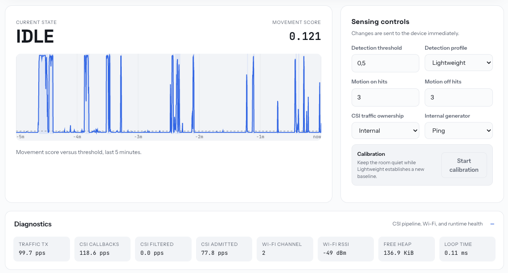

[](https://github.com/francescopace/espectre/blob/main/LICENSE)
[](https://github.com/francescopace/espectre/releases/latest)
main: [![CI main][ci-main-badge]][ci-main-runs] [![C++ runtime coverage main][cpp-main-badge]][ci-main-runs] [![Python coverage main][python-main-badge]][ci-main-runs] [![Web coverage main][web-main-badge]][ci-main-runs]
develop: [![CI develop][ci-develop-badge]][ci-develop-runs] [![C++ runtime coverage develop][cpp-develop-badge]][ci-develop-runs] [![Python coverage develop][python-develop-badge]][ci-develop-runs] [![Web coverage develop][web-develop-badge]][ci-develop-runs]

[ci-main-badge]: https://github.com/francescopace/espectre/actions/workflows/ci.yml/badge.svg?branch=main
[ci-main-runs]: https://github.com/francescopace/espectre/actions/workflows/ci.yml?query=branch%3Amain
[cpp-main-badge]: https://badgen.net/https/github.com/francescopace/espectre/releases/download/snapshot/coverage-cpp-runtime.json
[python-main-badge]: https://badgen.net/https/github.com/francescopace/espectre/releases/download/snapshot/coverage-python.json
[web-main-badge]: https://badgen.net/https/github.com/francescopace/espectre/releases/download/snapshot/coverage-web.json
[ci-develop-badge]: https://github.com/francescopace/espectre/actions/workflows/ci.yml/badge.svg?branch=develop
[ci-develop-runs]: https://github.com/francescopace/espectre/actions/workflows/ci.yml?query=branch%3Adevelop
[cpp-develop-badge]: https://badgen.net/https/github.com/francescopace/espectre/releases/download/snapshot-dev/coverage-cpp-runtime.json
[python-develop-badge]: https://badgen.net/https/github.com/francescopace/espectre/releases/download/snapshot-dev/coverage-python.json
[web-develop-badge]: https://badgen.net/https/github.com/francescopace/espectre/releases/download/snapshot-dev/coverage-web.json

<h1>ESPectre </h1>

**Turn an ESP32 into a private, local Wi-Fi motion sensor.**

When someone moves through a room, they change the way Wi-Fi signals travel through it. ESPectre reads those changes and reports motion in real time. No camera, no microphone, no wearable, and no dedicated radar hardware: just a supported ESP32 and the Wi-Fi network already in the room.

**ESPectre** is an open-source platform that brings together ready-to-flash firmware, an embeddable C++ SDK, a MicroPython implementation, browser tools, a host CLI, an open dataset, open model weights, and the research workflow used to build and validate the detectors.

[**Flash from your browser**](https://espectre.dev/tools/flash/) · [See the live tools](https://espectre.dev/tools/) · [Read the documentation](https://espectre.dev/guides/) · [Explore the SDK](https://espectre.dev/sdk/)

## Applications and integrations

ESPectre can turn on a display or lights when it detects motion, adjust heating and cooling in response to room activity, trigger an alarm or notification when movement occurs in an area that should be empty, and drive other room automations. It connects to Home Assistant through ESPHome or MQTT, exposes a standard Matter occupancy sensor and a local Direct HTTP API, and can be embedded in custom ESP32 firmware through the C++ SDK.

ESPectre processes CSI on the device and reports a motion state and movement score. Applications can react without sending raw sensing data to a cloud service. One board covers one sensing area; room-level coverage normally requires one board per room.

ESPectre detects changes in the radio environment. It does not identify people, count them, prove that a room is empty, or replace a safety-certified security, medical, or emergency system.

## Supported hardware

- ESP32-C6, ESP32-C5, ESP32-C3, ESP32-S3, ESP32-S2, and classic ESP32
- a normal Wi-Fi 4 (802.11n) network on 2.4 GHz

## Choose a firmware path

| Path | Best for | Start here |
|---|---|---|
| **Native** | Standalone sensors, MQTT integrations, including Home Assistant MQTT Discovery, and custom applications | [Native frontend](src/cpp/frontend/native/README.md) |
| **ESPHome** | Home Assistant users who want native entities, ESPHome provisioning, and Device Builder updates | [ESPHome frontend](src/cpp/frontend/esphome/README.md) |
| **Matter** | Matter controllers with occupancy-sensor support; controller validation is still limited | [Matter frontend](src/cpp/frontend/matter/README.md) |
| **Micro-ESPectre** | Lightweight sensing in MicroPython with local, read-only Direct HTTP monitoring | [Micro-ESPectre README](src/python/micro_espectre/README.md) |

Native, ESPHome, and Matter can choose between a `lightweight` detector, which learns a room-specific threshold at startup and leaves more resources to the rest of the application, and a `high_accuracy` detector, which runs the trained model included in the repository. Their behavior and measured trade-offs are documented in [SETUP.md](docs/SETUP.md#detection-profile-availability), [ALGORITHMS.md](docs/ALGORITHMS.md), and the [performance report](docs/performance/README.md).

## Quick start

The quickest path uses the browser and requires no local build environment. Use desktop Chrome 151 or later for the complete hosted workflow. Edge supports browser flashing, but compatibility with Device settings and Monitor is not guaranteed:

1. Open [Flash](https://espectre.dev/tools/flash/) in desktop Chrome or Edge.
2. Connect a [supported ESP32](#supported-hardware) over USB, then choose a firmware and release channel.
3. Complete on-screen Wi-Fi provisioning, or commission Matter with a supported controller.
4. Optionally, open [Device settings](https://espectre.dev/tools/device-settings/) to pin a preferred access point or set up MQTT.
5. Open [Monitor](https://espectre.dev/tools/monitor/) to watch motion, tune detection, and inspect the device.



> **Matter status:** The Matter frontend is still being validated across controller ecosystems. A controller may support standard Matter occupancy sensors without having been tested with current firmware.
> See [Matter controller compatibility](src/cpp/frontend/matter/README.md#matter-controller-compatibility) for the current matrix.

## Local setup

For local builds, flashing from this repository, and the rest of the operator path, start with [SETUP.md](docs/SETUP.md). The repository wrapper exposes the available workflows through:

```bash
./espectre --help
```

## Documentation

| Topic | What it covers | Guides |
|---|---|---|
| **Install and operate** | Device setup, CLI workflows, and detector tuning | [SETUP.md](docs/SETUP.md), [CLI.md](docs/CLI.md), [TUNING.md](docs/TUNING.md) |
| **Understand and integrate** | Runtime architecture, API, discovery, algorithms, and the C++ SDK | [ARCHITECTURE.md](docs/ARCHITECTURE.md), [API.md](docs/API.md), [DISCOVERY.md](docs/DISCOVERY.md), [ALGORITHMS.md](docs/ALGORITHMS.md), [SDK.md](docs/SDK.md) |
| **Collect and train** | CSI collection, model training, feature history, performance, and literature | [ML_DATA_COLLECTION.md](docs/ML_DATA_COLLECTION.md), [ML_TRAINING.md](docs/ML_TRAINING.md), [FEATURES.md](docs/FEATURES.md), [performance report](docs/performance/README.md), [LITERATURE.md](docs/LITERATURE.md) |
| **Research and direction** | Roadmap, architecture decisions, and release history | [ROADMAP.md](docs/ROADMAP.md), [ADR index](docs/adr/README.md), [CHANGELOG.md](docs/CHANGELOG.md) |
| **Frontend reference** | Firmware-path READMEs for ESPHome, Native, Matter, and Micro-ESPectre | [ESPHome](src/cpp/frontend/esphome/README.md), [Native](src/cpp/frontend/native/README.md), [Matter](src/cpp/frontend/matter/README.md), [Micro](src/python/micro_espectre/README.md) |
| **Contributing** | How to contribute and where to discuss the project | [CONTRIBUTING.md](CONTRIBUTING.md), [GitHub Discussions](https://github.com/francescopace/espectre/discussions) |

## Datasets, models, and validation

ESPectre publishes the research assets and validation evidence behind its detectors:

| Asset | What it gives you | Start here |
|---|---|---|
| **CSI dataset** | Real recordings for empty rooms, static presence, and motion, with catalog and provenance in [dataset_info.json](data/dataset_info.json) | [data/](data/) |
| **Model weights** | Trained weights in [C++](src/cpp/core/ml_weights.h) and [Python](tools/lib/ml_weights.py), plus the training, export, and validation workflow | [ML_TRAINING.md](docs/ML_TRAINING.md) |
| **Feature ledger** | Features that were tested, promoted, or rejected, including unsuccessful experiments | [FEATURES.md](docs/FEATURES.md) |
| **Algorithms and reports** | Detector behavior, the generated [performance report](docs/performance/README.md), and the [dataset quality report](data/auto_generated/DATASET_QUALITY_CHECK.md) | [ALGORITHMS.md](docs/ALGORITHMS.md) |
| **Literature and direction** | External research, [architecture decision records](docs/adr/README.md), and the public [roadmap](docs/ROADMAP.md) | [LITERATURE.md](docs/LITERATURE.md) |

## Security, privacy, and transparency

A sensor that can reveal presence should not be a black box. Wi-Fi sensing avoids images and audio, but motion and occupancy data can still reveal routines, sleep, or absence from home. ESPectre treats that risk as part of the engineering work:

- motion detection is local, and cloud connectivity is not required;
- raw CSI collection is optional and intended for defined research and debugging needs;
- the [security and responsible-use guide](https://espectre.dev/security/) documents deployment boundaries, consent, data minimization, abuse reporting, and private vulnerability reporting;
- firmware releases include build-specific SBOMs, notices, and license archives so their contents can be inspected;
- the public website and every browser tool are part of this repository under [docs/web](docs/web/README.md), including their source, privacy rules, analytics contract, and pinned browser dependencies;
- protocols, algorithms, performance evidence, limitations, roadmap decisions, and known validation boundaries are documented in public.

Use ESPectre only in spaces and networks where you have the right to deploy it. Inform affected people, obtain consent where required, protect access to the device and its data, and follow applicable privacy laws.

## Acknowledgments

- Thanks to [Espressif](https://www.espressif.com/) for making CSI accessible in ESP-IDF and for recognizing ESPectre as a [community project](https://github.com/espressif/esp-csi#6-related-resources) in [esp-csi](https://github.com/espressif/esp-csi).
- Thanks to the [MicroPython](https://github.com/micropython/micropython) maintainers for reviewing, testing, and merging [ESPectre's CSI contribution](https://github.com/micropython/micropython/pull/18460), which added direct CSI methods to mainline `network.WLAN`. 

## License

ESPectre first-party code is available under GPLv3, and eligible parts are also available under a separate commercial agreement:

- Choose **GPLv3** when your firmware or application can comply with GPLv3, including making the corresponding source available. See [LICENSE](LICENSE).
- If you want to embed ESPectre in **proprietary or closed-source firmware** without GPLv3 source-disclosure obligations, see [LICENSING.md](LICENSING.md) for commercial licensing. The commercial license covers eligible material and does not replace third-party terms; the ESPHome C++ frontend remains GPLv3-only.

Third-party terms and build-specific compliance artifacts are described in [THIRD_PARTY_NOTICES.md](THIRD_PARTY_NOTICES.md).
