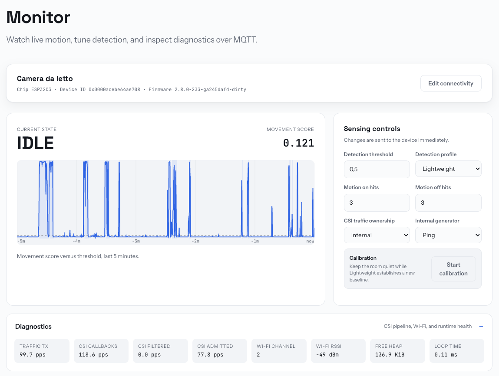

<h1>ESPectre </h1>

**ESPectre** is open-source firmware and tooling for motion sensing with ESP32 Wi-Fi channel state information (CSI). Detection runs on the device, without cameras, microphones, wearables, or radar hardware. ESPectre publishes motion and movement scores through ESPHome or MQTT, and exposes a standard Matter occupancy sensor.

## How It Works

An ESP32 associated with a Wi-Fi network receives packets and reads how the radio channel changes across Wi-Fi frequencies. The detectors track changes in those measurements and produce a movement score and motion state. One board covers one sensing area; room-level coverage requires one board in each room.

## Quick Start

If you want the fastest path, use the browser flasher:

1. Open [espectre.dev/flash](https://espectre.dev/flash/) with a Chromium-based browser
2. Pick the Native, ESPHome, or Matter firmware and ESP32 target
3. Flash the board
4. Open Configure to provision connectivity over Bluetooth, then continue into Monitor

The browser tools share one site:

- [Configure](https://espectre.dev/configure) provisions Native over Bluetooth
- [Monitor](https://espectre.dev/monitor) watches motion, tunes detection, and inspects diagnostics over MQTT
- [Run with the Spectre](https://espectre.dev/game/) and [Theremin](https://espectre.dev/theremin/) provide interactive sensing demos

GitHub Releases provide OTA payloads for ESPHome and Native. ESPHome updates can be compiled through ESPHome Device Builder or installed from a downloaded OTA image with the ESPectre CLI.

Supported hardware:

- ESP32-C6, ESP32-C5, ESP32-C3, ESP32-S3, and classic ESP32
- a normal Wi-Fi network; 2.4 GHz on every board, plus 5 GHz on the ESP32-C5

ESPectre includes two on-device detection profiles because deployments have different accuracy and resource budgets:

| Detection profile | Choose it when | Startup |
|---|---|---|
| `lightweight` | The surrounding firmware needs more CPU time and working memory | Learns a room-specific threshold from about 10 seconds of usable quiet-room data |
| `high_accuracy` | Detection quality matters more than the additional feature state and inference work | Uses a trained threshold and starts after CSI and its feature window are ready |

Startup details and the measured trade-offs are documented in [SETUP.md](docs/SETUP.md#detection-profiles-and-startup) and [ALGORITHMS.md](docs/ALGORITHMS.md).

## Choose a Firmware Path

| Path | Best for | Start here |
| ---- | -------- | ---------- |
| **ESPHome** | Home Assistant users who want the most polished production path | [ESPHome frontend](src/cpp/frontend/esphome/README.md) |
| **Matter** | Controllers with Matter occupancy-sensor support; validation is still limited | [Matter frontend](src/cpp/frontend/matter/README.md) |
| **Native BLE/MQTT** | Standalone devices, Home Assistant MQTT Discovery, web clients, and custom apps | [Native frontend](src/cpp/frontend/native/README.md) |
| **Streamer** | CSI data capture, dataset collection, live experiments, and ML workflows | [Streamer frontend](src/cpp/frontend/streamer/README.md) |
| **Micro-ESPectre** | MicroPython prototyping and optional Home Assistant MQTT Discovery | [Micro-ESPectre README](src/python/micro_espectre/README.md) |
| **SDK** | Custom firmware, smart-device makers, and OEM exploration | [EMBEDDING.md](docs/EMBEDDING.md) |

*Monitor on espectre.dev: live movement score, threshold, detection profile, and diagnostics over MQTT.*

## Responsible Use

ESPectre does not use cameras, microphones, or wearables. It works with derived radio-channel measurements, and the project is designed around a local-first privacy boundary. Motion and occupancy signals can still reveal sensitive patterns such as presence, routines, sleep, and absence from home. Use ESPectre only in spaces where you have the right to deploy it, inform affected people, protect retained data, and follow local privacy laws. See [Security and responsible use](https://espectre.dev/security/) for the project’s technical safeguards, deployment guidance, abuse-reporting channel, and private vulnerability-reporting process.

## Documentation

- **Install and operate:** [SETUP.md](docs/SETUP.md), [CLI.md](docs/CLI.md), and [TUNING.md](docs/TUNING.md)
- **Understand and integrate:** [ARCHITECTURE.md](docs/ARCHITECTURE.md), [EMBEDDING.md](docs/EMBEDDING.md), [ESPECTRE_PROTOCOL.md](docs/ESPECTRE_PROTOCOL.md), and [ALGORITHMS.md](docs/ALGORITHMS.md)
- **Collect and train:** [ML_DATA_COLLECTION.md](docs/ML_DATA_COLLECTION.md), [ML_TRAINING.md](docs/ML_TRAINING.md), [FEATURES.md](docs/FEATURES.md), and the generated [performance report](docs/performance/README.md)
- **Research and direction:** [LITERATURE.md](docs/LITERATURE.md), [ROADMAP.md](docs/ROADMAP.md), the [ADR index](docs/adr/README.md), and [CHANGELOG.md](docs/CHANGELOG.md)
- **Frontend reference:** [ESPHome](src/cpp/frontend/esphome/README.md), [Native](src/cpp/frontend/native/README.md), [Matter](src/cpp/frontend/matter/README.md), and [Streamer](src/cpp/frontend/streamer/README.md)
- **Contributing:** [CONTRIBUTING.md](CONTRIBUTING.md) and [GitHub Discussions](https://github.com/francescopace/espectre/discussions)

## Related Projects

- [radio-presence-scanner](https://github.com/francescopace/radio-presence-scanner): complementary BLE radio presence sensing from host devices, with an optional HTTP dashboard.
- [micropython-esp32-csi](https://github.com/francescopace/micropython-esp32-csi): historical development fork that led to upstream MicroPython ESP32 CSI support.

## Acknowledgments

- Thanks to [Espressif](https://www.espressif.com/) for making CSI accessible in ESP-IDF and for recognizing ESPectre as a [community project](https://github.com/espressif/esp-csi#6-related-resources) in [esp-csi](https://github.com/espressif/esp-csi).
- Thanks to the TOMMY team for the constructive public discussion around Wi-Fi sensing approaches, including their [TOMMY vs ESPectre](https://www.tommysense.com/docs/comparisons/espectre-comparison) comparison page.
- Thanks to the [MicroPython](https://github.com/micropython/micropython) maintainers for reviewing, testing, and merging our [PR](https://github.com/micropython/micropython/pull/18460), which added direct ESP32 Wi-Fi CSI methods to the mainline `network.WLAN` implementation. Micro-ESPectre can therefore use a mainline MicroPython revision instead of a project-specific CSI fork.

## License

ESPectre is dual-licensed:

- **GPLv3** for open-source use: see [LICENSE](LICENSE).
- **Commercial licenses** for embedding ESPectre into proprietary firmware: see [LICENSING.md](LICENSING.md).

Third-party terms and build-specific compliance artifacts are described in [THIRD_PARTY_NOTICES.md](THIRD_PARTY_NOTICES.md).
