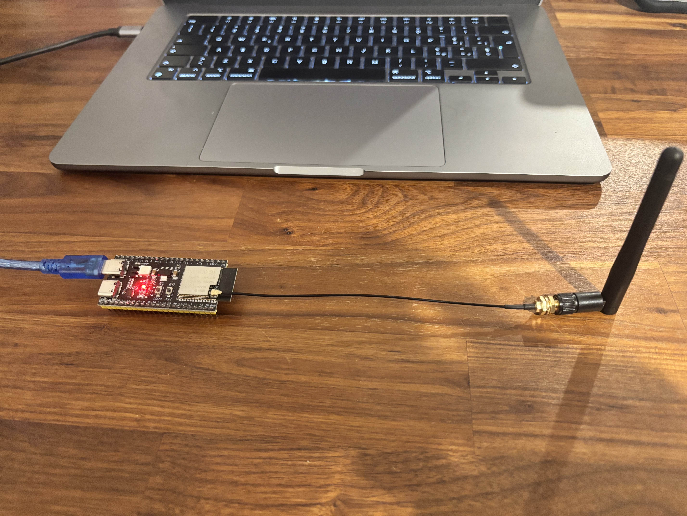
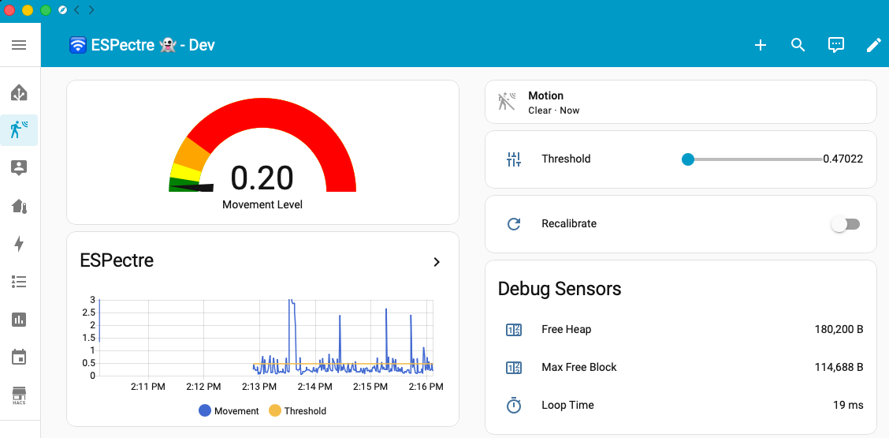

[](https://github.com/francescopace/espectre/blob/main/LICENSE)
[](https://www.espressif.com/en/products/socs)
[](https://esphome.io/)
[](https://csa-iot.org/all-solutions/matter/)
[](src/cpp/frontend/native/README.md)
[](https://github.com/francescopace/espectre/actions/workflows/ci.yml?query=branch%3Amain)
[](https://codecov.io/gh/francescopace/espectre)

# 🛜 ESPectre 👻

**Privacy-first Wi-Fi sensing platform based on CSI, with native Home Assistant and Matter integration.**

> [!IMPORTANT]
> **Upstream milestone**: the ESP32 Wi-Fi CSI support used by the Micro-ESPectre workflow was contributed upstream and merged into [micropython/micropython#18460](https://github.com/micropython/micropython/pull/18460) for the `1.29.0` release cycle. Announcement is available in [Discussion #142](https://github.com/francescopace/espectre/discussions/142).

---

## Table of Contents

- [In 3 Points](#in-3-points)
- [What You Need](#what-you-need)
- [Quick Start](#quick-start)
- [How It Works](#how-it-works-simple-version)
- [What You Can Do With It](#what-you-can-do-with-it)
- [Sensor Placement Guide](#where-to-place-the-sensor)
- [System Architecture](#system-architecture)
- [Codebase Architecture](#codebase-architecture)
- [FAQ](#faq-for-beginners)
- [Security and Privacy](#security-and-privacy)
- [Technical Deep Dive](#technical-deep-dive)
- [Two-Platform Strategy](#two-platform-strategy)
- [Future Evolution](#future-evolution)
- [Documentation](#documentation)
- [Media](#media)
- [Related Projects](#related-projects)
- [Acknowledgments](#acknowledgments)
- [License](#license)
- [Author](#author)

---

## In 3 Points

1. **What it does**: Detects movement using Wi-Fi and is evolving into a broader sensing platform
2. **What you need**: A ~€10 ESP32 device (S3 and C6 recommended, other variants supported)
3. **Setup time**: 10-15 minutes

---

## What You Need

### Hardware

- **2.4GHz Wi-Fi Router** - the one you already have at home works fine
- **ESP32 with CSI support** - ESP32-C3, ESP32-C5, ESP32-C6, ESP32-S3 or ESP32. See [SETUP.md](docs/SETUP.md) for the shared setup hub and frontend entry points.


*ESP32-S3 DevKit with external antennas*
---

## Quick Start

1. **Setup & Installation**: Start from [SETUP.md](docs/SETUP.md) to choose the right frontend path, or go directly to the [web flasher](https://espectre.dev/flash/)
2. **Tuning**: Optimize for your environment with [TUNING.md](docs/TUNING.md)

Repository CLI namespaces:
- `./espectre micro ...` for MicroPython flashing, deploy, streaming, dataset collection, and MQTT control
- `./espectre esphome ...` for local ESPHome build/flash/config/logs workflows
- `./espectre native ...` for the standalone native firmware `idf.py` workflow
- `./espectre matter ...` for Matter `idf.py` build/flash/monitor
- `./espectre streamer ...` for streamer firmware `idf.py` build/flash/monitor


*Home Assistant dashboard with real-time motion detection, threshold control, and debug sensors*

---

## How It Works

When someone moves in a room, they "disturb" the Wi-Fi waves traveling between the router and the sensor. It's like when you move your hand in front of a flashlight and see the shadow change.

The ESP32 device "listens" to these changes and understands if there's movement.

### Advantages

- **No cameras** (total privacy)
- **No wearables needed** (no bracelets or sensors to wear)
- **Works through walls** (Wi-Fi passes through walls)
- **Very cheap** (~€10 total)

Want to understand the technical details? See [ALGORITHMS.md](docs/ALGORITHMS.md) for CSI explanation and signal processing documentation.

---

## What You Can Do With It

### Practical Examples

- **Home security**: Get an alert if someone enters while you're away
- **Elderly care**: Monitor activity to detect falls or prolonged inactivity
- **Smart automation**: Turn on lights/heating only when someone is present
- **Energy saving**: Automatically turn off devices in empty rooms
- **Child monitoring**: Alert if they leave the room during the night
- **Climate control**: Heat/cool only occupied zones

---

## Where to Place the Sensor

Optimal sensor placement is crucial for reliable movement detection.

### Recommended Distance from Router

**Optimal range: 3-8 meters**

| Distance | Signal | Multipath | Sensitivity | Noise | Recommendation |
|----------|--------|-----------|-------------|-------|----------------|
| < 2m | Too strong | Minimal | Low | Low | ❌ Too close |
| 3-8m | Strong | Good | High | Low | ✅ **Optimal** |
| > 10-15m | Weak | Variable | Low | High | ❌ Too far |

### Placement Tips

**Do:**
- Position sensor in the area to monitor (not necessarily in direct line with router)
- Height: 1-1.5 meters from ground (desk/table height)
- External antenna: Use IPEX connector for better reception

**Don't:**
- Avoid metal obstacles between router and sensor (refrigerators, metal cabinets)
- Avoid corners or enclosed spaces (reduces multipath diversity)

---

## System Architecture

### Processing Pipeline

ESPectre uses a focused processing pipeline for motion detection:

```
┌─────────────┐
│  CSI Data   │  Raw Wi-Fi Channel State Information
└──────┬──────┘
       │
       ▼
┌─────────────┐
│  Gain Lock  │  AGC/FFT stabilization (~3 seconds)
│             │  Locks hardware gain for stable measurements
└──────┬──────┘
       │
       ▼
┌─────────────┐
│   Startup   │  Fixed shared subcarriers + threshold bootstrap
│ Calibration │  Keeps the same 12 subcarriers for MVS and ML
└──────┬──────┘
       │
       ▼
┌─────────────┐
│  Adaptive   │  auto: P95 × 1.1 | min: P100
│  Threshold  │  or fixed manual value
└──────┬──────┘
       │
       ▼
┌─────────────┐
│   Hampel    │  Turbulence outlier removal
│   Filter    │  (enabled by default)
└──────┬──────┘
       │
       ▼
┌─────────────┐
│  Low-pass   │  Noise reduction (smoothing)
│   Filter    │  (optional, disabled by default)
└──────┬──────┘
       │
       ▼
┌─────────────┐
│ Detection   │  MVS or ML score
│ Evaluation  │  every evaluation_interval packets
└──────┬──────┘
       │
       ▼
┌─────────────┐
│ Hit Filter  │  motion_on_hits / motion_off_hits
│             │  edge-driven IDLE ↔ MOTION
└──────┬──────┘
       │
       ▼
┌─────────────┐
│ Home        │  Edge-driven motion binary +
│ Assistant   │  periodic Movement Score / Threshold
└─────────────┘
```

### Single or Multiple Sensors

```
┌─────────┐  ┌─────────┐  ┌─────────┐
│ ESP32   │  │ ESP32   │  │ ESP32   │
│ Room 1  │  │ Room 2  │  │ Room 3  │
└────┬────┘  └────┬────┘  └────┬────┘
     │            │            │
     └────────────┴────────────┘
                  │
                  │ ESPHome Native API
                  ▼
         ┌────────────────────┐
         │   Home Assistant   │
         │   (Auto-discovery) │
         └────────────────────┘
```

Each sensor is automatically discovered by Home Assistant with:
- Binary sensor for motion detection, published immediately on state edges
- Movement score sensor, published on the periodic cadence
- Adjustable threshold (number entity)

Today, the main user-facing integration is still ESPHome + Home Assistant. The
same internal architecture now also supports Matter and native frontends, plus
future local orchestration layers that can combine events from multiple sensors
across the home.

### Calibration

> ⚠️ **IMPORTANT** (MVS mode): Keep the room **quiet and still** for about 10 seconds after device boot. The startup calibration runs during this time and movement will affect detection accuracy. ML Detector skips this threshold bootstrap.

For algorithm details, see [ALGORITHMS.md](docs/ALGORITHMS.md).

---

## Codebase Architecture

The runtime processing pipeline above is implemented with a separate internal code layout:

- `src/cpp/core/` for reusable detectors, filters, thresholds, and domain logic
- `src/cpp/runtime/` for the shared runtime contract and `src/cpp/runtime/esp_idf/` for the current ESP-IDF CSI/Wi-Fi/calibration implementation
- `src/cpp/frontend/esphome/espectre/` for the ESPHome adapter and packaging entrypoint
- `src/cpp/frontend/native/espectre/` for the standalone native adapter and firmware app
- `src/cpp/frontend/matter/espectre/` for the Matter adapter and esp-matter firmware app
- `src/cpp/frontend/streamer/espectre/` for the standalone CSI streamer frontend and UDP transport

```text
┌──────────────────────────────────┐
│ Frontend                         │
│ (ESPHome, native, Matter, streamer) │
└──────────────┬───────────────────┘
               │ uses
               ▼
┌──────────────────────────────────┐
│ Runtime                          │
│ (Wi-Fi, CSI, orchestration)      │
└──────────────┬───────────────────┘
               │ drives
               ▼
┌──────────────────────────────────┐
│ Core                             │
│ (detectors, filters, math, types)│
└──────────────┬───────────────────┘
```

This split keeps decoupled core logic from runtimes and frontends:

- the standalone native frontend under `src/cpp/frontend/native/`
- the Matter frontend under `src/cpp/frontend/matter/`
- the streamer frontend under `src/cpp/frontend/streamer/`
- alternate runtimes
- standalone reuse of the shared motion-detection core
- custom firmware targets built from the same reusable platform layers
- future local services that aggregate normalized signals from multiple devices

Frontend-local source of truth documents:

- [ESPHome Frontend](src/cpp/frontend/esphome/README.md)
- [Native Frontend](src/cpp/frontend/native/README.md)
- [Matter Frontend](src/cpp/frontend/matter/README.md)
- [Streamer Frontend](src/cpp/frontend/streamer/README.md)

See [ARCHITECTURE.md](docs/ARCHITECTURE.md) for the detailed rationale, folder structure, and reuse model.

---

## FAQ for Beginners

<details>
<summary>Click to expand FAQ</summary>

**Q: Do I need programming knowledge to use it?**  
A: No! ESPectre uses YAML configuration files. Just download the example, flash it, and configure WiFi via the ESPHome app or web interface.

**Q: Does it work with my router?**  
A: Yes, if your router has 2.4GHz Wi-Fi (virtually all modern routers have it).

**Q: How much does it cost in total?**  
A: Hardware: ~€10 for an ESP32 device (S3/C6 recommended, other variants also work). Software: All free and open source. You'll also need Home Assistant running somewhere (Raspberry Pi ~€35-50, or any existing PC/NAS).

**Q: Do I need to modify anything on the router?**  
A: No! The router works normally. The sensor "listens" to Wi-Fi signals without modifying anything.

**Q: Does it work through walls?**  
A: Yes, the 2.4GHz Wi-Fi signal penetrates drywall. Reinforced concrete walls reduce sensitivity but detection remains possible at reduced distances.

**Q: How many sensors are needed for a house?**  
A: It depends on size. One sensor can monitor ~50 m². For larger homes, use multiple sensors (1 sensor every 50-70 m² for optimal coverage).

**Q: Can it distinguish between people and pets?**  
A: The system uses a 2-state segmentation model (IDLE/MOTION) that identifies generic movement without distinguishing between people, pets, or other moving objects. For more sophisticated classification (people vs pets, activity recognition, gesture detection), trained AI/ML models would be required (see [Future Evolution](#future-evolution) section).

**Q: Does it work with mesh Wi-Fi networks?**  
A: Yes, it works normally. Make sure the ESP32 connects to the 2.4 GHz band.

**Q: How accurate is the detection?**  
A: Detection accuracy is highly environment-dependent and requires proper tuning. Factors affecting performance include: room layout, wall materials, furniture placement, distance from router (optimal: 3-8m), and interference levels. In optimal conditions with proper tuning, the system provides reliable movement detection. Adjust the `segmentation_threshold` parameter to tune sensitivity for your specific environment.

**Q: What's the power consumption?**  
A: ~500mW typical during continuous operation. The firmware includes support for power optimization, and deep sleep modes can be implemented for battery-powered deployments, though this would require custom modifications to the code.

**Q: If it doesn't work, can I get help?**  
A: Yes, open an [Issue on GitHub](https://github.com/francescopace/espectre/issues) or contact me via email.

</details>

---

## Security and Privacy

<details>
<summary>Privacy, Security & Ethical Considerations (click to expand)</summary>

### Nature of Collected Data

The system collects **anonymous data** related to the physical characteristics of the Wi-Fi radio channel:
- Amplitudes and phases of OFDM subcarriers
- Statistical signal variances
- **NOT collected**: personal identities, communication contents, images, audio

CSI data represents only the properties of the transmission medium and does not contain direct identifying information.

### Privacy Advantages

- **No cameras**: Respect for visual privacy
- **No microphones**: No audio recording
- **No wearables**: Doesn't require wearable devices
- **Aggregated data**: Only statistical metrics, not raw identifying data

### ⚠️ Disclaimer and Ethical Considerations

**WARNING**: Despite the intrinsic anonymity of CSI data, this system can be used for:

- **Non-consensual monitoring**: Detecting presence/movement of people without their explicit consent
- **Behavioral profiling**: With advanced AI models, inferring daily life patterns
- **Domestic privacy violation**: Tracking activities inside private homes

### Usage Responsibility

**The user is solely responsible for using this system and must:**

1. **Obtain explicit consent** from all monitored persons
2. **Respect local regulations** (GDPR in EU, local privacy laws)
3. **Clearly inform** about the presence of the sensing system
4. **Limit use** to legitimate purposes (home security, personal home automation)
5. **Protect data** with encryption and controlled access
6. **DO NOT use** for illegal surveillance, stalking, or violation of others' privacy

</details>

---

## Technical Deep Dive

For algorithm details (MVS, fixed subcarriers, Hampel filter), see [ALGORITHMS.md](docs/ALGORITHMS.md).

For performance metrics (confusion matrix, F1-score, benchmarks), see [PERFORMANCE.md](docs/PERFORMANCE.md).

---

## Two-Platform Strategy

This project follows a **dual-platform approach** to balance innovation speed with production stability while the main repository evolves from a single integration into a reusable sensing platform:

### ESPectre (This Repository) - Product Platform

**Target**: End users, smart home enthusiasts, integrators, and future multi-frontend deployments

- **ESPHome-first product path** with native Home Assistant integration
- **BLE and Matter frontends available** for alternate integration surfaces
- **Shared core/runtime/frontend architecture** for reusable firmware builds
- **YAML configuration** - no programming required
- **Auto-discovery** - devices appear automatically in Home Assistant
- **Production-ready** - stable, tested, easy to deploy
- **Platform direction** - supports custom firmware targets and future orchestration layers

### [Micro-ESPectre](docs/MICRO_ESPECTRE.md) - R&D Platform

**Target**: Researchers, developers, academic/industrial applications

- **Python/MicroPython** implementation for rapid prototyping
- **MQTT-based** - flexible integration (not limited to Home Assistant)
- **Fast iteration** - test new algorithms in seconds, not minutes
- **Analysis tools** - comprehensive suite for CSI data analysis
- **Use cases**: Academic research, industrial sensing, algorithm development

Micro-ESPectre gives you the fundamentals for:
- **People counting**
- **Activity recognition** (walking, falling, sitting, sleeping)
- **Localization and tracking**
- **Gesture recognition**

### Development Flow

```
┌─────────────────────┐     Validated      ┌──────────────────────┐
│   Micro-ESPectre    │ ─────────────────► │      ESPectre        │
│   (R&D Platform)    │    algorithms      │ (Production Platform)│
│                     │                    │                      │
│ • Fast prototyping  │                    │ • Multiple frontends │
│ • Algorithm testing │                    │ • Home Assistant     │
│ • Data analysis     │                    │ • End-user ready     │
│ • MQTT flexibility  │                    │ • Reusable platform  │
└─────────────────────┘                    └──────────────────────┘
```

**Innovation cycle**: New features and algorithms are first developed and validated in Micro-ESPectre (Python), then ported to ESPectre (C++) once proven effective.

For local development, the repository CLI is rooted at `./espectre`:
- `./espectre micro ...` for MicroPython tooling, data collection, and MQTT control
- `./espectre esphome ...` for local ESPHome build/flash/config/logs workflows
- `./espectre native ...`, `./espectre matter ...`, and `./espectre streamer ...` as thin `idf.py` wrappers

---

## Future Evolution

While ESPectre v2.x focuses on **motion detection** (MVS + adaptive threshold bootstrap), the project is now evolving along multiple connected directions: platform modularization, multi-frontend support, practical presence and occupancy inference, and later-stage research tracks.

| Capability | Status | Description |
|------------|--------|-------------|
| **Core / Runtime / Frontend platform split** | In Progress | Reusable architecture for multiple frontends and custom firmware |
| **Matter Frontend** | Available (experimental) | Compatibility path for Apple / Google / Alexa ecosystems via Matter |
| **Presence / Occupancy Inference** | In Progress | Practical amplitude-first sensing beyond binary motion |
| **Managed Cloud Profile** | Planned | Optional privacy-first cloud layer for multi-room state, device visibility, alerting, history, and fleet management |
| **Gesture Recognition** | Deferred | Future research/product phase after the current platform and orchestration work |
| **Human Activity Recognition** | Deferred | Future research/product phase after the current platform and orchestration work |
| **People Counting** | Planned | Estimate number of people in a room |
| **3D Localization** | Research | Stage-gated research track for precise indoor positioning |

The ML Detector is already available with `detection_algorithm: ml` in your YAML configuration. For algorithm details, see [ALGORITHMS.md](docs/ALGORITHMS.md#ml-neural-network-detector) and `PERFORMANCE.md` for current metrics.

The ML data collection and training infrastructure is documented in [ML_DATA_COLLECTION.md](docs/ML_DATA_COLLECTION.md). The broader product direction and sequencing between platform work, frontends, cloud orchestration, and research tracks are described in [ROADMAP.md](docs/ROADMAP.md), with the device protocol in [ESPECTRE_PROTOCOL.md](docs/ESPECTRE_PROTOCOL.md) and the local/cloud architecture profiles in [ARCHITECTURE.md](docs/ARCHITECTURE.md).

---

## Documentation

### ESPectre (Production)

| Document | Description |
|----------|-------------|
| [Intro](README.md) | (This file) Project overview, quick start, FAQ |
| [Setup Guide](docs/SETUP.md) | Shared setup hub and frontend chooser for ESPHome, native, Matter, and streamer workflows |
| [Tuning Guide](docs/TUNING.md) | Parameter tuning for optimal detection |
| [Performance](docs/PERFORMANCE.md) | Benchmarks, confusion matrix, F1-score |
| [Architecture Guide](docs/ARCHITECTURE.md) | Internal source layout, `core` / `runtime` / `frontend` split, local lab profile, managed cloud profile, and orchestration alignment |
| [Test Suite](test/cpp/README.md) | Layered CMake/CTest suite, coverage flow, and support layout |
| [ESPHome Frontend](src/cpp/frontend/esphome/README.md) | Local source of truth for the ESPHome integration surface |
| [Native Frontend](src/cpp/frontend/native/README.md) | Native frontend firmware workflow, provisioning notes, and frontend-specific troubleshooting |
| [Matter Frontend](src/cpp/frontend/matter/README.md) | Local source of truth for the Matter surface and firmware workflow |
| [Streamer Frontend](src/cpp/frontend/streamer/README.md) | Local source of truth for the CSI UDP streamer surface |
| [The Game](docs/web/game/README.md) | Browser game example built on the native frontend protocol over BLE, with interactive threshold tuning |
| [ESPectre Protocol](docs/ESPECTRE_PROTOCOL.md) | Shared device protocol, payloads, topics, transport mapping, and privacy boundary |

### Micro-ESPectre (R&D)

| Document | Description |
|----------|-------------|
| [Intro](docs/MICRO_ESPECTRE.md) | R&D platform overview, CLI, MQTT, Web Monitor |
| [Algorithms](docs/ALGORITHMS.md) | Scientific documentation of MVS, fixed subcarriers, Hampel filter |
| [Analysis Tools](tools/README.md) | CSI analysis and optimization scripts |
| [ML Data Collection](docs/ML_DATA_COLLECTION.md) | Building labeled datasets for machine learning |
| [References](docs/MICRO_ESPECTRE.md#references) | Academic papers and research resources |

### Project

| Document | Description |
|----------|-------------|
| [Roadmap](docs/ROADMAP.md) | Project vision, platform evolution, orchestration path, and research tracks |
| [Contributing](CONTRIBUTING.md) | How to contribute (code, data, docs) |
| [Changelog](docs/CHANGELOG.md) | Version history and release notes |
| [Security](SECURITY.md) | Security policy and vulnerability reporting |
| [Code of Conduct](CODE_OF_CONDUCT.md) | Community guidelines |

---

## Media

| Articles | Title |
|-------------|-------|
| Medium | [How I Turned My Wi-Fi Into a Motion Sensor - Part 1](https://medium.com/@francesco.pace/how-i-turned-my-wi-fi-into-a-motion-sensor-61a631a9b4ec?sk=c7f79130d78b0545fce4a228a6a79af3&utm_source=github&utm_medium=readme&utm_campaign=espectre) |
| Medium | [How I Turned My Wi-Fi Into a Motion Sensor - Part 2](https://medium.com/@francesco.pace/how-i-turned-my-wi-fi-into-a-motion-sensor-part-2-62038130e530?sk=7c8b6f11cf3fcb8d279648016ebff72a&utm_source=github&utm_medium=readme&utm_campaign=espectre) |
| IoT For All | [How I Turned My Wi-Fi Into a Motion Sensor](https://www.iotforall.com/wifi-motion-sensor-iot) |
| Hackaday | [Make Your Own ESP32-Based Person Sensor, No Special Hardware Needed](https://hackaday.com/2026/01/28/make-your-own-esp32-based-person-sensor-no-special-hardware-needed/) |
| Adafruit Learn | [ESPectre Human Detector for Feather](https://learn.adafruit.com/espectre-human-detector-for-feather) |
| Seeed Studio Wiki | [Deploying Espectre on Seeed Studio XIAO ESP32 Series with ESPHome](https://wiki.seeedstudio.com/xiao-esp32--series-espresense/) |
| Gigazine | [ESPectre turns your home Wi-Fi into a motion sensor without machine learning and integrates it with Home Assistant](https://gigazine.net/gsc_news/en/20251118-turned-wi-fi-motion-sensor/) |

| Blog | Discussion |
|----------|------------|
| Home Assistant | [ESPectre - Wi-Fi Motion Detection for Home Assistant](https://community.home-assistant.io/t/espectre-wi-fi-motion-detection-for-home-assistant/961251) |
| Hacker News | [Show HN: ESPectre - Motion detection based on Wi-Fi spectre analysis](https://news.ycombinator.com/item?id=45953977) |

| Podcasts | Episode |
|-------------|---------|
| Hackaday | [Podcast Episode 355: Person Detectors, Walkie Talkies, Open Smartphones...](https://hackaday.com/2026/01/30/hackaday-podcast-episode-355-person-detectors-walkie-talkies-open-smartphones-and-a-wifi-traffic-light/) |

---

## Related Projects

- [radio-presence-scanner](https://github.com/francescopace/radio-presence-scanner): complementary presence-sensing project focused on BLE radio observations from host devices (Python), with optional HTTP dashboard.
- [micropython-esp32-csi](https://github.com/francescopace/micropython-esp32-csi): custom MicroPython fork exposing ESP32 CSI APIs, used as the firmware foundation for rapid CSI prototyping in the Micro-ESPectre workflow.

---

## Acknowledgments

ESPectre leverages the native Wi-Fi CSI capabilities of ESP32 chips. Thanks to [Espressif](https://www.espressif.com/) for making CSI accessible in the ESP-IDF framework and for recognizing ESPectre as a [community project](https://github.com/espressif/esp-csi#6-related-resources) in their [esp-csi](https://github.com/espressif/esp-csi) repository.

Micro-ESPectre is built on MicroPython-based firmware.
Thanks to the MicroPython maintainers for reviewing, testing, and merging the upstream ESP32 CSI support into `micropython/micropython` via [PR #18460](https://github.com/micropython/micropython/pull/18460).

Thanks also to the TOMMY team for the constructive and supportive public discussion around Wi-Fi sensing approaches, including their [TOMMY vs ESPectre](https://www.tommysense.com/docs/comparisons/espectre-comparison) comparison page.

---

## License

This project is released under the **GNU General Public License v3.0 (GPLv3)**.

GPLv3 ensures that:
- The software remains free and open source
- Anyone can use, study, modify, and distribute it
- Modifications must be shared under the same license
- Protects end-user rights and software freedom

See [LICENSE](LICENSE) for the full license text.

Contributions are submitted under GPLv3 and must include a DCO
`Signed-off-by` trailer on each commit (`git commit -s`).

## Author

**Francesco Pace**  
Email: [francesco.pace@espectre.dev](mailto:francesco.pace@espectre.dev)  
LinkedIn: [linkedin.com/in/francescopace](https://www.linkedin.com/in/francescopace/)

If you find ESPectre useful and want to support its development, you can buy me a coffee. It's completely optional.
I work on this project because I'm passionate about it. Contributions help me buy new hardware to expand the list of tested and supported devices, and dedicate more time to new features.

<a href="https://www.buymeacoffee.com/espectre" target="_blank"></a>
