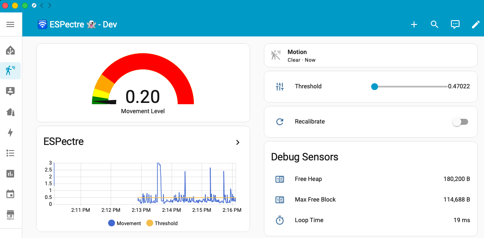

[](https://github.com/francescopace/espectre/blob/main/LICENSE)
[](https://esphome.io/)
[](https://www.espressif.com/en/products/socs)
[](https://github.com/francescopace/espectre/releases/latest)
[](https://github.com/francescopace/espectre/actions/workflows/ci.yml?query=branch%3Amain)
[](https://codecov.io/gh/francescopace/espectre)

<h1>ESPectre </h1>

**ESPectre** is an open-source Wi-Fi sensing platform for ESP32 devices.

It detects motion from ordinary Wi-Fi signals, without cameras, microphones, wearables, or radar hardware.  
It integrates directly with Home Assistant through ESPHome or Native MQTT
Discovery and offers a standards-based Matter occupancy-sensor path whose
controller coverage is still being validated. It can also connect over BLE,
MQTT, or custom integrations.

## How It Works

Wi-Fi signals bounce around a room. When a person moves, those reflections change.  
ESPectre analyzes those changes and turns tiny radio-channel variations into motion and movement-score signals.

ESPectre includes two on-device detectors:

- `classic`, the default signal-processing detector with adaptive startup calibration
- `ml`, a project-trained neural model with open weights, open data, and an open-source training pipeline

For the signal-processing details, see [ALGORITHMS.md](docs/ALGORITHMS.md).  
For the ML workflow, training pipeline, and model export path, see [ML_TRAINING.md](docs/ML_TRAINING.md).  
For benchmarks and performance notes, see [docs/performance](docs/performance/README.md).

## Why It Matters

ESPectre needs just one device to work, but you can put one in every room to build a room-level detection mesh:

- **Smart home ready**: ESPHome provides the most complete Home Assistant
  surface, while Native supports broker-based setups through MQTT Discovery.
- **Matter path**: Matter firmware exposes a standard occupancy sensor.
  Controller validation is still limited; see the
  [Matter frontend](src/cpp/frontend/matter/README.md) for the current matrix.
- **Native firmware**: standalone BLE, MQTT, OTA, and Home Assistant MQTT
  Discovery firmware works with or without Home Assistant and can be driven by
  web clients or custom integrations.
- **SDK-oriented architecture**: shared `core`, `runtime`, and `frontend` layers make ESPectre easier to embed in custom ESP32 firmware and OEM products.
- **Research and ML tooling**: streamer firmware, collection tools, and training docs support CSI dataset creation and future sensing models.

With ESPectre, ordinary Wi-Fi smart devices can double as ambient sensing nodes.  
Lights, switches, HVAC devices, appliances, and custom ESP32 products can add motion or occupancy awareness without cameras or dedicated sensors.

## Quick Start

If you want the fastest path, use the browser flasher:

1. Open [espectre.dev/flash](https://espectre.dev/flash/) with a Chromium-based browser
2. Pick the ESPHome, Native, or Matter base firmware and ESP32 target
3. Flash the board
4. Configure Wi-Fi and the remaining parameters by following the on-screen instructions

The browser tools share one site:

- [Configure](https://espectre.dev/configure/) provisions and tunes Native over BLE
- [MQTT Monitor](https://espectre.dev/monitor/) displays telemetry and device controls
- [The Game](https://espectre.dev/game/) and [Theremin](https://espectre.dev/theremin/) provide interactive sensing demos

GitHub Releases also provide Native OTA payloads; ESPHome updates are compiled
and installed through ESPHome Device Builder after the device is adopted.

Supported hardware:

- ESP32-C6, ESP32-C5, ESP32-C3, ESP32-S3, and classic ESP32
- a normal Wi-Fi network; 2.4 GHz on every board, plus 5 GHz on the ESP32-C5


*ESP32-S3 DevKit boards with external antennas*

## Build Your Own Path


| Path                   | Best for                                                                    | Start here                                                   |
| ---------------------- | --------------------------------------------------------------------------- | ------------------------------------------------------------ |
| **ESPHome**            | Home Assistant users who want the most polished production path             | [ESPHome frontend](src/cpp/frontend/esphome/README.md)       |
| **Matter**             | Controllers with Matter occupancy-sensor support; validation is still limited | [Matter frontend](src/cpp/frontend/matter/README.md)         |
| **Native BLE/MQTT**    | Standalone devices, Home Assistant MQTT Discovery, web clients, and custom apps | [Native frontend](src/cpp/frontend/native/README.md)         |
| **Streamer**           | CSI data capture, dataset collection, live experiments, and ML workflows    | [Streamer frontend](src/cpp/frontend/streamer/README.md)     |
| **Micro-ESPectre**     | Python/MicroPython prototyping and optional Home Assistant MQTT Discovery   | [Micro-ESPectre README](src/python/micro_espectre/README.md) |
| **SDK-oriented reuse** | Custom firmware, smart-device makers, and OEM exploration                   | [ARCHITECTURE.md](docs/ARCHITECTURE.md)                      |


For shared prerequisites and supported targets, use [SETUP.md](docs/SETUP.md).
For the repository CLI surface, use [CLI.md](docs/CLI.md).



*ESPHome dashboard with motion state, movement score, detector selection, threshold control, and recalibration*

## Platform Architecture

ESPectre v3 is organized around reusable layers:

```text
Frontend  ->  Runtime  ->  Core
```

- `src/cpp/core/`: detectors, filters, math, domain types, and ML weights
- `src/cpp/runtime/`: CSI, Wi-Fi, calibration, runtime contracts, and protocol services
- `src/cpp/frontend/`: ESPHome, native, Matter, and streamer firmware surfaces

This split keeps sensing logic independent from any single ecosystem and makes custom firmware reuse practical.  
It also creates a practical path for smart-device integrations where ESPectre sensing is one feature inside a larger product.

Use:

- [ARCHITECTURE.md](docs/ARCHITECTURE.md) for the current internal model
- [ESPECTRE_PROTOCOL.md](docs/ESPECTRE_PROTOCOL.md) for the shared BLE/MQTT protocol
- [ADR Guide](docs/adr/README.md) for the historical decision record


## For Device Makers

ESPectre v3 is designed to be more than a reference firmware.  
Smart-device makers can reuse the shared sensing layers inside ESP32-based products and map the runtime to their own product surface.

Useful starting points:

- embed `core` and `runtime` logic in custom firmware
- use the native BLE/MQTT frontend as a standalone integration baseline
- build a custom frontend over the same runtime contract
- keep telemetry derived and minimal through ESPectre Protocol
- discuss OEM-style integration needs in [GitHub Discussions](https://github.com/francescopace/espectre/discussions)


## Why Wi-Fi Sensing Now

ESPectre is built on today's ESP32 CSI APIs, but the broader industry is moving in the same direction.  
IEEE 802.11bf, also known as Wi-Fi Sensing, standardizes sensing-oriented Wi-Fi capabilities so future chipsets and products can expose motion, presence, and activity signals through vendor-supported interfaces.

That matters for ESPectre: the project already has reusable sensing logic, runtime boundaries, protocol semantics, data tooling, and multiple frontend surfaces. 
 When a vendor ships a microcontroller or embedded Wi-Fi platform with practical 802.11bf-style sensing support, ESPectre is structurally close to integrating it as another runtime instead of starting over.

## Roadmap


| Version  | Direction                                                                                                                      |
| -------- | ------------------------------------------------------------------------------------------------------------------------------ |
| **v1.x** | Proved Wi-Fi motion detection on ESP32                                                                                         |
| **v2.x** | Made ESPectre useful for Home Assistant through ESPHome and Micro-ESPectre                                                     |
| **v3.x** | Turns ESPectre into a modular Wi-Fi sensing platform with Matter, Native MQTT Discovery, streamer tooling, and SDK-oriented reuse |
| **v4.x** | Adds a privacy-first web orchestration layer for multi-node sensing, device management, history, alerts, and remote visibility |


The v4 web layer is intended to support local, self-hosted, and future managed
service deployments while keeping ESPectre local-first by default.

See [ROADMAP.md](docs/ROADMAP.md) for the detailed plan.

## Community

ESPectre is already useful, but the next jump depends on broader real-world coverage. Helpful contributions include:

- testing v3 firmware on different ESP32 boards and routers
- reporting Matter, native BLE/MQTT, and ESPHome behavior
- collecting `empty`, `static_presence`, and `motion` datasets
- improving setup and tuning docs for real homes and labs
- exploring custom firmware or OEM-style integrations on top of the shared platform

Start with [CONTRIBUTING.md](CONTRIBUTING.md), dataset collection in [ML_DATA_COLLECTION.md](docs/ML_DATA_COLLECTION.md), and design discussions in [GitHub Discussions](https://github.com/francescopace/espectre/discussions).

## Responsible Use

ESPectre does not use cameras, microphones, or wearables. It works with derived radio-channel measurements, and the project is designed around a local-first privacy boundary. 
Motion and occupancy signals can still reveal sensitive patterns such as presence, routines, sleep, and absence from home.  
Use ESPectre only in spaces where you have the right to deploy it, inform affected people, protect retained data, and follow local privacy laws.

## Documentation


| Document                                            | Purpose                                                                     |
| --------------------------------------------------- | --------------------------------------------------------------------------- |
| [SETUP.md](docs/SETUP.md)                           | Shared setup hub, frontend chooser, and supported targets                   |
| [CLI.md](docs/CLI.md)                               | Repository CLI command map, host tools, and interactive MQTT shell behavior |
| [TUNING.md](docs/TUNING.md)                         | Placement, thresholds, filters, calibration, and troubleshooting            |
| [ARCHITECTURE.md](docs/ARCHITECTURE.md)             | Internal architecture, SDK-oriented reuse, and web orchestration direction  |
| [EMBEDDING.md](docs/EMBEDDING.md)                   | Embedding the sensing engine into third-party ESP32 firmware                |
| [ESPECTRE_PROTOCOL.md](docs/ESPECTRE_PROTOCOL.md)   | Shared BLE/MQTT protocol, payloads, commands, and privacy boundary          |
| [ALGORITHMS.md](docs/ALGORITHMS.md)                 | CSI theory, detectors, filters, and feature extraction                      |
| [FEATURES.md](docs/FEATURES.md)                     | ML feature inventory, evidence, verdicts, and research backlog              |
| [LITERATURE.md](docs/LITERATURE.md)                 | Paper digest, reported methods, results, limits, and ESPectre research value |
| [README.md](docs/performance/README.md)             | Benchmarks, validation targets, resource usage, and caveats                 |
| [ML_DATA_COLLECTION.md](docs/ML_DATA_COLLECTION.md) | Dataset collection workflow for contributors                                |
| [ML_TRAINING.md](docs/ML_TRAINING.md)               | Training, validation, and model export workflow                             |
| [DATASET_QUALITY_CHECK.md](data/auto_generated/DATASET_QUALITY_CHECK.md) | Generated dataset admission and quality snapshot             |
| [ROADMAP.md](docs/ROADMAP.md)                       | Release direction from v3 platform work to v4 web orchestration             |
| [README.md](docs/web/README.md)                     | Website structure, shared palette, and visual testing workflow              |
| [README.md (ADR)](docs/adr/README.md)               | ADR index, conventions, and historical project decisions                    |
| [CHANGELOG.md](docs/CHANGELOG.md)                   | Release notes and version history                                           |


Frontend-specific docs:

- [Native frontend](src/cpp/frontend/native/README.md)
- [ESPHome frontend](src/cpp/frontend/esphome/README.md)
- [Matter frontend](src/cpp/frontend/matter/README.md)
- [Streamer frontend](src/cpp/frontend/streamer/README.md)

## Related Projects

- [radio-presence-scanner](https://github.com/francescopace/radio-presence-scanner):
complementary BLE radio presence sensing from host devices, with an optional HTTP dashboard.
- [micropython-esp32-csi](https://github.com/francescopace/micropython-esp32-csi):
MicroPython firmware distribution used by the Micro-ESPectre workflow.


## Acknowledgments

- Thanks to [Espressif](https://www.espressif.com/) for making CSI accessible in ESP-IDF and for recognizing ESPectre as a [community project](https://github.com/espressif/esp-csi#6-related-resources) in [esp-csi](https://github.com/espressif/esp-csi).
- Thanks to the TOMMY team for the constructive public discussion around Wi-Fi sensing approaches, including their [TOMMY vs ESPectre](https://www.tommysense.com/docs/comparisons/espectre-comparison) comparison page.
- Thanks to the [MicroPython](https://github.com/micropython/micropython) maintainers for reviewing, testing, and merging our [PR](https://github.com/micropython/micropython/pull/18460), which extended the ESP32 `network.WLAN` implementation in mainline MicroPython with direct Wi-Fi CSI access methods. That merge matters well beyond ESPectre: it opened public MicroPython access to ESP32 CSI data for the wider community, where that support did not previously exist, and turned a key part of our sensing stack into upstream open-source infrastructure.


## License

ESPectre is dual-licensed:

- **GPLv3** for open-source use: see [LICENSE](LICENSE).
- **Commercial licenses** for embedding ESPectre into proprietary firmware: see [LICENSING.md](LICENSING.md).

Contributions require a DCO `Signed-off-by` trailer on each commit (`git commit -s`) and a one-time [CLA](CLA.md) signature, so contributed code can be distributed under both licensing tracks.

## Author

**Francesco Pace**  
Email: [francesco.pace@espectre.dev](mailto:francesco.pace@espectre.dev)  
LinkedIn: [linkedin.com/in/francescopace](https://www.linkedin.com/in/francescopace/)
