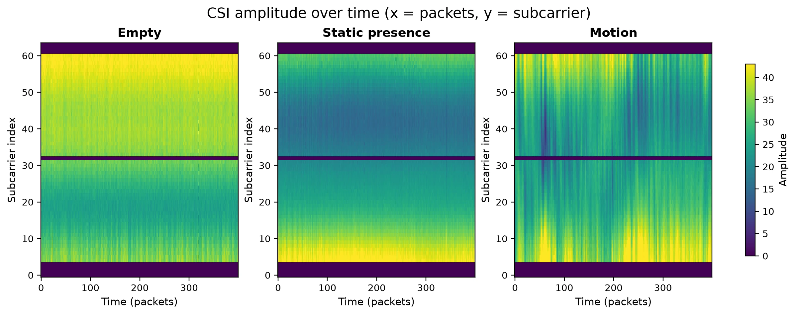

# Algorithms

Current detector and signal-processing reference for ESPectre.

This file documents the algorithms that are active in the current project
surface. Historical promotion rationale, superseded baselines, and longer
decision context now live in ADRs, especially:

- [`2026-07-08-promote-classic-detector-and-retire-legacy-baselines.md`](adr/2026-07-08-promote-classic-detector-and-retire-legacy-baselines.md)
- [`2026-07-07-adopt-gated-startup-threshold-calibration-for-classic-detector.md`](adr/2026-07-07-adopt-gated-startup-threshold-calibration-for-classic-detector.md)
- [`2026-07-07-use-core-6-as-the-production-ml-feature-set.md`](adr/2026-07-07-use-core-6-as-the-production-ml-feature-set.md)
- [`2026-07-04-keep-agc-active-and-standardize-cv-normalization.md`](adr/2026-07-04-keep-agc-active-and-standardize-cv-normalization.md)
- [`2026-06-09-replace-runtime-nbvi-with-fixed-shared-subcarriers.md`](adr/2026-06-09-replace-runtime-nbvi-with-fixed-shared-subcarriers.md)

## Overview

ESPectre detects motion from Wi-Fi CSI by extracting a small, fixed slice of
subcarriers, deriving gain-robust scalar signals from those amplitudes, and
feeding those signals into either:

- `ClassicDetector`, the default non-ML detector
- `MLDetector`, the neural detector with a trained probability threshold

Representative raw CSI amplitude windows for empty room, static presence, and
motion:



The current production detector definition is:

- AGC stays active
- the shared fixed 12-subcarrier set is used
- the classic path uses weighted L1-delta and turbulence-autocorrelation fusion
- the classic runtime has no voting or variance-recovery branch
- the ML path uses the Core-6 feature set

## Processing Pipeline

Steady-state detector flow:

```text
CSI packet
  -> fixed 12-subcarrier amplitudes
  -> CV turbulence (std / mean)
  -> optional Hampel / low-pass filtering
  -> detector-specific metric or feature extraction
  -> thresholded motion state
```

At boot:

- `classic` performs startup threshold calibration
- `ml` starts as soon as CSI capture is active from its trained default threshold

With the default `window_size=100`, the `classic` startup budget is
`10 x window_size = 1000` packets. This is a maximum, not a mandatory wait.

## AGC-Active Normalization

The shared turbulence signal is:

```text
turbulence = std(amplitudes) / mean(amplitudes)
```

This coefficient-of-variation form is gain-invariant:

```text
CV(kA) = std(kA) / mean(kA) = std(A) / mean(A)
```

If AGC scales all amplitudes by a factor `k`, turbulence stays unchanged. This
same AGC-active normalization model is used across:

- runtime detection
- host collection
- dataset schema
- offline ML tooling

## Fixed Subcarrier Set

Both detectors use the same fixed 12-subcarrier set:

```text
[14, 17, 20, 23, 26, 29, 35, 38, 41, 44, 47, 50]
```

The active runtime no longer performs per-session runtime subcarrier selection.
This set is part of the detector definition for the current project surface.

## Signal Conditioning

Optional filters operate on the scalar turbulence stream before detector
evaluation.

### Hampel Filter

Default: enabled (`window=7`, `threshold=5.0` MAD)

The Hampel filter removes large outliers using the median absolute deviation:

```text
MAD = median(|x_i - median(x)|)
```

Packets that exceed the configured MAD-scaled deviation are replaced by the
current window median.

### Low-Pass Filter

Default: disabled

The low-pass stage is a first-order Butterworth IIR filter applied to the
turbulence signal before detector evaluation. Use [`TUNING.md`](TUNING.md) for
the operational trade-off between false-positive reduction and responsiveness.

## Classic Detector

`ClassicDetector` is the production non-ML path. It combines:

- mean L1 displacement between normalized amplitude profiles
- lag-1 autocorrelation of the gain-invariant turbulence stream
- a fixed, weighted logistic fusion with no voting branches

### L1-Delta Primary Metric

Per packet, ESPectre computes a mean-normalized amplitude profile over the fixed
12-subcarrier set:

```text
p_i[k] = A_i[k] / mean(A_i)
```

It then compares the current profile with the one seen `lag` packets earlier:

```text
d_i = mean_k |p_i[k] - p_(i-lag)[k]|
```

Default `lag = 10`, which is roughly 100 ms at 100 packets per second.

The detector metric is the running mean of `d_i` over the active detection
window. Hampel filtering is applied to the per-packet `d_i` stream before the
window mean.

### Turbulence Autocorrelation

Per-packet turbulence is the spatial coefficient of variation:

```text
t_i = std(A_i) / mean(A_i)
```

After Hampel filtering, Classic calculates lag-1 autocorrelation over the
turbulence window. Both inputs are gain invariant under ideal uniform scaling.
The shared `hampel_enabled` setting controls both Hampel filters.
The same rule applies to ML feature extraction: all `turb_*` features use the
filtered turbulence stream, and all `l1_delta*` features use the filtered
per-packet L1-delta stream in training and both runtimes.

### Weighted Fusion

Classic standardizes `l1_delta` and `turb_autocorr` with fixed training
statistics, applies a two-term linear model, and converts its logit to a
probability:

```text
logit = b + w_l1 * z(l1_delta) + w_ac * z(turb_autocorr)
probability = 1 / (1 + exp(-logit))
motion = probability > threshold
```

The coefficients come from grouped, de-overlapped out-of-fold training balanced
by class, chip, and session. The runtime contains no majority vote or recovery
branch.

### Startup Threshold Calibration

At startup, Classic begins from the validated global probability threshold
and shifts its logit using the session's startup `q95` relative to the training
idle reference. This preserves the learned two-feature decision boundary while
compensating for session-level floor movement. Runtime adjustments use the same
`0.0-1.0` probability scale and remain active until recalibration or reboot.

### Implementation Status

Current aligned implementations:

- `src/python/micro_espectre/classic_detector.py`
- `src/cpp/core/classic_detector.*`

## Retired Historical Baseline

The old standalone moving-variance detector remains relevant only for offline comparison tooling and historical context. It is not part of the active runtime surface anymore.

## ML Detector

`MLDetector` is the production neural detector. It treats motion detection as a
binary classification problem over a sliding window and outputs a probability in
the range `0.0-1.0`.

Current threshold:

```text
motion if probability > 0.5
```

Unlike `classic`, the ML path does not need startup threshold calibration.

### Current Runtime Topology

The production export is a compact MLP:

```text
Input (6 features)
  -> Dense(32, ReLU)
  -> Dense(16, ReLU)
  -> Dense(1, Sigmoid)
```

Total parameter count: 769

The runtime accepts exported hidden-layer layouts generated by the training
script, but the committed production artifact currently uses the topology above.

### Core-6 Feature Set

The current production feature set contains six features:

| # | Feature | Formula | Meaning |
|---|---------|---------|---------|
| 0 | `turb_mad_over_mean` | `median(|x_i - median(x)|) / |mean(x)|` | Relative robust spread |
| 1 | `turb_skewness` | `E[(X-μ)^3] / σ^3` | Turbulence asymmetry |
| 2 | `turb_autocorr` | `C(1) / C(0)` | Lag-1 temporal correlation |
| 3 | `l1_delta` | `mean(d_i)` | Mean profile displacement |
| 4 | `l1_delta_std` | `std(d_i)` | Spread of the L1-delta series |
| 5 | `l1_delta_waveform_length` | `Σ|d_i - d_(i-1)|` | Short-term L1-delta variation |

Three features come from the turbulence series, and three come from the
L1-delta series derived from mean-normalized amplitude profiles.

### Feature Diagnostics Snapshot

The current Core-6 feature diagnostics were refreshed on 2026-07-16 from
`460,958` extracted training windows. Correlation is the marginal Pearson
correlation with the binary motion label. SHAP importance comes from `500`
balanced, blocked, held-out windows across three cross-validation folds grouped
by session, using the promoted seed `1386543369`.

| Rank | Feature | Label correlation | Mean absolute SHAP | SHAP contribution |
|------|---------|------------------:|-------------------:|------------------:|
| 1 | `l1_delta` | 0.7358 | 0.297198 | 51.3% |
| 2 | `turb_mad_over_mean` | 0.5752 | 0.123743 | 21.4% |
| 3 | `turb_autocorr` | 0.7834 | 0.101985 | 17.6% |
| 4 | `l1_delta_std` | 0.6909 | 0.028875 | 5.0% |
| 5 | `l1_delta_waveform_length` | 0.5859 | 0.016178 | 2.8% |
| 6 | `turb_skewness` | 0.2904 | 0.010868 | 1.9% |

Correlation measures each feature independently and does not account for the
strong overlap among the L1-delta descriptors. Grouped out-of-fold SHAP
measures contribution to unseen-session predictions, but correlated features
can still divide importance between them. Feature removal decisions therefore
require grouped, multi-seed ablation plus the paired and long-recording gates;
low SHAP importance alone is not a removal criterion.

Reproduce this snapshot without exporting new runtime artifacts:

```bash
python tools/train_ml_model.py --correlation
python tools/train_ml_model.py --shap 500 --seed 1386543369 --no-export
```

### Inference Flow

```text
CSI packet
  -> turbulence path
  -> optional filters
  -> sliding window
  -> Core-6 feature extraction
  -> MLP inference
  -> probability threshold at 0.5
```

### Runtime Alignment

The same production feature set is used by:

- `src/python/micro_espectre/csi_features.py`
- `src/cpp/core/ml_*`
- `tools/train_ml_model.py` exports

## Calibration Summary

| Detector | Threshold | Startup behavior |
|----------|-----------|------------------|
| `classic` | automatic, session-adjustable | quiet-logit startup adaptation with motion-first completion and quiet-only fallback |
| `ml` | trained default, session-adjustable | immediate detector startup once CSI is active |

Both detectors use the same fixed subcarrier set. Only the detector metric and
threshold behavior differ.

## References

1. **Subcarrier selection for efficient CSI-based indoor localization (2018)**  
   Spectral decorrelation and feature diversity.  
   [Read paper](https://www.researchgate.net/publication/326195991)

2. **Indoor Motion Detection Using Wi-Fi Channel State Information in Flat Floor Environments Versus in Staircase Environments (2018)**  
   Moving-variance segmentation background.  
   [Read paper](https://pmc.ncbi.nlm.nih.gov/articles/PMC6068568/)

3. **WiFi Motion Detection: A Study into Efficacy and Classification (2019)**  
   Signal-processing background.  
   [Read paper](https://arxiv.org/abs/1908.08476)

4. **CSI-F: A Human Motion Recognition Method Based on Channel-State-Information Signal Feature Fusion (2024)**  
   Hampel filtering and robustness background.  
   [Read paper](https://www.mdpi.com/1424-8220/24/3/862)
