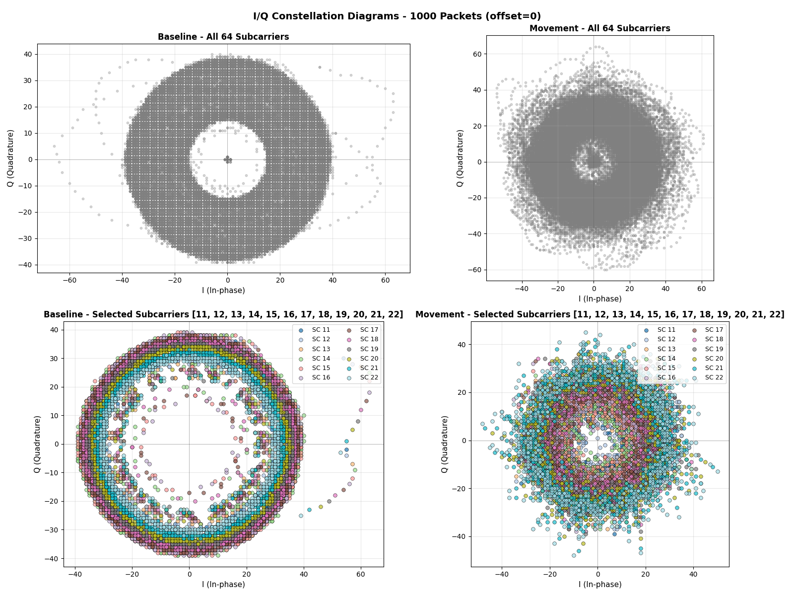

# Algorithms

Scientific documentation of the algorithms used in ESPectre for Wi-Fi CSI-based motion detection.

---

## Table of Contents

- [Overview](#overview)
- [Processing Pipeline](#processing-pipeline)
- [Gain Lock (Hardware Stabilization)](#gain-lock-hardware-stabilization)
- [CV Normalization (Gain-Invariant Turbulence)](#cv-normalization-gain-invariant-turbulence)
- [Fixed Subcarrier Set](#fixed-subcarrier-set)
- [Signal Conditioning](#signal-conditioning)
- [MVS: Moving Variance Segmentation](#mvs-moving-variance-segmentation)
- [ML: Neural Network Detector](#ml-neural-network-detector)
- [References](#references)

---

## Overview

ESPectre uses a combination of signal processing algorithms to detect motion from Wi-Fi Channel State Information (CSI). 

<details>
<summary>What is CSI? (click to expand)</summary>

**Channel State Information (CSI)** represents the physical characteristics of the wireless communication channel between transmitter and receiver. Unlike simple RSSI (Received Signal Strength Indicator), CSI provides rich, multi-dimensional data about the radio channel.

**What CSI Captures:**

*Per-subcarrier information:*
- **Amplitude**: Signal strength for each OFDM subcarrier (64 for HT20 mode)
- **Phase**: Phase shift of each subcarrier
- **Frequency response**: How the channel affects different frequencies

*Environmental effects:*
- **Multipath propagation**: Reflections from walls, furniture, objects
- **Doppler shifts**: Changes caused by movement
- **Temporal variations**: How the channel evolves over time
- **Spatial patterns**: Signal distribution across antennas/subcarriers

**Why It Works for Movement Detection:**

When a person moves in an environment, they alter multipath reflections, change signal amplitude and phase, create temporal variations in CSI patterns, and modify the electromagnetic field structure. These changes are detectable even through walls, enabling **privacy-preserving presence detection** without cameras, microphones, or wearable devices.

</details>

---

## Processing Pipeline

```
┌───────────────────────────────────────────────────────────────────────────────────┐
│                           CSI PROCESSING PIPELINE                                  │
├───────────────────────────────────────────────────────────────────────────────────┤
│                                                                                   │
│  ┌──────────┐    ┌──────────┐    ┌──────────────┐    ┌─────────────┐              │
│  │ CSI Data │───▶│Gain Lock │───▶│ Fixed 12 SC  │───▶│ Turbulence  │              │
│  │ N subcs  │    │ AGC/FFT  │    │ Threshold    │    │ σ or σ/μ    │              │
│  └──────────┘    └──────────┘    └──────────────┘    └──────┬──────┘              │
│                  (3s, 300 pkt)   (~10s, 10×window)          │                     │
│                                                             ▼                     │
│  ┌───────────┐    ┌───────────────┐    ┌─────────────────┐  ┌──────────────────┐  │
│  │ IDLE or   │◀───│ Adaptive      │◀───│ Moving Variance │◀─│ Optional Filters │  │
│  │ MOTION    │    │ Threshold     │    │ (window=100)    │  │ LowPass + Hampel │  │
│  └───────────┘    └───────────────┘    └─────────────────┘  └──────────────────┘  │
│                                                                                   │
└───────────────────────────────────────────────────────────────────────────────────┘
```

**Calibration sequence (at boot):**
1. **Gain Lock** (3s, 300 packets): Collect AGC/FFT, lock values
2. **Threshold Bootstrap** (~10s, 10 × window_size packets, MVS only): Keep the fixed 12-subcarrier set and calculate baseline moving variance

With default `window_size=100`, this means 1000 packets. If you change `segmentation_window_size`, the calibration buffer adjusts automatically.

**Data flow per packet (after calibration):**
1. **CSI Data**: Raw I/Q values for 64 subcarriers (HT20 mode)
   - Espressif format: `[Q₀, I₀, Q₁, I₁, ...]` (Imaginary first, Real second per subcarrier)
2. **Amplitude Extraction**: `|H| = √(I² + Q²)` for selected 12 subcarriers
3. **Spatial Turbulence**: `σ(amplitudes)` (raw std, gain locked) or `σ/μ` (CV, gain not locked)
4. **Hampel Filter** (optional): Remove outliers using MAD
5. **Low-Pass Filter** (optional): Remove high-frequency noise (Butterworth 1st order)
6. **Moving Variance**: `Var(turbulence)` over sliding window
7. **Adaptive Threshold**: Compare variance to `Pxx(baseline_mv)` → IDLE or MOTION

---

## Gain Lock (Hardware Stabilization)

### The Problem

The ESP32 WiFi hardware includes automatic gain control (AGC) that dynamically adjusts signal amplification based on received signal strength. While this improves data decoding reliability, it creates a problem for CSI sensing:

| Without Gain Lock | With Gain Lock |
|-------------------|----------------|
| AGC varies dynamically | AGC fixed to calibrated value |
| CSI amplitudes oscillate ±20-30% | Amplitudes stable |
| Baseline appears "noisy" | Baseline flat |
| Potential false positives | Cleaner detection |

### How It Works

**Gain Lock** stabilizes CSI amplitude measurements by locking the ESP32's AGC and FFT scaling. Based on [Espressif's esp-csi recommendations](https://github.com/espressif/esp-csi).

The lock happens in a **dedicated phase BEFORE threshold bootstrap** to ensure clean data:

```
┌──────────────────────────────────────────────────────────────────────┐
│                    TWO-PHASE CALIBRATION                              │
├──────────────────────────────────────────────────────────────────────┤
│                                                                      │
│  PHASE 1: GAIN LOCK (~3 seconds, 300 packets)                        │
│  ┌─────────────┐    ┌─────────────┐    ┌─────────────┐              │
│  │  Read PHY   │───▶│   Collect   │───▶│  Calculate  │              │
│  │  agc_gain   │    │  agc_samples│    │   Median    │              │
│  │  fft_gain   │    │  fft_samples│    │             │              │
│  └─────────────┘    └─────────────┘    └──────┬──────┘              │
│                                               │                      │
│  Packet 300:                                  ▼                      │
│  ┌──────────────────────────────────────────────────────────────┐   │
│  │  phy_fft_scale_force(true, median_fft)                       │   │
│  │  phy_force_rx_gain(true, median_agc)                         │   │
│  │  → AGC/FFT now LOCKED                                        │   │
│  └──────────────────────────────────────────────────────────────┘   │
│                           │                                          │
│                           ▼                                          │
│  PHASE 2: BAND CALIBRATION (~10 seconds, 10 × window_size packets)   │
│  ┌──────────────────────────────────────────────────────────────┐   │
│  │  Now all packets have stable gain!                           │   │
│  │  → Baseline variance calculated on clean data                │   │
│  │  → Subcarrier selection more accurate                        │   │
│  └──────────────────────────────────────────────────────────────┘   │
│                                                                      │
└──────────────────────────────────────────────────────────────────────┘
```

**Why two phases?** Separating gain lock from threshold bootstrap ensures:
- Calibration only sees data with **stable, locked gain**
- Baseline variance is **accurate** (not inflated by AGC variations)
- Adaptive threshold is calculated correctly
- Total time: ~13 seconds (3s gain lock + 10s calibration)

**Why median instead of mean?** Median is more robust against outliers:
- Occasional packet with extreme gain values doesn't skew the baseline
- Matches Espressif's internal methodology for gain calibration

### Implementation

The gain lock uses undocumented PHY functions available on newer ESP32 variants:

```c
extern void phy_fft_scale_force(bool force_en, int8_t force_value);
extern void phy_force_rx_gain(int force_en, int force_value);

if (packet_count < 300) {
    agc_samples[packet_count] = phy_info->agc_gain;   // uint8_t
    fft_samples[packet_count] = phy_info->fft_gain;   // int8_t (signed!)
} else if (packet_count == 300) {
    median_agc = calculate_median(agc_samples, 300);
    median_fft = calculate_median(fft_samples, 300);
    
    phy_fft_scale_force(true, median_fft);
    phy_force_rx_gain(true, median_agc);
    on_gain_locked_callback();
}
```

On platforms without gain lock support (ESP32 Base, ESP32-S2), [CV Normalization](#cv-normalization-gain-invariant-turbulence) provides gain-invariant detection as a fallback.

**Reference**: [Espressif esp-csi example](https://github.com/espressif/esp-csi/blob/master/examples/get-started/csi_recv_router/main/app_main.c)

---

## CV Normalization (Gain-Invariant Turbulence)

### The Concept

ESPectre computes **spatial turbulence** -- a scalar that summarizes how much the CSI amplitude pattern varies across subcarriers in a single packet. The computation depends on whether gain lock is active:

- **Gain locked**: Raw standard deviation is used (better sensitivity when gain is stable)
  ```
  turbulence = σ(amplitudes)
  ```
- **Gain not locked**: The **Coefficient of Variation (CV)** is used instead
  ```
  turbulence = σ(amplitudes) / μ(amplitudes)
  ```

### Why CV Works

CV is a dimensionless ratio that is mathematically invariant to linear gain scaling:

```
CV(kA) = σ(kA) / μ(kA) = k·σ(A) / k·μ(A) = σ(A) / μ(A) = CV(A)
```

If the receiver AGC scales all amplitudes by a factor k, the CV remains unchanged. This eliminates the need for gain compensation on platforms where AGC cannot be locked.

### When CV Normalization Is Used

CV normalization is automatically enabled when:
1. Gain lock mode is `disabled`
2. Gain lock mode is `auto` and lock was skipped (e.g., signal too strong, AGC < 30)
3. Platform does not support gain lock (ESP32 Base, ESP32-S2)

**Impact on detection**: CV-normalized turbulence values are typically in the range 0.05-0.25 (compared to 2-20 for raw std). Adaptive thresholds from calibration are correspondingly smaller (order of 1e-4 to 1e-3).

### Platform Support

| Platform | Gain Lock | CV Normalization |
|----------|-----------|------------------|
| ESP32-S3 | Supported | When lock skipped |
| ESP32-C3 | Supported | When lock skipped |
| ESP32-C5 | Supported | When lock skipped |
| ESP32-C6 | Supported | When lock skipped |
| ESP32 (original) | Not available | Always enabled |
| ESP32-S2 | Not available | Always enabled |

---

## Fixed Subcarrier Set

ESPectre uses one shared fixed 12-subcarrier set for both detectors:

`[12, 14, 16, 18, 20, 24, 28, 36, 40, 44, 48, 52]`

This set was originally validated offline and is now treated as part of the production detector definition.


*I/Q constellation diagrams showing the geometric representation of WiFi signal propagation in the complex plane. The baseline (idle) state exhibits a stable, compact pattern, while movement introduces entropic dispersion as multipath reflections change.*

### Why This Set

The fixed set balances three goals:

- avoid guard-band and DC subcarriers
- spread energy across the valid HT20 band instead of clustering tightly
- stay aligned with the ML training pipeline so both detectors consume the same CSI slice

### Adaptive Threshold Calculation

For MVS, startup calibration keeps this fixed band and derives the adaptive threshold from baseline moving-variance values:

```python
def calculate_adaptive_threshold(mv_values, percentile, factor):
    return calculate_percentile(mv_values, percentile) * factor
```

| Mode | Formula | Effect |
|------|---------|--------|
| Auto (default) | P95 × 1.1 | Balanced sensitivity/false positives |
| Min | P100 × 1.0 | Maximum sensitivity (may have FP) |

See [TUNING.md](TUNING.md) for configuration options (`segmentation_threshold`).

### Why Spread-Out Subcarriers?

Using **spread-out** subcarriers provides:
- **Spectral diversity**: Different frequency components respond differently to motion
- **Noise resilience**: Narrowband interference typically affects adjacent subcarriers
- **Environment adaptation**: Works well in complex multipath environments

### Guard Bands and DC Zone

HT20 mode (64 subcarriers) configuration:

| Parameter | Value |
|-----------|-------|
| Total Subcarriers | 64 |
| Guard Band Low | 11 |
| Guard Band High | 52 |
| DC Subcarrier | 32 |
| Valid Subcarriers | 41 |

See [PERFORMANCE.md](PERFORMANCE.md) for detailed fixed-band validation metrics.

---

## Signal Conditioning

Optional filters can be applied to the turbulence stream before detection. Both filters operate on the scalar turbulence value (one per CSI packet) and share the same `SegmentationContext` used by both MVS and ML detectors.

### Hampel Filter

**Enabled by default** (window=7, threshold=5.0 MAD).

The Hampel filter removes statistical outliers using the Median Absolute Deviation (MAD) method, reducing false positives from sudden RF interference.

**How it works:**

1. Maintain a sliding window of recent turbulence values
2. Calculate the median of the window
3. Calculate MAD: `MAD = median(|xᵢ - median|)`
4. If `|x - median| > threshold × 1.4826 × MAD`, replace with median

The constant **1.4826** is the consistency constant that makes MAD a consistent estimator of standard deviation for Gaussian distributions.

```python
# Matches src/python/micro_espectre/filters.py (MicroPython) and the same logic in C++.
# threshold_scaled = threshold * 1.4826  (pre-computed at init)

def insertion_sort(arr, n):
    for i in range(1, n):
        key = arr[i]
        j = i - 1
        while j >= 0 and arr[j] > key:
            arr[j + 1] = arr[j]
            j -= 1
        arr[j + 1] = key

def hampel_filter(value, buffer, sorted_scratch, window_size, index, count,
                  threshold_scaled):
    buffer[index] = value
    index = (index + 1) % window_size
    if count < window_size:
        count += 1
    if count < 3:
        return value

    n = count
    mid = n // 2

    for i in range(n):
        sorted_scratch[i] = buffer[i]
    insertion_sort(sorted_scratch, n)
    median = sorted_scratch[mid]

    for i in range(n):
        sorted_scratch[i] = abs(buffer[i] - median)
    insertion_sort(sorted_scratch, n)
    mad = sorted_scratch[mid]

    if mad > 1e-6:
        deviation = abs(value - median) / mad
        if deviation > threshold_scaled:
            return median
    return value
```

**Embedded optimization**: Circular turbulence buffer, pre-allocated `buffer` and `sorted_scratch` (no per-packet list growth). Insertion sort on the active window (N ≤ 11) on MicroPython; the C++ component uses the same MAD test with `std::sort` on stack copies of the same small window.

**Reference**: [5] CSI-F: Feature Fusion Method (MDPI Sensors)

### Low-Pass Filter

**Disabled by default**. Enable with `lowpass_enabled: true`.

The low-pass filter removes high-frequency noise from turbulence values using a **1st-order Butterworth IIR filter**:

```python
class LowPassFilter:
    def __init__(self, cutoff_hz=11.0, sample_rate_hz=100.0):
        wc = tan(π × cutoff / sample_rate)
        k = 1.0 + wc
        self.b0 = wc / k
        self.a1 = (wc - 1.0) / k
        
        self.x_prev = 0.0
        self.y_prev = 0.0
    
    def filter(self, x):
        y = self.b0 * x + self.b0 * self.x_prev - self.a1 * self.y_prev
        self.x_prev = x
        self.y_prev = y
        return y
```

**Why 11 Hz cutoff?** Human movement generates signal variations typically in the **0.5-10 Hz** range. RF noise and interference are usually **>15 Hz**. The 11 Hz cutoff preserves motion signal while removing high-frequency noise.

See [TUNING.md](TUNING.md) for filter configuration and tuning guidance.

---

## MVS: Moving Variance Segmentation

### The Insight

Human movement causes **multipath interference** in Wi-Fi signals, which manifests as:
- **Idle state**: Stable CSI amplitudes → low turbulence variance
- **Motion state**: Fluctuating CSI amplitudes → high turbulence variance

By monitoring the **variance of turbulence** over a sliding window, we can reliably detect when motion occurs.

### Algorithm Steps

1. **Spatial Turbulence**

   Computed per packet from the 12 selected subcarrier amplitudes. MVS and ML use raw std when gain is locked, or CV normalization otherwise (see [CV Normalization](#cv-normalization-gain-invariant-turbulence)). ML then extracts relative window features for the neural detector.

2. **Moving Variance (Two-Pass Algorithm)**
   ```
   μ = Σxᵢ / n                    # Mean of turbulence buffer
   Var = Σ(xᵢ - μ)² / n           # Variance (numerically stable)
   ```
   The two-pass algorithm avoids catastrophic cancellation that can occur with running variance on float32.

3. **State Machine**
   ```
   if state == IDLE and variance > threshold:
       state = MOTION
   elif state == MOTION and variance < threshold:
       state = IDLE
   ```

### Performance

For detailed performance metrics, see [PERFORMANCE.md](PERFORMANCE.md).

**Reference**: [2] MVS segmentation: the fused CSI stream and corresponding moving variance sequence

---

## ML: Neural Network Detector

### The Insight

Motion detection can be framed as a **binary classification problem**:
- **Input**: Statistical features computed from a sliding window of turbulence values
- **Output**: Probability of motion (0.0 to 1.0)

A neural network can learn complex, non-linear patterns that may be missed by simple threshold-based methods. Unlike MVS, ML learns decision boundaries from labeled training data and generalizes across environments without per-environment calibration. The production binary model maps both `empty` and `static_presence` captures to IDLE, and maps `motion` captures to MOTION.

### Architecture

The ML detector uses a compact **Multi-Layer Perceptron (MLP)** over 8 relative turbulence-window features.
The current production export remains small enough for embedded deployment, while the runtime now accepts any exported hidden-layer layout generated by the training script.
The training script supports `standard`, `robust`, and `clipped_standard` normalization modes. Experimental modes should be validated against the real-data regression suite before replacing the committed production weights.
The trainer currently uses a PyTorch MLP with ReLU hidden layers and exports the learned weights into the shared Python/C++ runtime format used for production artifacts.

Current production topology:

```
Input (8 features)
    ↓
Dense(32, ReLU)      ← 8×32 + 32 = 288 parameters
    ↓
Dense(16, ReLU)      ← 32×16 + 16 = 528 parameters
    ↓
Dense(1, Sigmoid)    ← 16×1 + 1 = 17 parameters
    ↓
Output (probability)
```

**Total**: 833 parameters, ~3.3 KB (constexpr float weights)

The input feature set was previously reduced from 12 to 9 after long-recording
holdout experiments showed that `turb_kurtosis`, `turb_entropy`, and
`turb_slope` hurt deployment robustness more than they helped paired
validation. A later gain-shift sweep moved the production export from raw
9-feature inputs to an 8-feature relative set. The current `32-16` topology,
`fp_weight=2.0`, and hard-negative sample weighting were selected because they
improved long-recording false-positive robustness while preserving the relative
feature set's gain-shift invariance. MVS is used only to mine difficult IDLE
windows during this training mode, not as a general teacher for motion labels.

### Inference Pipeline

```
┌──────────────┐    ┌──────────────┐    ┌───────────────────┐    ┌──────────────┐
│ CSI Packet   │───▶│ Turbulence   │───▶│ Optional Filters  │───▶│ Buffer (100) │
│              │    │ raw base     │    │ Hampel + LowPass  │    │              │
└──────────────┘    └──────────────┘    └───────────────────┘    └──────┬───────┘
                                                                        │
                                                                        ▼
┌──────────────┐    ┌──────────────┐    ┌──────────────┐    ┌──────────────┐
│ IDLE/MOTION  │◀───│ Threshold    │◀───│ Motion Score │◀───│ 8 Features   │
│              │    │ > 5.0        │    │ [0.0-10.0]   │    │ → Neural Net │
└──────────────┘    └──────────────┘    └──────────────┘    └──────────────┘
```

### Calibration

Both detectors use the same fixed, non-configurable subcarrier set:

| Algorithm |Threshold | Boot Time |
|-----------|---------------------|-----------|
| MVS | Adaptive (percentile-based) | ~13s |
| ML | Fixed (5.0 on 0-10 scale) | **~3s** |

The production subcarrier set is `[12, 14, 16, 18, 20, 24, 28, 36, 40, 44, 48, 52]`.
MVS uses a baseline threshold bootstrap after gain lock; ML keeps its fixed threshold and therefore finishes boot after gain lock only.

### Features

The ML detector extracts **8 relative statistical features** from a sliding window of 100 turbulence values (configured via `segmentation_window_size`).

**Design principles:**
- Ratios are computed against the local window mean to reduce absolute gain sensitivity
- No redundant features (e.g., no variance alongside std, no range alongside max/min)
- 8 turbulence-window features chosen by grouped CV, long-recording holdout, and exported-artifact gain-stress behavior
- MicroPython compatible: pure Python implementation without numpy at runtime

| # | Feature | Formula | Description |
|---|---------|---------|-------------|
| 0 | `turb_std_over_mean` | σ / \|μ\| | Relative spread |
| 1 | `turb_max_over_mean` | max(xᵢ) / \|μ\| | Relative upper envelope |
| 2 | `turb_min_over_mean` | min(xᵢ) / \|μ\| | Relative lower envelope |
| 3 | `turb_iqr_over_mean` | (P75(x) - P25(x)) / \|μ\| | Relative robust spread |
| 4 | `turb_mad_over_mean` | median(\|xᵢ - median(x)\|) / \|μ\| | Relative median absolute deviation |
| 5 | `waveform_length_over_mean` | Σ\|xᵢ - xᵢ₋₁\| / (\|μ\|(n-1)) | Relative temporal variation |
| 6 | `turb_skewness` | E[(X-μ)³]/σ³ | Turbulence asymmetry (3rd moment) |
| 7 | `turb_autocorr` | C(1)/C(0) | Lag-1 autocorrelation |

#### Feature Categories

**Relative Envelope and Spread (0-4)**: Scale-reduced statistics of the turbulence buffer, divided by the local window mean magnitude.

**Robust Spread (3, 4)**:
- **Interquartile range (IQR)**: Spread between the 75th and 25th percentiles. More robust than zero-crossing-style oscillation counts on quiet-but-noisy windows.
- **MAD**: Robust alternative to std, less sensitive to outliers.

**Higher-Order Moments (6)**:
- **Skewness**: Asymmetry of turbulence distribution.

**Temporal Structure (7)**:
- **Autocorrelation**: Lag-1 temporal correlation. High during idle (smooth signal), low during motion (turbulent)

**Relative Temporal Variation (5)**:
- **Waveform Length over Mean**: Sum of absolute first differences over the turbulence window, divided by local mean magnitude and window step count. Higher values indicate faster/more irregular short-term motion dynamics without carrying absolute gain scale.

#### Feature Importance

SHAP and correlation can diverge significantly: correlation captures linear association with the label, while SHAP captures non-linear contribution inside the network.

The raw 9-feature SHAP/correlation ranking that informed earlier reductions is
now historical; see [EXPERIMENTS.md](EXPERIMENTS.md) for that log. For the
current relative model, feature candidates should be compared with grouped CV,
the paired/long recording gates, and the exported-artifact gain-stress gate
rather than correlation alone.

#### Feature Definitions

**Interquartile Range (IQR)**:
```
IQR = P75(x) - P25(x)
```
Measures the width of the middle 50% of the turbulence distribution. Unlike zero-crossing rate, it responds to spread without being dominated by rapid sign flips around the mean, which made it a better fit for suppressing quiet-window false positives in the current long-run validation set.

**Skewness** (third standardized moment):
```
γ₁ = E[(X - μ)³] / σ³
```
- γ₁ > 0: Right-skewed (tail on right)
- γ₁ < 0: Left-skewed (tail on left)
- γ₁ = 0: Symmetric

**Lag-1 Autocorrelation**:
```
r₁ = (1/(n-1)) Σ(xᵢ - μ)(xᵢ₊₁ - μ) / σ²
```
Measures temporal correlation between consecutive values. Ranges from -1.0 to 1.0. Smooth signals have high positive autocorrelation; turbulent signals have low autocorrelation.

**Median Absolute Deviation**:
```
MAD = median(|xᵢ - median(x)|)
```
Robust measure of spread. Unlike std, a single outlier cannot dramatically inflate the MAD. IQR and MAD share one sorted copy of the turbulence window per evaluation (`std::sort` in C++, `list.sort()` in MicroPython).

**Waveform Length**:
```
WL = Σ |xᵢ - xᵢ₋₁|,  i = 1..n-1
WL_relative = WL / (|μ| * (n - 1))
```
Measures total temporal variation in the turbulence window. The exported ML
feature uses the relative form. Compared to slope/autocorrelation, it is more
sensitive to short, bursty oscillations and does not require logarithms or
histogram binning.

### Training

Operational training commands, export formats, and validation gates now live in
[ML_TRAINING.md](ML_TRAINING.md). Dataset collection and labeling remain in
[ML_DATA_COLLECTION.md](ML_DATA_COLLECTION.md).

### Performance

ML's strength is **generalization without runtime calibration**: it uses fixed subcarriers and pre-trained weights, so it can boot quickly and perform strongly on the paired real-data validation set.

Historical experiment logs that informed the current production choices are collected in [EXPERIMENTS.md](EXPERIMENTS.md). This keeps the algorithm reference focused on the currently promoted pipeline while preserving the rationale behind rejected or superseded approaches.

See [PERFORMANCE.md](PERFORMANCE.md) for detailed per-chip results and [TUNING.md](TUNING.md) for configuration and tuning guidance.

---

## References

1. **Subcarrier selection for efficient CSI-based indoor localization (2018)**  
   Spectral de-correlation and feature diversity.  
   [Read paper](https://www.researchgate.net/publication/326195991)

2. **Indoor Motion Detection Using Wi-Fi Channel State Information in Flat Floor Environments Versus in Staircase Environments (2018)** 
   Moving variance segmentation.  
   [Read paper](https://pmc.ncbi.nlm.nih.gov/articles/PMC6068568/)

3. **WiFi Motion Detection: A Study into Efficacy and Classification (2019)**
   Signal processing methods for motion detection.  
   [Read paper](https://arxiv.org/abs/1908.08476)

4. **A Novel Passive Indoor Localization Method by Fusion CSI Amplitude and Phase Information (2019)**
   SNR considerations and noise gate strategies.  
   [Read paper](https://pmc.ncbi.nlm.nih.gov/articles/PMC6412876/)

5. **CSI-F: A Human Motion Recognition Method Based on Channel-State-Information Signal Feature Fusion (2024)**
   Hampel filter and statistical robustness.  
   [Read paper](https://www.mdpi.com/1424-8220/24/3/862)

6. **Linear-Complexity Subcarrier Selection Strategy for Fast Preprocessing of CSI in Passive Wi-Fi Sensing Classification Tasks (2025)** 
   Computational efficiency for embedded systems.  
   [Read paper](https://www.researchgate.net/publication/397240630)

7. **CIRSense: Rethinking WiFi Sensing with Channel Impulse Response (2025)**  
   SSNR (Sensing Signal-to-Noise Ratio) optimization.  
   [Read paper](https://arxiv.org/html/2510.11374v1)
