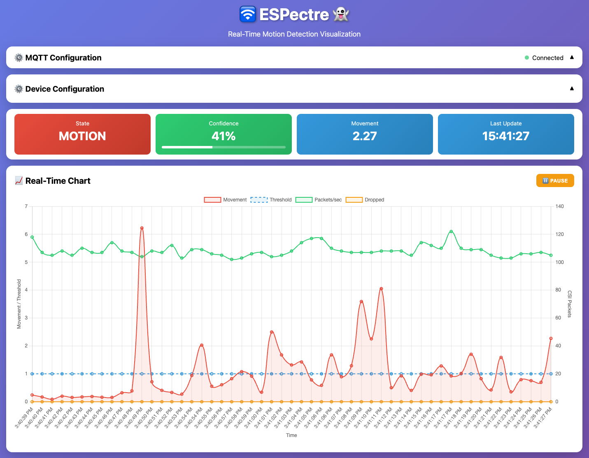
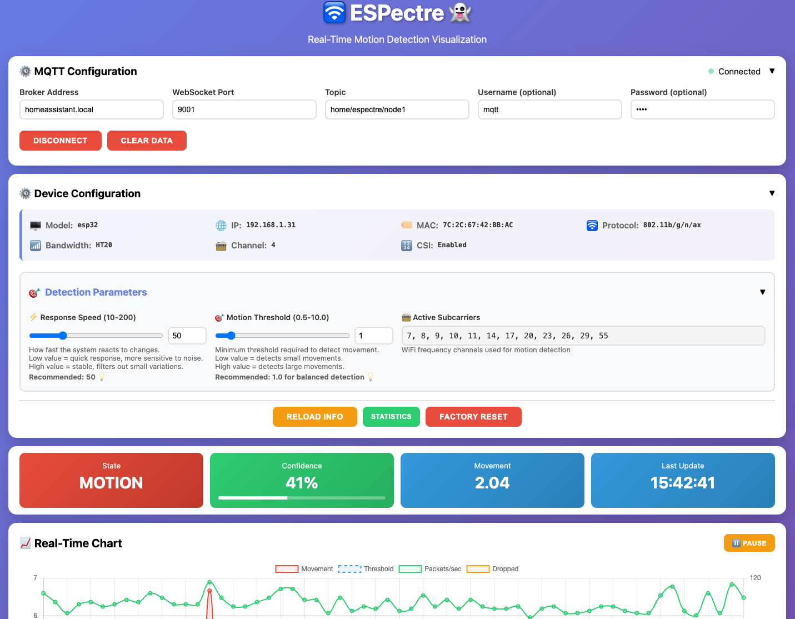

# 🛜 Micro-ESPectre 👻

**R&D Platform for Wi-Fi CSI Motion Detection - Pure Python implementation for MicroPython**

Micro-ESPectre is the **research and development platform** of the ESPectre project, designed for fast prototyping, algorithm experimentation, and academic/industrial research. It implements the core motion detection algorithms in pure Python, enabling rapid iteration without compilation overhead.

## What is Micro-ESPectre?

Micro-ESPectre implements the ESPectre motion-detection algorithms entirely in Python and serves as the **innovation lab** where new approaches and parameters are developed and validated before being migrated to the production ESPHome component.

### Role in the ESPectre Ecosystem

Micro-ESPectre is part of a **two-platform strategy**:

| Platform | Purpose | Target Users |
|----------|---------|--------------|
| **[ESPectre](https://github.com/francescopace/espectre)** (C++) | Production deployment | Smart home users, Home Assistant |
| **[Micro-ESPectre](MICRO_ESPECTRE.md)** (Python) | R&D and prototyping | Researchers, developers, academics |

**Why MQTT instead of Native API?**
Micro-ESPectre uses MQTT for maximum flexibility - it's not tied to Home Assistant and can integrate with:
- **Industrial systems** (SCADA, PLCs, factory automation)
- **Academic research** (data collection, algorithm validation)
- **Custom applications** (any MQTT-compatible platform)

### Innovation Flow

```
┌─────────────────────────────────────────────────────────────┐
│                    INNOVATION CYCLE                         │
├─────────────────────────────────────────────────────────────┤
│  Micro-ESPectre (Python)          ESPectre (ESPHome)        │
│  ┌─────────────────────┐          ┌─────────────────────┐   │
│  │ • Fast prototyping  │ ──────▶  │ • Production ready  │   │
│  │ • Algorithm testing │  Port    │ • Home Assistant    │   │
│  │ • Parameter tuning  │ ──────▶  │ • Native API        │   │
│  │ • Research/academic │          │ • OTA updates       │   │
│  └─────────────────────┘          └─────────────────────┘   │
└─────────────────────────────────────────────────────────────┘
```

**Key Benefits for R&D:**
- **Instant deployment**: No compilation, ~5 seconds to update
- **Easy experimentation**: Modify parameters and test immediately
- **Quick validation**: Test algorithms and configurations rapidly
- **Proven patterns**: Validated algorithms flow to production C++ code

### What is micropython-esp32-csi?

[micropython-esp32-csi](https://github.com/francescopace/micropython-esp32-csi) is a MicroPython fork that I wrote to expose ESP32's CSI (Channel State Information) capabilities to Python. 
This fork makes CSI-based applications accessible to Python developers and enables rapid prototyping of WiFi sensing applications.

## Comparison with C++ Version (ESPHome)

### Feature Comparison

| Feature | ESPHome (C++) | Python (MicroPython) | Status |
|---------|---------------|----------------------|--------|
| **Motion Detection** |
| MVS Detector | ✅ | ✅ | Moving Variance Segmentation (default) |
| ML Detector | ✅ | ✅ | Neural Network (experimental) |
| ML Features (9) | ✅ | ✅ | mean, std, max, min, iqr, skewness, autocorr, mad, waveform_length |
| **Calibration (MVS only)** |
| Fixed subcarriers | ✅ | ✅ | Shared 12-subcarrier production set |
| Adaptive Threshold | ✅ | ✅ | P95 × 1.1 of baseline variance |
| **Gain Lock** |
| AGC/FFT Lock | ✅ | ✅ | Hardware gain stabilization (S3/C3/C5/C6) |
| CV Normalization | ✅ | ✅ | Gain-invariant normalization when lock skipped |
| **Filters** |
| Low-Pass | ✅ | ✅ | Butterworth 1st order, 11 Hz cutoff (disabled by default) |
| Hampel | ✅ | ✅ | MAD-based outlier removal (enabled by default) |
| **Traffic Generator** |
| DNS Method | ✅ | ✅ | UDP packets to gateway (default) |
| Ping Method | ✅ | ❌ | ICMP packets (ESPHome only) |
| Configurable Rate | ✅ | ✅ | 1-1000 pps |
| **Configuration** |
| YAML | ✅ | ❌ | ESPHome declarative config |
| MQTT Commands | ❌ | ✅ | Runtime parameter changes |
| Runtime Config | ✅ (via HA) | ✅ (via MQTT) | Different methods |

### Performance Comparison

| Metric | ESPHome (C++) | Python (MicroPython) |
|--------|---------------|----------------------|
| Performance | ⭐⭐⭐⭐⭐ | ⭐⭐⭐⭐ |
| Memory Usage | ⭐⭐⭐⭐ | ⭐⭐⭐ |
| Ease of Use | ⭐⭐⭐⭐ | ⭐⭐⭐⭐⭐ |
| Deployment | ⭐⭐⭐⭐ | ⭐⭐⭐⭐⭐ |
| Build Time | ~15 seconds | Instant (no build) |
| Update Time | ~15 seconds (OTA) | ~5 seconds |
| HA Integration | ⭐⭐⭐⭐⭐ (Native) | ⭐⭐⭐ (MQTT) |

For detailed performance metrics (confusion matrix, F1-score, benchmarks), see [PERFORMANCE.md](PERFORMANCE.md).

### When to Use Which Version?

**Use Micro-ESPectre (Python) if you want:**
- Quick prototyping and experimentation
- Easy deployment and updates (~5 seconds)
- Simple Python-based development
- MQTT-based runtime configuration

**Use ESPectre (ESPHome) if you need:**
- Native Home Assistant integration (auto-discovery)
- Maximum performance and efficiency
- Production-grade stability
- YAML-based configuration

## Requirements

### Hardware
- ESP32 with CSI support (ESP32, C3, S3, C6 supported)
- 2.4GHz WiFi router

### Software
- MicroPython with esp32-csi module installed
- MQTT broker (Home Assistant, Mosquitto, etc.)
- Python 3.12 (Recommended for deployment scripts, CLI, and analysis tools)

## CLI Tool Overview

Micro-ESPectre now uses the repository CLI root **`espectre`**. The micro workflow lives under **`./espectre micro ...`**, while `./me` remains available as a temporary compatibility shim for the historical commands.

The repository CLI is now split by workflow:
- `./espectre micro ...` for the MicroPython and host-side research loop documented here
- `./espectre esphome ...` for local ESPHome firmware builds from the repo examples
- `./espectre matter ...` for the Matter ESP-IDF frontend
- `./espectre streamer ...` for the CSI streamer ESP-IDF frontend

### Main Commands

The `espectre micro` namespace provides these essential commands:

| Command | Description | Usage Example |
|---------|-------------|---------------|
| `flash` | Flash MicroPython firmware to device | `./espectre micro flash --erase` |
| `deploy` | Deploy Python code to device | `./espectre micro deploy` |
| `run` | Run the application | `./espectre micro run` |
| `stream` | Stream raw CSI data via UDP | `./espectre micro stream --ip 192.168.1.100` |
| `detect` | Run live ML motion detection on the PC | `./espectre micro detect --log-turbulence` |
| `collect` | Collect labeled CSI data for ML training | `./espectre micro collect --label baseline --duration 10` |
| `verify` | Verify firmware installation | `./espectre micro verify` |
| `ui` | Open web monitoring interface in browser | `./espectre micro ui` |
| *(interactive)* | Interactive MQTT control | `./espectre micro` |

### Key Features

- **Auto-detection**: Automatically detects serial port and chip type
- **Fast deployment**: Updates code in ~5 seconds (no compilation)
- **Simple syntax**: Intuitive commands for all operations
- **Manual override**: Specify port/chip manually if needed

**Example workflow:**
```bash
./espectre micro flash --erase    # Flash firmware (first time only)
./espectre micro deploy           # Deploy code
./espectre micro run              # Run application
./espectre micro                  # Interactive MQTT control

# For real-time CSI streaming (gesture detection, research)
./espectre micro stream --ip 192.168.1.100  # Stream to PC

# On the PC, inspect live ML motion inference
./espectre micro detect --log-turbulence
```

> **Note**: The interactive mode (`./espectre micro` without a subcommand) provides advanced MQTT control features and is covered in detail in the [Interactive CLI (Advanced)](#interactive-cli-advanced) section. The legacy `./me` entrypoint still forwards to the same workflow.

## Quick Start

Get started in just **6 simple steps** - no compilation required!

### 0. Setup Python Environment

If you've already set up the main ESPectre project, you can reuse that virtual environment. Otherwise, create a new one:

```bash
# Clone the repository
git clone https://github.com/francescopace/espectre.git
cd espectre

# Verify Python version (3.12 required)
python3 --version  # Should show Python 3.12.x

# Create and activate virtual environment
python3.12 -m venv .venv      # macOS/Linux — use python3 if pyenv auto-selected 3.12
source .venv/bin/activate     # On macOS/Linux
# .venv\Scripts\activate      # On Windows

# Your prompt should now show (.venv) prefix
```

> **Tip — Python 3.12 not found?**
>
> **macOS (Homebrew):** `brew install python@3.12`
>
> **pyenv (any OS):**
> ```bash
> pyenv install 3.12
> # The .python-version file in this directory selects it automatically
> ```
> After installing, re-run `python3.12 -m venv .venv`.

**Why use a virtual environment?**
- Isolates project dependencies from system Python
- Prevents version conflicts with other projects
- Makes the project portable and reproducible

**Note:** Remember to activate the virtual environment (`source .venv/bin/activate`) every time you open a new terminal session to work with this project.

### 1. Install Dependencies

```bash
# Install Python dependencies (.venv should be active)
pip install -r requirements.txt
```

This installs all required tools including `esptool` (for flashing firmware) and `mpremote` (for deploying code).

### 2. Flash MicroPython Firmware

**⚠️ Required for first-time setup** (only once per device)

The precompiled firmware with CSI support is automatically downloaded from [micropython-esp32-csi releases](https://github.com/francescopace/micropython-esp32-csi/releases).

**Auto-detect mode** (recommended - detects port and chip automatically):
```bash
./espectre micro flash --erase
```

The CLI will:
- Auto-detect your serial port
- Auto-detect your chip type
- Download the correct firmware (cached locally)
- Flash it to your device

**Manual mode** (if auto-detect fails):
```bash
# Specify chip and/or port manually
# Supported chips: esp32, c3, s3, c6
./espectre micro flash --chip s3 --port /dev/ttyUSB0 --erase
```

**Verify the installation:**
```bash
./espectre micro verify
```

### 3. Configure WiFi and MQTT

```bash
# Create configuration file
cp src/python/config_local.py.example src/python/config_local.py

# Edit with your credentials
vi src/python/config_local.py  # or use your preferred editor
```

Update these settings:
```python
WIFI_SSID = "YourWiFiSSID"
WIFI_PASSWORD = "YourWiFiPassword"
MQTT_BROKER = "homeassistant.local"  # or IP address
MQTT_USERNAME = "mqtt"
MQTT_PASSWORD = "mqtt"
```

### 4. Deploy and Run

```bash
# Deploy code (auto-detect port)
./espectre micro deploy

# Run application (auto-detect port)
./espectre micro run
```

That's it! The device will now:
- Connect to WiFi
- Connect to MQTT broker
- Start publishing motion detection data
- Keep the shared fixed subcarrier set and bootstrap the MVS threshold

### 5. Monitor and Control

**Option A: Interactive CLI (MQTT control)**
```bash
./espectre micro
```

**Option B: Home Assistant**

Add to your `configuration.yaml`:
```yaml
mqtt:
  binary_sensor:
    - name: "ESPectre Motion"
      state_topic: "home/espectre/node1"
      value_template: "{{ value_json.state }}"
      payload_on: "motion"
      payload_off: "idle"
      device_class: motion
```

## Project Structure

```

├── data/                      # Collected CSI datasets (.npz files)
├── .firmware/                 # Downloaded firmware cache (gitignored)
├── src/python/                # Main Python package
├── test/python/               # Pytest test suite
├── tools/                     # Analysis and optimization tools
├── requirements.txt           # Python dependencies
├── tools/web/espectre-monitor.html   # Web Monitor: real-time analysis & configuration
├── tools/web/espectre-theremin.html  # Audio sonification tool (experimental)
├── espectre                   # Repository CLI entrypoint
├── me                         # Legacy shim for `espectre micro`
├── docs/ML_DATA_COLLECTION.md # Guide for ML data collection
├── .gitignore                 # Git ignore rules
└── docs/MICRO_ESPECTRE.md     # This file
```

### Key Files

- **`espectre`**: Main repository CLI with `micro`, `esphome`, `matter`, and `streamer` namespaces
- **`me`**: Temporary compatibility shim for the legacy micro-only commands
- **`.firmware/`**: Downloaded firmware cache (auto-created on first flash)
- **`src/python/`**: Core Python implementation of motion detection algorithms
- **`src/python/csi_streamer.py`**: UDP streaming module for real-time CSI data
- **`test/python/`**: Pytest test suite for all core modules
- **`tools/`**: Analysis scripts for algorithm development and validation
- **`tools/csi_utils.py`**: CSI utilities (receiver, collector, detectors) for PC-side processing
- **`tools/web/`**: Browser-based utilities such as the Web Monitor and theremin
- **`docs/ML_DATA_COLLECTION.md`**: Guide for collecting labeled CSI datasets for ML

## Testing

Micro-ESPectre includes a comprehensive test suite using pytest.

### Running Tests

```bash
# Activate virtual environment
source .venv/bin/activate

# Run all tests
pytest test/python -v

# Run with coverage
pytest test/python -v --cov=src/python --cov-report=term-missing

# Run specific test file
pytest test/python/test_filters.py -v

# Run specific test class or function
pytest test/python/test_segmentation.py::TestStateMachine -v
```

### Test Suites

| Suite | Type | Data | Focus |
|-------|------|------|-------|
| `test_config` | Unit | — | Configuration constants, guard bands |
| `test_filters` | Unit | Synthetic | Hampel, low-pass filters |
| `test_features` | Unit | Synthetic | Production ML feature extraction (9 inputs) |
| `test_segmentation` | Unit | Synthetic | MVS state machine, variance calculation |
| `test_segmentation_additional` | Unit | Synthetic | Additional segmentation edge cases |
| `test_ml_detector` | Unit | **Real** | ML detector, features, inference |
| `test_ml_inference` | Unit | **Real** | ML inference matches C++ reference |
| `test_mqtt` | Unit | Synthetic | MQTT handler and commands |
| `test_traffic_generator` | Unit | Synthetic | Rate limiting, error handling |
| `test_running_variance` | Unit | Synthetic | O(1) vs two-pass variance comparison |
| `test_optimization_equivalence` | Unit | Synthetic | Optimization correctness |
| `test_validation_real_data` | Integration | **Real** | End-to-end with real CSI data |

### CI Integration

Tests run automatically on every push/PR via GitHub Actions. See `.github/workflows/ci.yml`.

## Configuration

All configuration is in `config.py`. The detection pipeline follows this order:

```
Boot → Gain Lock → Calibration → Detection Loop (with optional filters)
```

### 1. Gain Lock (Hardware Stabilization)

Locks AGC/FFT gain values for stable CSI amplitudes.

```python
GAIN_LOCK_MODE = "auto"       # "auto", "enabled", or "disabled"
GAIN_LOCK_MIN_SAFE_AGC = 30   # Minimum safe AGC (used in auto mode)
```

| Mode | Description |
|------|-------------|
| `auto` (default) | Lock gain, skip if signal too strong (AGC < 30). Uses CV normalization when skipped. |
| `enabled` | Always force gain lock (may freeze if too close to AP) |
| `disabled` | Never lock gain. Uses CV normalization for stable detection. |

### 2. Detection Algorithm

Choose the motion detection algorithm.

```python
DETECTION_ALGORITHM = "mvs"   # "mvs" (default) or "ml"
```

| Algorithm | Method | Calibration | Boot Time |
|-----------|--------|-------------|-----------|
| **MVS** (default) | Moving Variance Segmentation of Turbulence | Subcarriers + Threshold | ~13s |
| **ML** | Neural Network (9 features → MLP) | **None** (fixed subcarriers) | **~3s** |

### 3. Calibration Algorithm (MVS only)

Uses the shared production subcarrier set and computes the adaptive threshold from baseline data.

| Setting | Value | Purpose |
|---------|-------|---------|
| Threshold bootstrap | P95 × 1.1 baseline MV | MVS startup calibration |

### 4. Detection Parameters (MVS only)

```python
SEG_THRESHOLD = "auto"     # "auto" (adaptive), "min" (max baseline), or 0.0-10.0
SEG_WINDOW_SIZE = 100      # Moving variance window (10-200 packets)
PUBLISH_INTERVAL = 100     # Periodic MQTT/log publish cadence
EVALUATION_INTERVAL = 25   # Detector evaluation cadence (independent from publish)
MOTION_ON_HITS = 3         # Consecutive evaluated MOTION hits required to enter MOTION
MOTION_OFF_HITS = 3        # Consecutive evaluated IDLE hits required to return to IDLE
```

`SEG_WINDOW_SIZE` still defines the analysis window, while `EVALUATION_INTERVAL`
controls how often the detector state machine is evaluated during runtime. The
published MQTT payload remains periodic (`PUBLISH_INTERVAL`), but the reported
`state` now reflects the filtered runtime state after the `MOTION_ON_HITS` /
`MOTION_OFF_HITS` debounce logic has been applied.

### 5. Filters (Optional, MVS and ML)

Applied to turbulence values before motion detection. Both MVS and ML detectors support these filters.

```python
# Low-pass filter (reduces high-frequency noise)
ENABLE_LOWPASS_FILTER = False
LOWPASS_CUTOFF = 11.0          # Cutoff frequency in Hz

# Hampel filter (outlier/spike removal)
ENABLE_HAMPEL_FILTER = True
HAMPEL_WINDOW = 7
HAMPEL_THRESHOLD = 5.0
```

For detailed parameter tuning, see [TUNING.md](TUNING.md).

### Published Data (MQTT Payload)

The system publishes JSON payloads to the configured MQTT topic (default: `home/espectre/node1`):

```json
{
  "movement": 0.0234,            // Current moving variance
  "threshold": 1.0,              // Current threshold
  "state": "idle",               // "idle" or "motion"
  "packets_processed": 100,      // Packets since last publish
  "packets_dropped": 0,          // Packets dropped since last publish
  "pps": 105,                    // Packets per second (calculated with ms precision)
  "timestamp": 1700000000        // Unix timestamp
}
```

The payload is emitted every `PUBLISH_INTERVAL` packets. Its `state` field is
not the raw detector output of a single evaluation: it is the effective runtime
state after evaluation every `EVALUATION_INTERVAL` packets and after the
`MOTION_ON_HITS` / `MOTION_OFF_HITS` consecutive-hit filter.

## Analysis Tools

The `tools/` directory contains Python scripts for CSI data analysis and algorithm validation.

See [tools/README.md](../tools/README.md) for complete script documentation.

## Fixed Subcarrier Set

Micro-ESPectre uses the same fixed subcarrier set as the production C++ runtime:

- **Fixed defaults**: Uses the shared 12-subcarrier production set and calibrates only the MVS threshold at boot

Both algorithms achieve high performance (>90% recall, <15% FP rate) with **zero manual configuration**.

> ⚠️ **IMPORTANT**: Keep the room **quiet and still** after device boot during calibration:
> - **MVS**: ~13 seconds (gain lock + threshold bootstrap)
> - **ML**: ~3 seconds (gain lock only)

For complete algorithm documentation, see [ALGORITHMS.md](ALGORITHMS.md).

## Machine Learning

Micro-ESPectre includes a **neural network-based motion detector** as an experimental feature.

### ML Detector (Experimental)

The ML detector (`DETECTION_ALGORITHM = "ml"`) is a compact MLP trained on real CSI data. It extracts 9 turbulence-window features, including robust spread statistics such as `turb_iqr` and `turb_mad`, and outputs a motion probability.

| Aspect | Details |
|--------|---------|
| Architecture | MLP (9 → 24 → 12 → 1) |
| Input | 9 features from 100-packet window |
| Output | Probability (0.0 - 1.0), threshold at 0.5 |
| Filters | Supports low-pass and Hampel filters (same as MVS) |
| Performance | See [PERFORMANCE.md](PERFORMANCE.md) for per-chip results |

**Documentation**:
- [ALGORITHMS.md](ALGORITHMS.md#ml-neural-network-detector) - Architecture, features, performance
- [ML_DATA_COLLECTION.md](ML_DATA_COLLECTION.md) - Data collection, training, usage

### Future ML Applications (Roadmap 3.x)

The ML infrastructure enables advanced features planned for future releases:

- Gesture recognition
- Human Activity Recognition (HAR)
- People counting
- Localization and tracking

<details>
<summary>Standardized Wi-Fi Sensing (IEEE 802.11bf) (click to expand)</summary>

Currently, only a limited number of Wi-Fi chipsets support CSI extraction, which restricts hardware options for Wi-Fi sensing applications. However, the **IEEE 802.11bf (Wi-Fi Sensing)** standard should significantly improve this situation by making CSI extraction a standardized feature.

### IEEE 802.11bf - Wi-Fi Sensing

The **802.11bf** standard was **[officially published on September 26, 2025](https://standards.ieee.org/ieee/802.11bf/11574/)**, introducing **Wi-Fi Sensing** as a native feature of the Wi-Fi protocol. Main characteristics:

- **Native sensing**: Detection of movements, gestures, presence, and vital signs
- **Interoperability**: Standardized support across different vendors
- **Optimizations**: Specific protocols to reduce overhead and power consumption
- **Privacy by design**: Privacy protection mechanisms integrated into the standard
- **Greater precision**: Improvements in temporal and spatial granularity
- **Existing infrastructure**: Works with already present Wi-Fi infrastructure

### Adoption Status (2025)

**Market**: The Wi-Fi Sensing market is in its early stages and is expected to experience significant growth in the coming years as the 802.11bf standard enables native sensing capabilities in consumer devices.

**Hardware availability**:
- ⚠️ **Consumer routers**: Currently **there are no widely available consumer routers** with native 802.11bf support
- 🏢 **Commercial/industrial**: Experimental devices and integrated solutions already in use
- 🔧 **Hardware requirements**: Requires multiple antennas, Wi-Fi 6/6E/7 support, and AI algorithms for signal processing

**Expected timeline**:
- **2025-2026**: First implementations in enterprise and premium smart home devices
- **2027-2028**: Diffusion in high-end consumer routers
- **2029+**: Mainstream adoption in consumer devices

### Future Benefits for Wi-Fi Sensing

When 802.11bf is widely adopted, applications like this project will become:
- **More accessible**: No need for specialized hardware or modified firmware
- **More reliable**: Standardization ensures predictable behavior
- **More efficient**: Protocols optimized for continuous sensing
- **More secure**: Privacy mechanisms integrated at the standard level
- **More powerful**: Ability to detect even vital signs (breathing, heartbeat)

**Perspective**: In the next 3-5 years, routers and consumer devices will natively support Wi-Fi Sensing, making projects like this implementable without specialized hardware or firmware modifications. This will open new possibilities for smart home, elderly care, home security, health monitoring, and advanced IoT applications.

**For now**: Solutions like this project based on **ESP32 CSI API** remain the most accessible and economical way to experiment with Wi-Fi Sensing.

</details>

## Interactive CLI (Advanced)

Beyond the basic commands covered in the [CLI Tool Overview](#cli-tool-overview), `./espectre micro` provides an **interactive mode** for advanced device control and monitoring via MQTT.

**Prerequisites**: Make sure you have completed the [Python Environment Setup](#0-setup-python-environment) before using the CLI.

### Usage

```bash
# Make sure virtual environment is active
# (your prompt should show (.venv) prefix)
# If not: source .venv/bin/activate  # On macOS/Linux

# Run the interactive CLI:
./espectre micro

# Connect to specific broker
./espectre micro --broker 192.168.1.100 --port-mqtt 1883

# With authentication
./espectre micro --broker homeassistant.local --username mqtt --password mqtt
```

### Features

- **Interactive prompt** with autocompletion (TAB) and history search (Ctrl+R)
- **All MQTT commands** available (see table below)
- **Web UI launcher**: `webui` command opens `tools/web/espectre-monitor.html` in browser
- **YAML-formatted responses** for easy reading
- **Environment variables** support via `.env` file

### CLI-Only Commands

| Command | Description |
|---------|-------------|
| `webui` | Open web monitor in browser |
| `clear` | Clear screen |
| `help` | Show all commands |
| `about` | Show about information |
| `exit` | Exit CLI |

## Web Monitor

Micro-ESPectre includes a powerful **Web-based monitoring dashboard** for real-time analysis and configuration. This tool is essential for parameter tuning, algorithm validation, and live visualization of motion detection.

### Features

| Feature | Description |
|---------|-------------|
| **MQTT Connection** | Direct WebSocket connection to your MQTT broker |
| **Device Info** | View device model, IP, MAC, WiFi protocol, bandwidth, and channel |
| **Live Configuration** | Adjust detection parameters (response speed, threshold) in real-time |
| **Real-Time Chart** | Live visualization of movement, threshold, packets/sec, and dropped packets |
| **Runtime Statistics** | Memory usage, loop timing, and Traffic Generator diagnostics |
| **Factory Reset** | Reset device to default configuration and re-calibrate |

### Screenshots

**Real-Time Chart View**



The dashboard displays:
- **State**: Current detection state (MOTION in red, IDLE in green)
- **Movement**: Current moving variance value
- **Last Update**: Timestamp of last MQTT message

The chart shows:
- **Movement** (red line): Current moving variance output
- **Threshold** (dashed blue): Detection threshold level
- **Packets/sec** (green): CSI packet rate from traffic generator
- **Dropped** (orange): Dropped packets count

**Configuration Panel**



**Device Configuration** section shows:
- Model, IP address, MAC address, WiFi protocol
- Bandwidth (HT20), Channel, CSI status

**Detection Parameters** (adjustable via sliders):
- **Response Speed** (10-200): How fast the system reacts to changes (window size)
- **Motion Threshold** (0.5-10.0): Minimum threshold to detect movement
- **Active Subcarriers**: WiFi frequency channels used for detection

**Action Buttons**:
- **RELOAD INFO**: Refresh device information
- **STATISTICS**: View runtime statistics
- **FACTORY RESET**: Reset device to default configuration

### Usage

**Launch from CLI** (recommended):
```bash
./espectre micro          # Start interactive mode
webui         # Open web monitor in browser
```

The CLI automatically serves the HTML file and opens it in your default browser.

**Manual launch**:
Open `../tools/web/espectre-monitor.html` directly in your browser and configure the MQTT connection manually.

### Browser Compatibility

> ⚠️ **Chrome Users**: If MQTT WebSocket connection fails, you need to enable local network WebSocket access:
> 1. Open `chrome://flags/#local-network-access-check-websockets`
> 2. Set to **"Enabled"**
> 3. Restart Chrome
>
> This is required because Chrome blocks WebSocket connections to private network addresses (like `homeassistant.local`) by default.

### Additional Tools

- **`tools/web/espectre-theremin.html`**: Audio sonification of CSI data (experimental) - converts motion data to sound for auditory feedback

## MQTT Integration

Micro-ESPectre uses MQTT for communication with Home Assistant and runtime configuration.

> **Note**: The main ESPectre component (ESPHome) uses **Native API** instead of MQTT for Home Assistant integration. Micro-ESPectre retains MQTT support for flexibility and compatibility with non-Home Assistant setups.

### Available MQTT Commands

Publish JSON commands to `home/espectre/node1/cmd`:

| Command | Example Payload | Description |
|---------|-----------------|-------------|
| `info` | `{"cmd": "info"}` | Get system information (network, device, config) |
| `stats` | `{"cmd": "stats"}` | Get runtime statistics (memory, state, metrics) |
| `segmentation_threshold` | `{"cmd": "segmentation_threshold", "value": 1.5}` | Set detection threshold (0.0-10.0) |
| `segmentation_window_size` | `{"cmd": "segmentation_window_size", "value": 100}` | Set window size (10-200 packets) |
| `factory_reset` | `{"cmd": "factory_reset"}` | Reset to defaults and re-calibrate |

### Command Responses

**`info` command** returns system information:
```json
{
  "network": {
    "ip_address": "192.168.1.28",
    "mac_address": "7C:2C:67:42:BB:AC",
    "channel": {"primary": 4, "secondary": 0},
    "band_mode": "2g-only",
    "protocol": "802.11b/g/n/ax",
    "bandwidth": "HT20",
    "csi_enabled": true,
    "traffic_generator_rate": 100
  },
  "device": {"type": "esp32"},
  "mqtt": {
    "base_topic": "home/espectre/node1",
    "cmd_topic": "home/espectre/node1/cmd",
    "response_topic": "home/espectre/node1/response"
  },
  "detection": {
    "algorithm": "MVS",
    "calibrator": "fixed_subcarriers",
    "threshold": 1.0,
    "window_size": 100,
    "publish_interval": 100,
    "evaluation_interval": 25,
    "motion_on_hits": 3,
    "motion_off_hits": 3
  },
  "subcarriers": {"indices": [12, 14, 16, 18, 20, 24, 28, 36, 40, 44, 48, 52]}
}
```

**`stats` command** returns runtime statistics:
```json
{
  "timestamp": 1733250000,
  "uptime": "2h 15m 30s",
  "free_memory_kb": 8090.2,
  "loop_time_ms": 0.97,
  "state": "idle",
  "turbulence": 1.8608,
  "movement": 0.0824,
  "threshold": 1.0,
  "traffic_generator": {
    "running": true,
    "target_pps": 100,
    "actual_pps": 99.8,
    "avg_loop_ms": 1.25,
    "packets_sent": 125000,
    "errors": 0
  }
}
```

- `free_memory_kb`: Available heap memory (higher on S3 with PSRAM ~8MB)
- `loop_time_ms`: Main loop execution time in milliseconds (the smaller, the better)
- `traffic_generator`: Traffic generator diagnostics
  - `running`: Whether the generator is active
  - `target_pps`: Configured packets per second
  - `actual_pps`: Actual packets per second achieved
  - `avg_loop_ms`: Average loop time (should be ≤10ms for 100pps)
  - `packets_sent`: Total packets sent since start
  - `errors`: Socket errors count

### Runtime Configuration

Configuration changes made via MQTT commands are **session-only** and reset on reboot. The adaptive threshold is recalculated automatically at each boot for optimal performance.

## Home Assistant Integration

For seamless Home Assistant integration with auto-discovery, consider using the main [ESPectre ESPHome component](https://github.com/francescopace/espectre) instead.
However, if you need to integrate Micro-ESPectre with Home Assistant, you can do it via MQTT.
Add these sensors to your `configuration.yaml`:

```yaml
mqtt:
  sensor:
    - name: "ESPectre Movement"
      state_topic: "home/espectre/node1"
      value_template: "{{ value_json.movement }}"
      unit_of_measurement: ""
      
    - name: "ESPectre State"
      state_topic: "home/espectre/node1"
      value_template: "{{ value_json.state }}"

  binary_sensor:
    - name: "ESPectre Motion"
      state_topic: "home/espectre/node1"
      value_template: "{{ value_json.state }}"
      payload_on: "motion"
      payload_off: "idle"
      device_class: motion
```

## References

For scientific references and algorithm documentation, see [ALGORITHMS.md](ALGORITHMS.md).

## Related Projects

- [ESPectre](../README.md) - Main project with native Home Assistant integration
- [micropython-esp32-csi](https://github.com/francescopace/micropython-esp32-csi) - MicroPython CSI module

## License

GPLv3 - See [LICENSE](../LICENSE) for details.

---

## Author

**Francesco Pace**  
Email: [francesco.pace@espectre.dev](mailto:francesco.pace@espectre.dev)  
LinkedIn: [linkedin.com/in/francescopace](https://www.linkedin.com/in/francescopace/)
