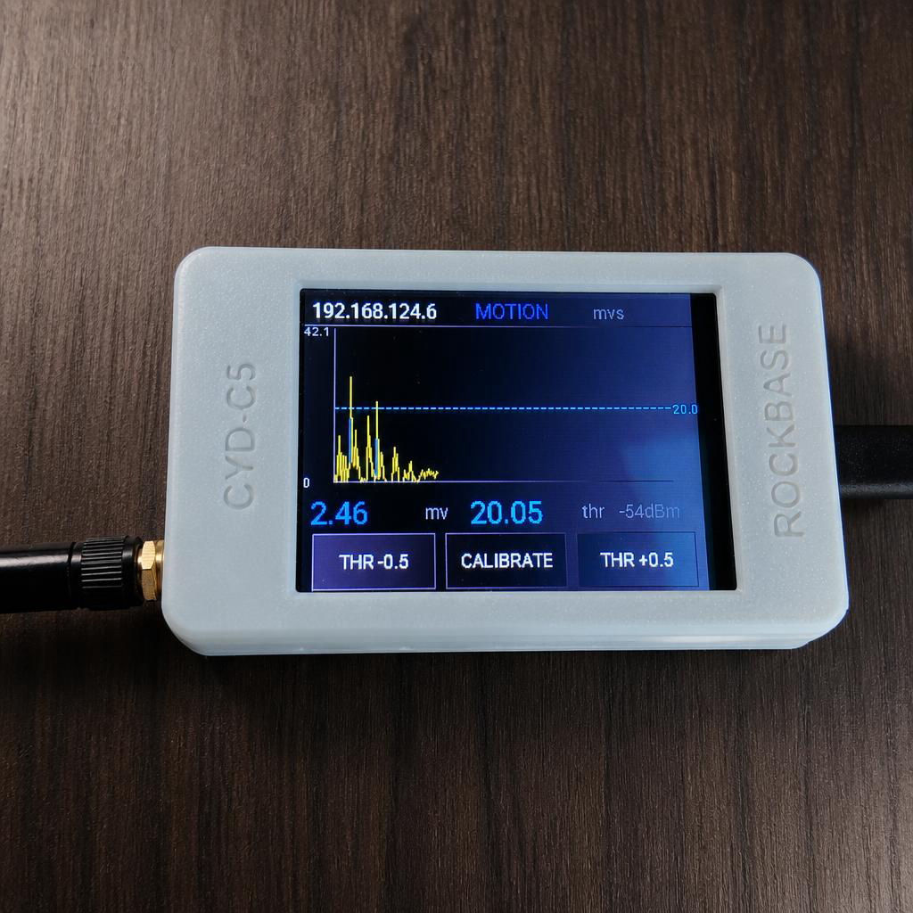
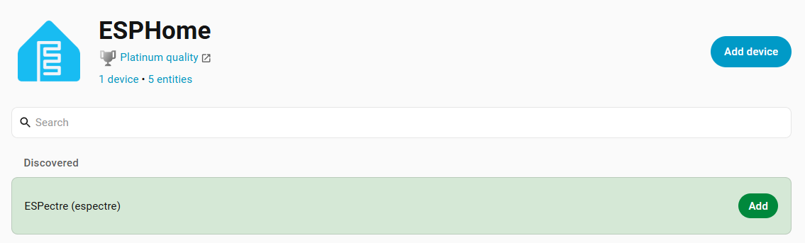
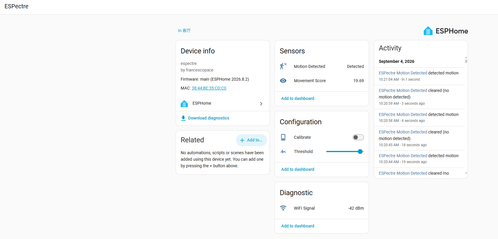
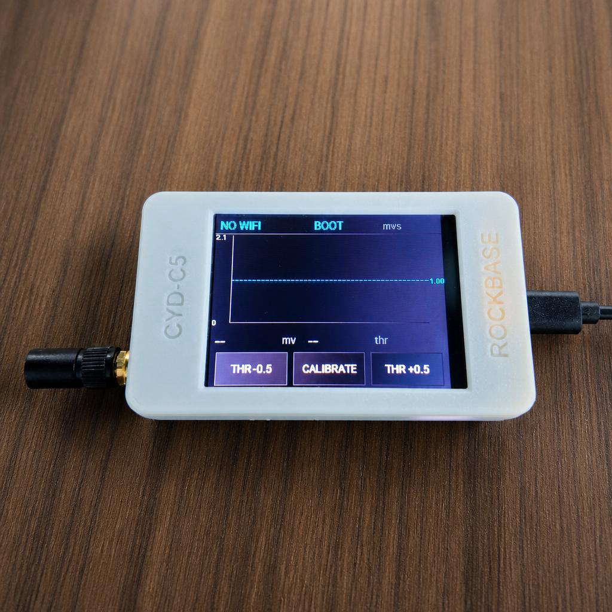

# ESPectre × NM-CYD-C5 使用说明

[English](USAGE-NM-CYD-C5.md) | 简体中文

> 适用固件：`examples/espectre-cyd-c5.yaml`（nm-cyd-c5 分支）
> 适用硬件：NM-CYD-C5（推荐外置天线版本，nm-cyd-c5-ant；ESP32-C5，2.8 寸 320×240 ST7789 触摸屏）

ESPectre 是基于 WiFi CSI（信道状态信息）的人体运动检测系统。本固件在 NM-CYD-C5 上除实现ESPectre的人体运动检测功能外，还提供完整的本地交互能力：实时运动曲线、门限线显示、触摸门限手动调节按键、一键校准，同时支持 Home Assistant、网页界面和蓝牙监视器。

---

## 1. 功能一览

| 功能 | 入口 |
|---|---|
| 运动检测（MVS / ML 算法） | 自动运行，WiFi CSI 被动感知，无需佩戴任何设备 |
| Movement 实时曲线 + Threshold 门限线 | 设备屏幕（320×240） |
| 触摸调节门限（±0.5，范围 0–10） | 屏幕按钮 / HA / 网页 / 蓝牙 |
| NBVI 自动校准（子载波选择 + 自适应门限） | 屏幕 CALIBRATE 按钮 / HA Calibrate 开关 |
| Home Assistant 集成 | 原生 ESPHome API（自动发现） |
| 网页控制台（实体查看/控制、日志、OTA） | 浏览器访问设备 IP |
| 蓝牙实时监视器（25 Hz 曲线） | `micro-espectre/espectre-monitor.html` |



## 2. 首次配网

设备烧录固件后首次启动时未保存任何 WiFi 凭据，会自动开启配网热点：

1. 用手机或电脑扫描 WiFi，连接名为 **`ESPectre Fallback`** 的热点；
2. 浏览器会自动弹出配网页面（未弹出则手动访问 `192.168.4.1`）；
3. 输入你当前环境的 WiFi 并输入密码 —— **官方建议使用 2.4 GHz 网络**（ESPectre 的 CSI 检测强制工作在 2.4 GHz 频段，5 GHz 网络无法用于检测）；
4. 配置成功后设备自动重启并连接 WiFi；
5. 连接成功后，**屏幕左上角标题栏会直接显示设备 IP 地址**（未连接时显示黄色 `NO WIFI`）。

> 也可以使用 Home Assistant 手机 App 通过蓝牙（BLE Improv）配网，效果相同。

## 3. 添加到 Home Assistant

前提：设备与 Home Assistant 在**同一网段**。

1. 在 Home Assistant 中安装 **ESPHome** 集成（设置 → 设备与服务 → 添加集成 → ESPHome）；
2. 打开 Home Assistant → **Settings（设置）** → 找到 **ESPHome** → 点击 **Add New Device（添加新设备）**；
3. 设备与 HA 在同一网络时会**自动被发现**（mDNS 主机名 `espectre`），点击确认即可完成添加；未自动发现时手动输入屏幕上的 IP 地址（端口 6053，本固件未设 API 加密，无需密钥）。



添加成功后可见 5 个实体：

| 实体 | 类型 | 说明 |
|---|---|---|
| Movement Score | sensor | 运动分数（滑动方差，曲线数据源） |
| Motion Detected | binary_sensor | 运动状态（可用于自动化触发） |
| Threshold | number | 门限，范围 0–10（与屏幕按钮联动） |
| Calibrate | switch | 触发重新校准，完成自动关闭 |
| WiFi Signal | sensor | 信号强度 dBm |




## 4. 屏幕界面与操作

```
┌──────────────────────────────────────────────┐
│ 192.168.1.100   MOTION/IDLE/CAL…       mvs   │ 标题栏：IP / 状态 / 算法
├──────────────────────────────────────────────┤
│        ╭─╮        Movement 曲线（青）         │
│       ╱   ╲╭─╮    超门限段变红               │
│  - - - - - - - -  Threshold 门限虚线（黄）    │
├──────────────────────────────────────────────┤
│  1.83 mv   1.10 thr                 -55dBm   │ 数值栏
├────────────┬──────────────────┬──────────────┤
│  THR −0.5  │    CALIBRATE     │   THR +0.5   │ 触摸按钮
└────────────┴──────────────────┴──────────────┘
```



- **曲线区**：约 4.5 分钟滚动历史（1 点/秒），纵轴自动缩放；曲线超过黄色门限线的部分变红，直观呈现"判决"过程。
-- **THR −0.5 / +0.5**：步进调节门限，范围 0–10，实时生效（会话级，重启后按校准值/配置重算）。
-- **CALIBRATE**：触发 NBVI 重新校准（约 10 秒，期间请保持环境静止）。校准会自动选择最优子载波并计算自适应门限（P95×1.1），**校准结果可能远超 10（可达 10.0+），属正常现象**。
- 状态文字：`MOTION`（红）/ `IDLE`（绿）/ `CALIBRATING...`（蓝）/ `BOOT`（黄）。

## 5. 网页控制台

浏览器访问 `http://<设备IP>/`（IP 见屏幕标题栏）：

- 查看/控制全部实体（Movement Score、Motion、Threshold 滑块、Calibrate）；
- 页面底部实时日志窗口；
- **OTA 固件上传**：以后更新固件可直接在网页上传 `firmware.ota.bin`，无需 USB。

> 默认无访问密码，仅限可信局域网使用。如需鉴权，可在 YAML 中启用 `web_server.auth`。

## 6. 蓝牙实时监视器（可选）

需要比屏幕更流畅的实时曲线时：用 Chrome/Edge 打开仓库中的 `micro-espectre/espectre-monitor.html`，通过 Web Bluetooth 直连设备（25 Hz 推送 Movement + Threshold），可实时查看曲线并拖动滑块调节门限。要求设备在蓝牙范围内，浏览器需支持 Web Bluetooth（Chrome/Edge）。

## 7. 日常使用建议

- **安装位置**：设备与路由器之间无金属遮挡，CSI 对 2.4 GHz 链路质量敏感；
- **何时校准**：设备挪动位置、环境布局变化、误报/漏报明显时，按 CALIBRATE 重新校准（校准时保持房间无人走动）；或通过ESPHome网页，或通过Home Assistant 触发 Calibrate 实体。
- **门限调节原则**：误报多→调大；漏报多→调小。小幅动作检测建议先重新校准再微调；
- **断网自愈**：WiFi 断开后设备自动重连，CSI 与检测自动恢复，无需干预。

## 8. 常见问题

| 现象 | 处理 |
|---|---|
| 屏幕显示 `NO WIFI` | 未连网：连接 `ESPectre Fallback` 热点重新配网，确认使用 2.4 GHz 网络 |
| 浏览器打不开设备 IP | 确认已刷入含 `web_server` 的本固件，且设备与电脑同网段 |
| HA 搜不到设备 | 检查同网段/VLAN；或手动输入 IP:6053 添加 |
| 触摸按钮无反应/偏移 | 电阻屏个体差异，微调 YAML 中 `touchscreen.calibration` 四个边界值 |
| 校准失败或不理想 | 校准时保持环境绝对静止；信号过强（离路由器 <50cm）时增益锁会跳过，属预期 |
| 固件更新 | 网页 OTA 上传，或 `esphome upload`（WiFi 直连，无需 USB） |

