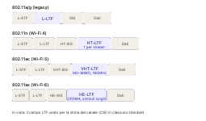

# ADR: keep the 12-tone HT20 Classic band

- Status: Superseded
- Date: 2026-07-20
- Superseded by: 2026-07-25-select-the-classic-band-from-channel-coherence.md

> The design rules and the `N = 10..16` sweep below assume HT20 CSI arrives with DC in bin 32 on every chip. Classic-MAC parts (ESP32, C3, S3) actually deliver it with DC in bin 0, so on those chips the band included two identically-zero bins and different `N` landed on a different number of dead tones. The sweep's independent variable was not the tone count, and the band spans 36 of the 56 usable subcarriers rather than the full range. Kept for the historical record.

## Context

The project had already moved away from runtime subcarrier search and onto one fixed shared Classic/ML band:

- `DEFAULT_SUBCARRIERS = (14, 17, 20, 23, 26, 29, 35, 38, 41, 44, 47, 50)`
- uniform spacing across the usable HT20 range
- symmetric placement around DC index `32`
- explicit skip of the DC-null region `30..34`
- 3-index margin inside the HT20 guard-band limits `11..52`

That fixed band had become the active production baseline, but the project still needed a durable record of why the count stayed at `12`, why the exact indices stayed unchanged, and why the runtime and validation contract remained HT20 instead of pivoting toward adjacent-tone averaging or HE20-style virtual subcarrier expectations.

The PHY layout comparison below is a useful visual summary of that choice:

*HT20 is the current production sensing contract because it already matches the project's validated 64-subcarrier view and fixed 12-tone band directly. Wider or newer PHY layouts may still be preserved as provenance, but they introduce additional grouping assumptions that this decision did not find strong enough to promote into the active detector baseline.*

On 2026-07-20, two host-side benchmark passes were run against the real CSI datasets using the production Classic calibration path:

1. A count sweep across `N = 10..16`, keeping the same design rules and using dataset-specific startup calibration.
2. A follow-up iso-FP ROC comparison between:
   - the plain 12-tone production band
   - pair averaging on the same 12-tone positions, where each `|H[k]|` was replaced by the mean of `|H[k]|` and one valid adjacent tone

The benchmark corpus for the locked decision consisted of:

- 13 paired static-presence/motion datasets
- 12 long-quiet recordings
- 12 empty-room recordings

All evaluated recordings exposed full 64-subcarrier HT20 CSI, so no dataset was excluded from the final comparison.

The wider-than-12 sweep required a scratch-only Python shim because the current Python Classic hot path pre-allocates 12-tone amplitude and L1 buffers. The shim was accepted for research only after exact `N=12` parity with the unshimmed production path.

## Decision

Keep the current 12-tone HT20 Classic band unchanged:

- continue using `14, 17, 20, 23, 26, 29, 35, 38, 41, 44, 47, 50`
- keep HT20 as the active detector and validation contract
- do not switch production Classic to a different tone count in the `10..16` range
- do not adopt adjacent-tone pair averaging as a production Classic change
- do not treat this pair-averaging result as support for HE20 4-tone virtual-subcarrier averaging; the mechanism should be considered weakened by this evidence

The 2026-07-20 benchmark evidence supporting that decision was:

| N | Paired recall % | Paired FP % | Paired F1 % | Long FP % | Empty FP % |
| --- | --- | --- | --- | --- | --- |
| 10 | 98.423 | 0.000 | 99.194 | 0.145 | 0.132 |
| 11 | 98.552 | 0.044 | 99.217 | 0.164 | 0.192 |
| 12 | 98.666 | 0.088 | 99.230 | 0.173 | 0.135 |
| 13 | 98.379 | 0.055 | 99.116 | 0.223 | 0.057 |
| 14 | 98.684 | 0.033 | 99.298 | 0.237 | 0.136 |
| 15 | 98.575 | 0.033 | 99.240 | 0.261 | 0.192 |
| 16 | 98.478 | 0.066 | 99.155 | 0.245 | 0.116 |

`N=14` looked slightly better on paired means, but the paired deltas versus the production `N=12` baseline were small relative to dataset-to-dataset spread: mean `F1 +0.068 +/- 0.415`, mean `FP -0.055 +/- 0.111`, with worse long-quiet false positives. The result was therefore judged flat within noise rather than strong enough to justify a production switch.

The pair-averaging follow-up also did not justify a production change:

- at the original operating point (`k=1.0`), pair averaging lowered paired FP from `0.088%` to `0.055%`, but also lowered paired recall from `98.666%` to `97.980%`
- after retuning the effective Classic startup-strength knob on an iso-FP ROC, pair averaging reached `98.904%` recall at matched paired FP `0.088%`
- that recall gain was only `+0.238` points, while the per-dataset recall delta at the matched point was `+0.370 +/- 1.256`
- at matched long-quiet FP `0.173%`, pair averaging slightly underperformed the plain baseline (`98.638%` recall versus `98.667%`)

The project therefore interprets pair averaging as an operating-point shift, not as a durable separability improvement.

## Alternatives Considered

### Switch to 14 tones

Rejected. `N=14` improved paired mean F1 slightly, but the gain did not clear the dataset-to-dataset spread and it regressed long-quiet false positives.

### Switch to another fixed count in the 10..16 range

Rejected. The sweep did not show a robust winner over the existing 12-tone set. The production baseline remained inside the flat part of the trade-off surface.

### Adopt pair averaging and retune the startup strength

Rejected. The iso-FP ROC showed only a small aggregate recall gain at matched paired FP, and that gain was weaker than the per-dataset spread. The long-quiet matched-FP comparison did not improve.

### Use these results as evidence for HE20 virtual-subcarrier averaging

Rejected. Adjacent-tone averaging is the relevant mechanism here, and the HT20 result weakens, rather than strengthens, the expectation that wider grouped averaging will produce a durable separability gain in production.

## Consequences

Benefits:

- the project keeps one stable, already validated 12-tone production band
- Classic and ML remain aligned on the same fixed HT20 band contract
- future detector or frontend changes do not need a simultaneous subcarrier-map migration without stronger evidence
- the benchmark history now records that "keep 12" was an evidence-based choice, not just inertia

Trade-offs:

- some nearby counts can look slightly better on one aggregate slice, especially paired mean F1, without being strong enough to justify a switch
- future HE20 or wider-band work should not assume adjacent-tone averaging is a likely free gain; it must be re-demonstrated on its own data and payload contract
- the Python hot path still has explicit 12-tone buffer assumptions, so any future wider-band research must again separate scratch-only evaluation from production readiness

## Related

- `docs/adr/2026-06-09-replace-runtime-nbvi-with-fixed-shared-subcarriers.md`
- `docs/adr/2026-07-08-promote-classic-detector-and-retire-legacy-baselines.md`
- `docs/adr/2026-07-19-preserve-per-record-phy-provenance-in-streamer-datasets.md`
