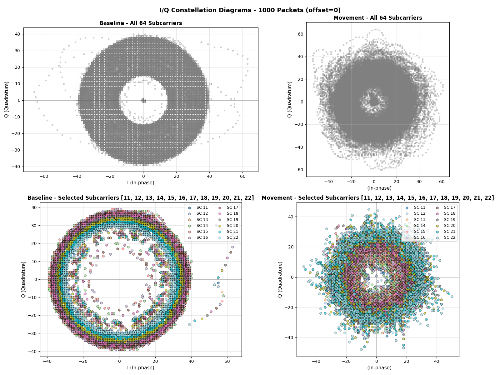

# Algorithms

Scientific documentation of the algorithms used in ESPectre for Wi-Fi CSI-based motion detection.

---

## Table of Contents

- [Overview](#overview)
- [Processing Pipeline](#processing-pipeline)
- [Gain Lock (Hardware Stabilization)](#gain-lock-hardware-stabilization)
- [MVS: Moving Variance Segmentation](#mvs-moving-variance-segmentation)
- [Automatic Subcarrier Selection](#automatic-subcarrier-selection)
- [Low-Pass Filter](#low-pass-filter)
- [Hampel Filter](#hampel-filter)
- [CSI Features](#csi-features-for-ml)
- [References](#references)

---

## Overview

ESPectre uses a combination of signal processing algorithms to detect motion from Wi-Fi Channel State Information (CSI). 

<details>
<summary>What is CSI? (click to expand)</summary>

**Channel State Information (CSI)** represents the physical characteristics of the wireless communication channel between transmitter and receiver. Unlike simple RSSI (Received Signal Strength Indicator), CSI provides rich, multi-dimensional data about the radio channel.

**What CSI Captures:**

*Per-subcarrier information:*
- **Amplitude**: Signal strength for each OFDM subcarrier (64 for HT20 mode)
- **Phase**: Phase shift of each subcarrier
- **Frequency response**: How the channel affects different frequencies

*Environmental effects:*
- **Multipath propagation**: Reflections from walls, furniture, objects
- **Doppler shifts**: Changes caused by movement
- **Temporal variations**: How the channel evolves over time
- **Spatial patterns**: Signal distribution across antennas/subcarriers

**Why It Works for Movement Detection:**

When a person moves in an environment, they alter multipath reflections, change signal amplitude and phase, create temporal variations in CSI patterns, and modify the electromagnetic field structure. These changes are detectable even through walls, enabling **privacy-preserving presence detection** without cameras, microphones, or wearable devices.

</details>

---

## Processing Pipeline

```
┌───────────────────────────────────────────────────────────────────────────────────┐
│                           CSI PROCESSING PIPELINE                                  │
├───────────────────────────────────────────────────────────────────────────────────┤
│                                                                                   │
│  ┌──────────┐    ┌──────────┐    ┌──────────────┐    ┌─────────────┐              │
│  │ CSI Data │───▶│Gain Lock │───▶│ Band Select  │───▶│ Turbulence  │              │
│  │ N subcs  │    │ AGC/FFT  │    │ 12 subcs     │    │ σ(amps)     │              │
│  └──────────┘    └──────────┘    └──────────────┘    └──────┬──────┘              │
│                  (3s, 300 pkt)    (7s, 700 pkt)             │                     │
│                                                             ▼                     │
│  ┌───────────┐    ┌───────────────┐    ┌─────────────────┐  ┌──────────────────┐  │
│  │ IDLE or   │◀───│ Adaptive      │◀───│ Moving Variance │◀─│ Optional Filters │  │
│  │ MOTION    │    │ Threshold     │    │ (window=50)     │  │ LowPass + Hampel │  │
│  └───────────┘    └───────────────┘    └─────────────────┘  └──────────────────┘  │
│                                                                                   │
└───────────────────────────────────────────────────────────────────────────────────┘
```

**Calibration sequence (at boot):**
1. **Gain Lock** (3s, 300 packets): Collect AGC/FFT, lock values
2. **Band Calibration** (7s, 700 packets): Select 12 optimal subcarriers, calculate baseline variance

**Data flow per packet (after calibration):**
1. **CSI Data**: Raw I/Q values for 64 subcarriers (HT20 mode)
2. **Amplitude Extraction**: `|H| = √(I² + Q²)` for selected 12 subcarriers
3. **Spatial Turbulence**: `σ = std(amplitudes)` - variability across subcarriers
4. **Hampel Filter**: Remove outliers using MAD (optional, disabled by default)
5. **Low-Pass Filter**: Remove high-frequency noise (Butterworth 1st order, 11 Hz cutoff)
6. **Moving Variance**: `Var(turbulence)` over sliding window
7. **Adaptive Threshold**: Compare variance to `P95(baseline_mv) × 1.4` → IDLE or MOTION

---

## Gain Lock (Hardware Stabilization)

### Overview

**Gain Lock** is a hardware-level optimization that stabilizes CSI amplitude measurements by locking the ESP32's automatic gain control (AGC) and FFT scaling. This technique is based on [Espressif's esp-csi recommendations](https://github.com/espressif/esp-csi).

### The Problem

The ESP32 WiFi hardware includes automatic gain control (AGC) that dynamically adjusts signal amplification based on received signal strength. While this improves data decoding reliability, it creates a problem for CSI sensing:

| Without Gain Lock | With Gain Lock |
|-------------------|----------------|
| AGC varies dynamically | AGC fixed to calibrated value |
| CSI amplitudes oscillate ±20-30% | Amplitudes stable |
| Baseline appears "noisy" | Baseline flat |
| Potential false positives | Cleaner detection |

### How It Works

The gain lock happens in a **dedicated phase BEFORE band calibration** to ensure clean data:

```
┌──────────────────────────────────────────────────────────────────────┐
│                    TWO-PHASE CALIBRATION                              │
├──────────────────────────────────────────────────────────────────────┤
│                                                                      │
│  PHASE 1: GAIN LOCK (~3 seconds, 300 packets)                        │
│  ┌─────────────┐    ┌─────────────┐    ┌─────────────┐              │
│  │  Read PHY   │───▶│  Accumulate │───▶│  Calculate  │              │
│  │  agc_gain   │    │  agc_sum    │    │  Average    │              │
│  │  fft_gain   │    │  fft_sum    │    │             │              │
│  └─────────────┘    └─────────────┘    └──────┬──────┘              │
│                                               │                      │
│  Packet 300:                                  ▼                      │
│  ┌──────────────────────────────────────────────────────────────┐   │
│  │  phy_fft_scale_force(true, avg_fft)                          │   │
│  │  phy_force_rx_gain(true, avg_agc)                            │   │
│  │  → AGC/FFT now LOCKED                                        │   │
│  └──────────────────────────────────────────────────────────────┘   │
│                           │                                          │
│                           ▼                                          │
│  PHASE 2: BAND CALIBRATION (~7 seconds, 700 packets)                │
│  ┌──────────────────────────────────────────────────────────────┐   │
│  │  Now all packets have stable gain!                           │   │
│  │  → Baseline variance calculated on clean data                │   │
│  │  → Subcarrier selection more accurate                        │   │
│  └──────────────────────────────────────────────────────────────┘   │
│                                                                      │
└──────────────────────────────────────────────────────────────────────┘
```

**Why two phases?** Separating gain lock from band calibration ensures:
- Calibration only sees data with **stable, locked gain**
- Baseline variance is **accurate** (not inflated by AGC variations)
- Adaptive threshold is calculated correctly
- Total time: ~10 seconds (3s gain lock + 7s calibration)

### Implementation

The gain lock uses undocumented PHY functions available on newer ESP32 variants:

```c
// External PHY functions (from ESP-IDF PHY blob)
extern void phy_fft_scale_force(bool force_en, uint8_t force_value);
extern void phy_force_rx_gain(int force_en, int force_value);

// Calibration logic (300 packets, ~3 seconds)
if (packet_count < 300) {
    agc_sum += phy_info->agc_gain;
    fft_sum += phy_info->fft_gain;
} else if (packet_count == 300) {
    phy_fft_scale_force(true, fft_sum / 300);
    phy_force_rx_gain(true, agc_sum / 300);
    // Gain is now locked, trigger band calibration
    on_gain_locked_callback();
}
```

### Platform Support

| Platform | Gain Lock | Notes |
|----------|-----------|-------|
| ESP32-S3 | Supported | Full AGC/FFT control |
| ESP32-C3 | Supported | Full AGC/FFT control |
| ESP32-C5 | Supported | Full AGC/FFT control |
| ESP32-C6 | Supported | Full AGC/FFT control |
| ESP32 (original) | Not available | PHY functions not exposed |
| ESP32-S2 | Not available | PHY functions not exposed |

On unsupported platforms, ESPectre skips the gain lock process without affecting functionality. Motion detection still works, but may have slightly higher baseline variance.

### Configuration

Gain lock is **always enabled** on supported platforms with no configuration required. It operates transparently during the first ~3 seconds after boot (300 packets at 100 Hz), followed by band calibration (~7 seconds, 700 packets).

**Reference**: [Espressif esp-csi example](https://github.com/espressif/esp-csi/blob/master/examples/get-started/csi_recv_router/main/app_main.c)

---

## MVS: Moving Variance Segmentation

### Overview

**MVS (Moving Variance Segmentation)** is the core motion detection algorithm. It analyzes the variance of spatial turbulence over time to distinguish between idle and motion states.

### The Insight

Human movement causes **multipath interference** in Wi-Fi signals, which manifests as:
- **Idle state**: Stable CSI amplitudes → low turbulence variance
- **Motion state**: Fluctuating CSI amplitudes → high turbulence variance

By monitoring the **variance of turbulence** over a sliding window, we can reliably detect when motion occurs.

### Algorithm Steps

1. **Spatial Turbulence Calculation**
   ```
   turbulence = σ(amplitudes) = √(Σ(aᵢ - μ)² / n)
   ```
   Where `aᵢ` are the amplitudes of the 12 selected subcarriers.

2. **Moving Variance (Two-Pass Algorithm)**
   ```
   μ = Σxᵢ / n                    # Mean of turbulence buffer
   Var = Σ(xᵢ - μ)² / n           # Variance (numerically stable)
   ```
   The two-pass algorithm avoids catastrophic cancellation that can occur with running variance on float32.

3. **State Machine**
   ```
   if state == IDLE and variance > threshold:
       state = MOTION
   elif state == MOTION and variance < threshold:
       state = IDLE
   ```

### Key Parameters

| Parameter | Default | Range | Effect |
|-----------|---------|-------|--------|
| `threshold` | Adaptive | 0.5-10.0 | Calculated as P95(baseline_mv) × 1.4 during calibration |
| `window_size` | 50 | 10-200 | Larger = smoother, slower response |

**Note**: The adaptive threshold is calculated automatically during calibration. It adapts to each environment's baseline noise level, ensuring zero false positives across all ESP32 variants.

### Performance

📊 **For detailed performance metrics** (confusion matrix, test methodology, benchmarks), see [PERFORMANCE.md](../PERFORMANCE.md).

**Reference**: [1] MVS segmentation: the fused CSI stream and corresponding moving variance sequence (ResearchGate)

---

## Automatic Subcarrier Selection

### Overview

ESPectre uses **P95 Moving Variance** optimization for automatic subcarrier band selection, achieving **F1=98.2%** with **zero manual configuration**.


*I/Q constellation diagrams showing the geometric representation of WiFi signal propagation in the complex plane. The baseline (idle) state exhibits a stable, compact pattern, while movement introduces entropic dispersion as multipath reflections change.*

### The Problem

WiFi CSI provides 64 subcarriers in HT20 mode, but not all are equally useful for motion detection:
- Some are too weak (low SNR)
- Some are too noisy (high variance even at rest)
- Some are in guard bands or DC zones
- Manual selection works but doesn't scale across environments

**Challenge**: Find an automatic method that selects the optimal band for motion detection.

### The Solution: P95 Moving Variance

The key insight is that the **95th percentile of moving variance (P95 MV)** during baseline directly predicts the false positive rate:
- If P95 MV < detection threshold → near-zero false positives
- If P95 MV > detection threshold → high false positive rate

The algorithm evaluates all candidate 12-subcarrier bands and selects the one with:
1. P95 MV below a safety margin (threshold - 0.15 = 0.85 for threshold=1.0)
2. Highest P95 MV among safe bands (most responsive to movement)

### Algorithm

```python
def band_calibrate(csi_buffer, band_size=12):
    # 1. Collect baseline data (700 packets, ~7s @ 100Hz)
    #    Skip first 300 packets (used for gain lock)
    magnitudes = calculate_magnitudes(csi_buffer[300:])
    
    # 2. Generate candidate bands (12 consecutive subcarriers)
    #    Avoiding guard bands and DC zone
    candidates = generate_candidate_bands(band_size)
    
    # 3. Evaluate each candidate
    results = []
    for band in candidates:
        # Extract ONLY the 12 subcarriers needed (not all 64)
        turbulences = [spatial_turbulence(pkt, band) for pkt in magnitudes]
        
        # Calculate moving variance series
        mv_series = moving_variance(turbulences, window=50)
        
        # Calculate P95 of moving variance
        p95 = percentile(mv_series, 95)
        
        results.append({'band': band, 'p95': p95})
    
    # 4. Select optimal band
    safe_margin = 0.15  # Safety below threshold
    safe_bands = [r for r in results if r['p95'] < (threshold - safe_margin)]
    
    if safe_bands:
        # Select most "active" safe band (highest P95 still under limit)
        best = max(safe_bands, key=lambda r: r['p95'])
    else:
        # Fallback: select band with lowest P95
        best = min(results, key=lambda r: r['p95'])
    
    return best['band']
```

### Why P95?

The 95th percentile captures the "worst case" behavior during baseline:
- Mean MV may look good but hide occasional spikes
- Max MV is too sensitive to outliers
- P95 represents the upper bound of normal variance

If P95 < threshold, 95% of samples are below threshold → very low FP rate.

### Computational Complexity

Let B = candidate bands, P = packets (700), N = subcarriers, W = window size (50), K = band size (12).

**Algorithm complexity:**

| Operation | Complexity | Notes |
|-----------|------------|-------|
| Turbulence per packet | O(K) | std of 12 values |
| Moving variance | O(P × W) | sliding window |
| P95 calculation | O(P log P) | sorting |
| **Total per band** | O(P × W) | dominated by MV |
| **Total all bands** | O(B × P × W) | ~40 bands for 64 SC |

### Calibration Time

| WiFi Mode | Candidate Bands | Time (measured) |
|-----------|-----------------|-----------------|
| HT20 (64 SC) | ~40 | ~1-2s |

### Guard Bands and DC Zone

HT20 mode (64 subcarriers) configuration:

| Parameter | Value |
|-----------|-------|
| Total Subcarriers | 64 |
| Guard Band Low | 11 |
| Guard Band High | 52 |
| DC Subcarrier | 32 |
| Valid Subcarriers | 41 |
| Candidate Bands | ~19 |

### Fallback Behavior

When calibration cannot find valid bands (e.g., poor signal quality), a fallback mechanism ensures motion detection remains functional:

1. **Lowest P95 band used**: The band with minimum P95 is selected
2. **Motion detection works**: Even suboptimal bands provide usable detection

### Configuration

```python
# Python (Micro-ESPectre)
BandCalibrator(
    buffer_size=700,             # 7s @ 100Hz (after 3s gain lock)
    expected_subcarriers=None    # Auto-detect from first packet
)
```

### Parameters

| Parameter | Default | Range | Effect |
|-----------|---------|-------|--------|
| `buffer_size` | 700 | 500-1000 | Packets for calibration (~7s at 100Hz) |

The algorithm has minimal configuration - it automatically adapts to the environment by analyzing the P95 moving variance of each candidate band

---

## Low-Pass Filter

### Overview

The **Low-Pass Filter** removes high-frequency noise from turbulence values. This is particularly useful in noisy RF environments where the selected band may include subcarriers susceptible to interference.

> ℹ️ **Default: Disabled** - The low-pass filter is disabled by default for simplicity. Enable it (11 Hz cutoff recommended) if you experience false positives in noisy RF environments.

### How It Works

The filter uses a **1st-order Butterworth IIR filter** implemented for real-time processing:

1. **Bilinear transform** to convert analog filter to digital
2. **Difference equation**: `y[n] = b₀·x[n] + b₀·x[n-1] - a₁·y[n-1]`
3. **Single sample latency** for real-time processing

### Algorithm

```python
class LowPassFilter:
    def __init__(self, cutoff_hz=11.0, sample_rate_hz=100.0):
        # Bilinear transform
        wc = tan(π × cutoff / sample_rate)
        k = 1.0 + wc
        self.b0 = wc / k
        self.a1 = (wc - 1.0) / k
        
        self.x_prev = 0.0
        self.y_prev = 0.0
    
    def filter(self, x):
        y = self.b0 * x + self.b0 * self.x_prev - self.a1 * self.y_prev
        self.x_prev = x
        self.y_prev = y
        return y
```

### Parameters

| Parameter | Default | Range | Effect |
|-----------|---------|-------|--------|
| `lowpass_enabled` | false | - | Enable/disable filter |
| `lowpass_cutoff` | 11.0 | 5-20 Hz | Lower = more smoothing, slower response |

### Why 11 Hz Cutoff

Human movement generates signal variations typically in the **0.5-10 Hz** range. RF noise and interference are usually **>15 Hz**. The 11 Hz cutoff:
- **Preserves** motion signal (>90% recall)
- **Removes** high-frequency noise
- **Reduces** false positives in noisy environments

### Performance (60s noisy baseline)

| Configuration | Recall | FP Rate | F1 Score |
|---------------|--------|---------|----------|
| No filter | 98.3% | 51.2% | N/A |
| Low-pass 11 Hz | **92.4%** | **2.34%** | **88.9%** |
| Low-pass 11 Hz + Hampel | **92.1%** | **0.84%** | **93.2%** |

---

## Hampel Filter

### Overview

The **Hampel filter** removes statistical outliers using the Median Absolute Deviation (MAD) method. It can be applied to turbulence values before MVS calculation to reduce false positives from sudden interference.

> ⚠️ **Default: Disabled** - The Hampel filter is disabled by default because MVS already provides robust motion detection with 0% false positives in typical environments. Enabling it reduces Recall from 98.1% to 96.3%. Only enable in environments with high electromagnetic interference causing sudden spikes (e.g., industrial settings, proximity to microwave ovens or multiple WiFi access points).

### How It Works

1. **Maintain sliding window** of recent turbulence values
2. **Calculate median** of the window
3. **Calculate MAD**: `MAD = median(|xᵢ - median|)`
4. **Detect outliers**: If `|x - median| > threshold × 1.4826 × MAD`, replace with median

The constant **1.4826** is the consistency constant for Gaussian distributions.

### Algorithm

```python
def hampel_filter(value, buffer, threshold=4.0):
    # Add to circular buffer
    buffer.append(value)
    
    # Calculate median
    sorted_buffer = sorted(buffer)
    median = sorted_buffer[len(buffer) // 2]
    
    # Calculate MAD
    deviations = [abs(x - median) for x in buffer]
    mad = sorted(deviations)[len(deviations) // 2]
    
    # Check if outlier
    scaled_mad = 1.4826 * mad * threshold
    if abs(value - median) > scaled_mad:
        return median  # Replace outlier
    return value       # Keep original
```

### Implementation Optimization

For embedded systems, the implementation uses:
- **Insertion sort** instead of quicksort (faster for N < 15)
- **Pre-allocated buffers** (no dynamic allocation)
- **Circular buffer** for O(1) insertion

### Parameters

| Parameter | Default | Range | Effect |
|-----------|---------|-------|--------|
| `hampel_enabled` | false | - | Enable/disable filter |
| `hampel_window` | 7 | 3-11 | Larger = more context, slower |
| `hampel_threshold` | 4.0 | 1.0-10.0 | Lower = more aggressive filtering |

### Why Disabled by Default

Testing showed that in clean environments:
- **Without Hampel**: 98.1% Recall, 0% FP
- **With Hampel**: 96.3% Recall, 0% FP

The filter reduces recall because it treats the first packets of real movement as "outliers" and replaces them with the baseline median, delaying detection.

**Reference**: [6] CSI-F: Feature Fusion Method (MDPI Sensors)

---

## CSI Features (for ML)

ESPectre extracts statistical features from CSI data for future machine learning applications (planned for v3.x).

### Available Features

| Feature | Fisher J | Source | Description |
|---------|----------|--------|-------------|
| `iqr_turb` | 3.56 | Turbulence buffer | Interquartile range approximation |
| `skewness` | 2.54 | Current packet | Distribution asymmetry |
| `kurtosis` | 2.24 | Current packet | Distribution tailedness |
| `entropy_turb` | 2.08 | Turbulence buffer | Shannon entropy |
| `variance_turb` | 1.21 | Turbulence buffer | Moving variance (from MVS) |

**Fisher's Criterion (J)**: Measures class separability. Higher J = better feature for distinguishing idle vs motion.

### Feature Definitions

**Skewness** (third standardized moment):
```
γ₁ = E[(X - μ)³] / σ³
```
- γ₁ > 0: Right-skewed (tail on right)
- γ₁ < 0: Left-skewed (tail on left)
- γ₁ = 0: Symmetric

**Kurtosis** (fourth standardized moment):
```
γ₂ = E[(X - μ)⁴] / σ⁴ - 3
```
- γ₂ > 0: Heavy tails (leptokurtic)
- γ₂ < 0: Light tails (platykurtic)
- γ₂ = 0: Normal distribution (mesokurtic)

**Shannon Entropy**:
```
H = -Σ pᵢ × log₂(pᵢ)
```
Measures uncertainty/randomness in the turbulence distribution.

---

## References

### Primary Sources

1. **MVS Segmentation** - ResearchGate  
   The fused CSI stream and corresponding moving variance sequence.  
   📄 [Read paper](https://www.researchgate.net/figure/MVS-segmentation-a-the-fused-CSI-stream-b-corresponding-moving-variance-sequence_fig6_326244454)

2. **Indoor Motion Detection Using Wi-Fi CSI (2018)** - PMC  
   False positive reduction and sensitivity optimization.  
   📄 [Read paper](https://pmc.ncbi.nlm.nih.gov/articles/PMC6068568/)

3. **WiFi Motion Detection: Efficacy and Performance (2019)** - arXiv  
   Signal processing methods for motion detection.  
   📄 [Read paper](https://arxiv.org/abs/1908.08476)

### Algorithm-Specific References

4. **Passive Indoor Localization** - PMC  
   SNR considerations and noise gate strategies.  
   📄 [Read paper](https://pmc.ncbi.nlm.nih.gov/articles/PMC6412876/)

5. **Subcarrier Selection for Indoor Localization** - ResearchGate  
   Spectral de-correlation and feature diversity.  
   📄 [Read paper](https://www.researchgate.net/publication/326195991)

6. **CSI-F: Feature Fusion Method** - MDPI Sensors  
   Hampel filter and statistical robustness.  
   📄 [Read paper](https://www.mdpi.com/1424-8220/24/3/862)

7. **Linear-Complexity Subcarrier Selection** - ResearchGate  
   Computational efficiency for embedded systems.  
   📄 [Read paper](https://www.researchgate.net/publication/397240630)

8. **CIRSense: Rethinking WiFi Sensing** - arXiv  
   SSNR (Sensing Signal-to-Noise Ratio) optimization.  
   📄 [Read paper](https://arxiv.org/html/2510.11374v1)

---

## License

GPLv3 - See [LICENSE](../LICENSE) for details.

