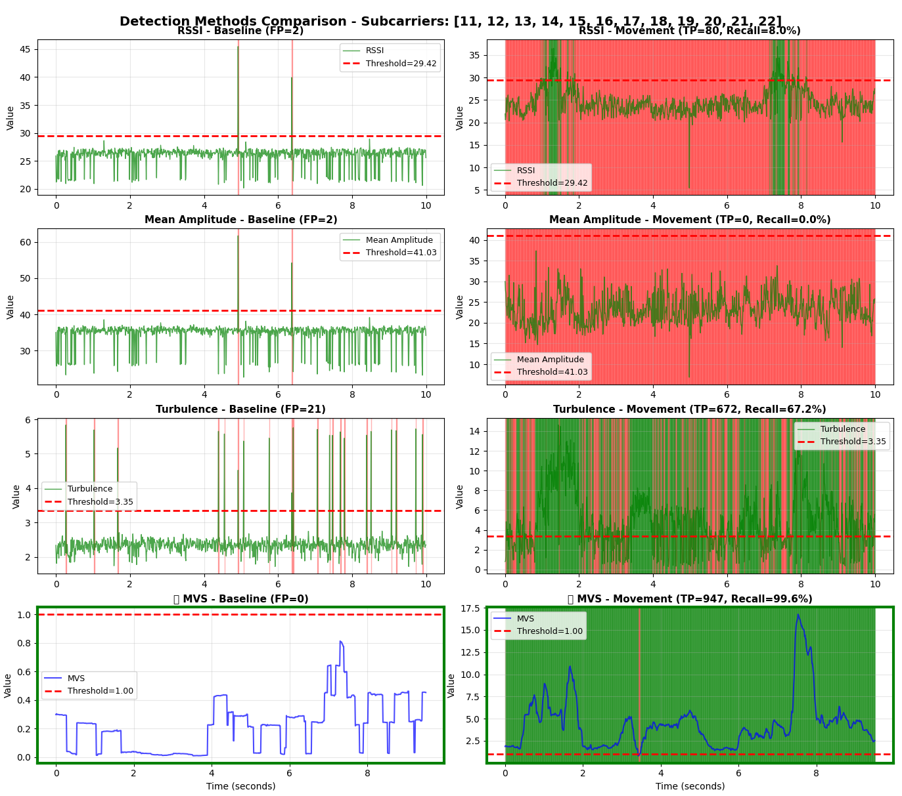

# Analysis Tools

**Python scripts for CSI data analysis, algorithm optimization, and validation**

This directory contains analysis tools for developing and validating ESPectre's motion detection algorithms. These scripts are essential for parameter tuning, algorithm validation, and scientific analysis.

## Supported Chips

All analysis tools support any ESP32 variant with CSI capability:
- **ESP32** (original)
- **ESP32-C3**
- **ESP32-S3**
- **ESP32-C6**

Use `--chip <name>` to specify the chip (e.g., `--chip c3`, `--chip s3`). Most tools default to C6 if not specified.

For algorithm documentation (MVS, fixed subcarriers, Hampel filter), see [ALGORITHMS.md](../docs/ALGORITHMS.md).

For production performance metrics, see [PERFORMANCE.md](../docs/PERFORMANCE.md).

For data collection and ML datasets, see [ML_DATA_COLLECTION.md](../docs/ML_DATA_COLLECTION.md).

---

## Table of Contents

- [Analysis Scripts](#analysis-scripts)
- [Usage Examples](#usage-examples)
- [Key Results](#key-results)

---

## Analysis Scripts

### 1. Raw Data Analysis (`1_analyze_raw_data.py`)

**Purpose**: Analyze data quality and verify dataset integrity

- Default mode reads `dataset_info.json` and analyzes all explicit historical pairs
- Verifies labels are correct (`static_presence` vs `motion`)
- Compares turbulence variance between states
- Prints a compact table with per-pair metrics (`Static Presence Var`, `Motion Var`, `Ratio`, `Gap end->start`, status)
- Supports per-chip detailed mode on the most recent dataset for that chip

```bash
python 1_analyze_raw_data.py           # Historical table from dataset_info.json
python 1_analyze_raw_data.py --chip C6 # Detailed analysis on latest C6 dataset
python 1_analyze_raw_data.py --chip C3 # Detailed analysis on latest C3 dataset
```

---

### 2. System Tuning (`2_analyze_system_tuning.py`)

**Purpose**: Grid search for optimal fixed-subcarrier MVS parameters

- Tests threshold and window-size combinations using the fixed production subcarriers
- Shows confusion matrix for best configuration
- Finds optimal parameter combinations

```bash
python 2_analyze_system_tuning.py              # Full grid search (default: C6)
python 2_analyze_system_tuning.py --chip S3    # Use S3 dataset
python 2_analyze_system_tuning.py --quick      # Reduced parameter space
```

---

### 3. Grid-Search Metadata Refresh (`3_refresh_gridsearch_metadata.py`)

**Purpose**: Refresh the production-aligned MVS threshold field in `data/dataset_info.json`

- Calculates `optimal_threshold_gridsearch` for `empty`, `static_presence`, `motion`, and `test` entries
- Uses fixed default subcarriers, Hampel filtering, and adaptive P95 × 1.1 threshold bootstrap
- Runs as a dry run by default, supports `--write` to update the field, and supports `--check` for validation

```bash
python 3_refresh_gridsearch_metadata.py          # Dry run
python 3_refresh_gridsearch_metadata.py --write  # Update dataset_info.json
python 3_refresh_gridsearch_metadata.py --check  # Fail if metadata is stale
```

---

### 4. Filter Location Analysis (`4_analyze_filter_location.py`)

**Purpose**: Compare filter placement in processing pipeline

- Tests pre-filtering vs post-filtering approaches
- Evaluates impact on motion detection accuracy
- Determines optimal filter location

```bash
python 4_analyze_filter_location.py              # Use C6 dataset
python 4_analyze_filter_location.py --chip S3    # Use S3 dataset
python 4_analyze_filter_location.py --plot       # Show visualizations
```

---

### 5. Filter Turbulence Analysis (`5_analyze_filter_turbulence.py`)

**Purpose**: Compare how different filters affect turbulence and motion detection

- **Hampel vs Lowpass comparison**: Shows the fundamental difference between outlier removal and frequency smoothing
- Tests only the four runtime-relevant configurations: no filter, Hampel only, low-pass only, and Hampel + low-pass
- Reuses the production `SegmentationContext` instead of maintaining parallel experimental filters
- Visualizes the resulting moving-variance traces and effective MOTION/IDLE regions

**Key insight**: Hampel and Lowpass are NOT the same type of filter!
- **Hampel**: Removes spikes/outliers (preserves signal shape)
- **Lowpass**: Smooths high-frequency noise (introduces lag)
- **Combined**: Best of both - spike removal + noise smoothing

```bash
python 5_analyze_filter_turbulence.py              # Use C6 dataset
python 5_analyze_filter_turbulence.py --chip S3    # Use S3 dataset
python 5_analyze_filter_turbulence.py --plot       # Show 4-panel visualization
```

---

### 6. Filter Parameters Optimization (`6_optimize_filter_params.py`)

**Purpose**: Optimize low-pass and Hampel filter parameters

- Optimizes low-pass cutoff frequency and threshold parameters
- Grid search for Hampel filter parameters (window, threshold)
- Auto-detects chip from static-presence file metadata (ensures matching motion data)
- Uses the fixed production subcarrier set
- Finds optimal configuration for noisy environments

```bash
python 6_optimize_filter_params.py              # Low-pass optimization
python 6_optimize_filter_params.py c6           # Use only C6 data
python 6_optimize_filter_params.py --hampel     # Hampel optimization
python 6_optimize_filter_params.py c6 --hampel  # C6 + Hampel
python 6_optimize_filter_params.py --all        # Combined optimization (low-pass + Hampel)
```

---

### 7. Detection Methods Comparison (`7_compare_detection_methods.py`)

**Purpose**: Compare different motion detection algorithms

- Compares RSSI, Mean Amplitude, Turbulence, and MVS detection methods
- Demonstrates MVS superiority with simpler approach and lower CPU
- Shows separation between static presence and motion

```bash
python 7_compare_detection_methods.py              # Use C6 dataset
python 7_compare_detection_methods.py --chip S3    # Use S3 dataset
python 7_compare_detection_methods.py --plot       # Show 5×2 comparison
```



---

### 8. I/Q Constellation Plotter (`8_plot_constellation.py`)

**Purpose**: Visualize I/Q constellation diagrams

- Compares static presence (stable) vs motion (dispersed) patterns
- Shows all 64 subcarriers (HT20) plus the fixed production subcarriers
- Reveals geometric signal characteristics

```bash
python 8_plot_constellation.py              # Use C6 dataset
python 8_plot_constellation.py --chip S3    # Use S3 dataset
python 8_plot_constellation.py --packets 1000
python 8_plot_constellation.py --packets 200 --offset 50  # Start from packet 50
python 8_plot_constellation.py --grid       # One subplot per subcarrier
```

---

### 9. ESP32 Variant Comparison (`9_compare_chips.py`)

**Purpose**: Compare CSI characteristics between ESP32 variants

- Compares signal quality between S3 and C6 chips
- Analyzes SNR differences and detection performance
- Helps choose optimal hardware for specific environments

```bash
python 9_compare_chips.py
python 9_compare_chips.py --plot
```

---

### 10. ML Model Training (`10_train_ml_model.py`)

**Purpose**: Train, evaluate, and export the production ML model

Install the ML requirements before using this script:

```bash
pip install -r requirements-ml.txt
```

The main repository workflow and this training stack target Python `3.14`.

- Trains the MLP detector with weighted binary cross-entropy
- Default training uses `--fp-weight 2.0`, `--scaler standard`, `--batch-size 1024`, `--device cpu`, grouped session-level CV, and hard-negative MVS sample weighting
- Caches derived features and base sample weights for repeated local runs; use `--no-cache` to rebuild
- Reports blocked out-of-fold metrics plus worst session/chip/source-file groups
- Uses a PyTorch MLP trainer and exports runtime-compatible weights for both platforms
- Supports FP-first architecture campaigns, gain-shift diagnostics, and feature-importance analysis
- Exports weights for both platforms:
  - `src/python/micro_espectre/ml_weights.py`
  - `src/cpp/core/ml_weights.h`

```bash
python 10_train_ml_model.py                # Train with default settings
python 10_train_ml_model.py --info         # Show dataset and split info
python 10_train_ml_model.py --experiment   # Run the FP-first MLP topology campaign
python 10_train_ml_model.py --experiment --experiment-promote  # Promote the winner if it beats the baseline
python 10_train_ml_model.py --experiment --experiment-architectures "16,8;24,12;32,16;24;24,12,6"  # Custom shortlist
python 10_train_ml_model.py --fp-weight 2.0  # Penalize false positives 2x
python 10_train_ml_model.py --scaler clipped_standard  # Robust clipping + z-score
python 10_train_ml_model.py --batch-size 32  # Smaller-batch comparison
python 10_train_ml_model.py --device cuda    # Force CUDA when available
python 10_train_ml_model.py --device mps     # Force Apple GPU when available
python 10_train_ml_model.py --no-cache       # Rebuild cached training matrix
python 10_train_ml_model.py --exclude-chip ESP32  # Run a chip-exclusion experiment
python 10_train_ml_model.py --seed-search-until-improvement 20  # Stop at first better seed
python 10_train_ml_model.py --gain-stress-gate  # Stress exported model with artificial feature gain shifts
python 10_train_ml_model.py --gain-stress-gate --gain-stress-scales 0.75,1.0,1.25  # Custom stress multipliers
python 10_train_ml_model.py --gain-feature-experiment  # Compare raw/relative/hybrid gain robustness
python 10_train_ml_model.py --shap         # SHAP importance (200 samples)
python 10_train_ml_model.py --shap 500     # SHAP importance (500 samples)
```

For the complete ML training workflow, promotion guidance, gain-stress
diagnostics, and post-training regressions, see
[ML_TRAINING.md](../docs/ML_TRAINING.md). For dataset preparation and labeling,
see [ML_DATA_COLLECTION.md](../docs/ML_DATA_COLLECTION.md).

### 11. Dataset Quality Validation (`11_validate_dataset_quality.py`)

Validates CSI datasets for integrity, signal quality, and ML readiness. It now checks per-file integrity for `empty`, `static_presence`, and `motion`, keeps pair validation focused on `static_presence`/`motion`, and includes an `EMPTY SANITY` phase that measures how well `empty` separates from overlapping `static_presence` groups.

**Checks performed:**
- File integrity — NPZ loads, expected keys exist, shapes are valid
- Signal quality — amplitude range, zero-packet detection
- Pair validation — static-presence vs motion variance ratio, temporal gap
- ML readiness — label balance, minimum samples, chip diversity

Turbulence mode follows runtime conventions: raw std for gain-locked files, CV normalization for files without gain lock. ML uses the same gain-mode-aware base turbulence and exports relative neural-detector features.

```bash
python 11_validate_dataset_quality.py              # Full validation
python 11_validate_dataset_quality.py --chip C6    # Validate C6 only
python 11_validate_dataset_quality.py --report     # Generate markdown report
python 11_validate_dataset_quality.py --strict     # Fail on warnings too
```

---

## Usage Examples

### Basic Analysis Workflow

```bash
cd tools

# 0. Collect data (files saved in data/)
# Requires two terminals:
#   Terminal 1: ESPectre streamer firmware running with collector IP/port set to this host
#   Terminal 2: ./espectre collect --label static_presence --duration 60
#               ./espectre collect --label motion --duration 30
# Optional debug terminal:
#               ./espectre collect --streamer-ip 192.168.1.50 --no-save --log-turbulence
# see ../docs/ML_DATA_COLLECTION.md for details

# 1. Analyze raw data
python 1_analyze_raw_data.py

# 2. Optimize parameters
python 2_analyze_system_tuning.py --quick

# 3. Compare filter placement
python 4_analyze_filter_location.py --plot

# 4. Run unit tests
cd ..
pytest test/python -v
```

### Advanced Analysis

```bash
# Compare detection methods
python 7_compare_detection_methods.py --plot

# Plot I/Q constellations (auto-finds most recent dataset)
python 8_plot_constellation.py --chip S3 --packets 1000 --grid

# Compare ESP32 variants (auto-finds most recent datasets for available chips)
python 9_compare_chips.py --plot
```

---

## Key Results

### Filter Optimization (Noisy Environment)

Tested on 60-second noisy static-presence capture with C6 chip:

| Configuration | Recall | FP Rate | F1 Score |
|---------------|--------|---------|----------|
| Low-pass 11Hz only | 92.4% | 2.34% | 88.9% |
| **Low-pass 11Hz + Hampel (W=9, T=4)** | **92.1%** | **0.84%** | **93.2%** |

### Fixed Subcarriers

ESPectre now uses one shared fixed 12-subcarrier set for both MVS and ML. The runtime calibration step tunes only the MVS threshold from baseline data.

For detailed performance metrics, see [PERFORMANCE.md](../docs/PERFORMANCE.md).

---

## Additional Resources

- [ALGORITHMS.md](../docs/ALGORITHMS.md) - Algorithm documentation (MVS, fixed subcarriers, Hampel)
- [Micro-ESPectre](../src/python/micro_espectre/README.md) - R&D platform documentation
- [ESPectre](../README.md) - Main project with Home Assistant integration
